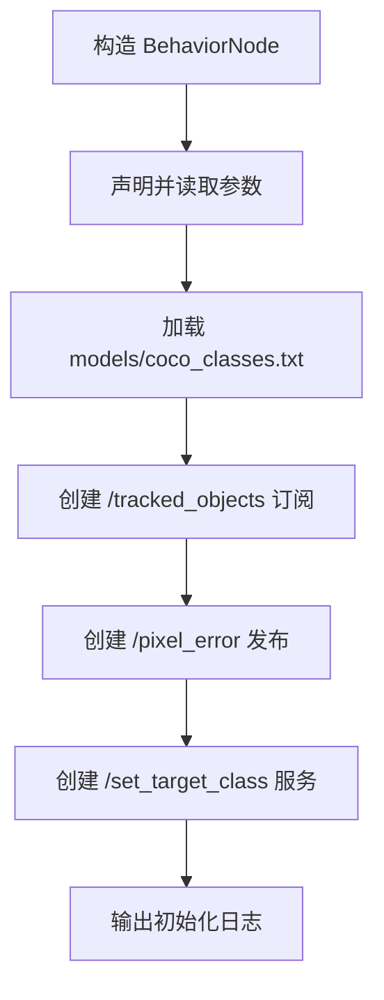
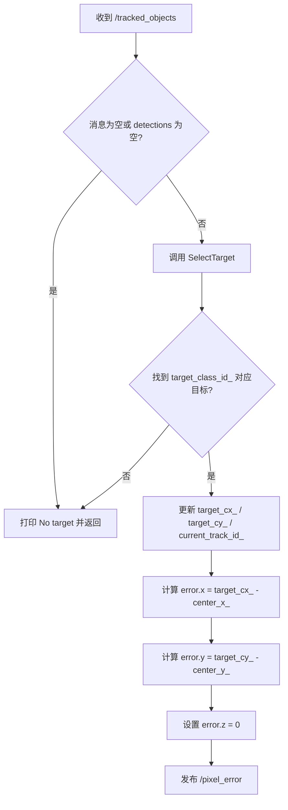
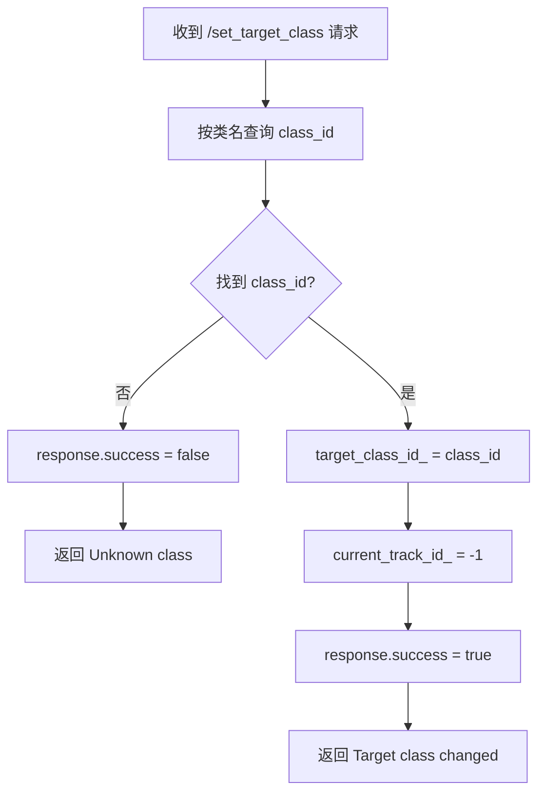

# behavior_node 节点代码说明文档

## 1. 节点概述

### 1.1 节点用途

`behavior_node` 的职责是从上游 `tracker_node` 发布的 `/tracked_objects` 中，筛选出当前关心的目标类别，然后计算该目标相对画面中心的像素偏差，并通过 `/pixel_error` 发布给下游 `leg_motion_node`。

对初学者来说，可以把它理解成视觉链路里的“目标选择层”：

- `detection_node` 负责“看见什么”
- `tracker_node` 负责“同一个物体是不是上一帧那个”
- `behavior_node` 负责“现在到底跟谁走”
- `leg_motion_node` 负责“根据误差怎么动”

### 1.2 所属功能包与入口

| 项目 | 内容 |
| --- | --- |
| 功能包 | `behavior_node` |
| 可执行文件 | `behavior_node_exe` |
| 主源码 | `ros2_ws/src/behavior_node/src/behavior_node.cpp` |
| 头文件 | `ros2_ws/src/behavior_node/include/behavior_node/behavior_node.hpp` |
| 进程入口 | `ros2_ws/src/behavior_node/src/main.cpp` |
| launch 文件 | `ros2_ws/src/behavior_node/launch/behavior.launch.py` |
| 默认参数文件 | `config/behavior.yaml` |

### 1.3 在系统中的角色

系统主链路如下：

```text
gst_receiver -> stereo_splitter -> detection_node -> tracker_node -> behavior_node -> leg_motion_node -> uart_bridge -> STM32
```

`behavior_node` 位于“感知”和“控制”之间，扮演桥梁角色：

- 上游输入：带 `track_id` 的检测框数组 `/tracked_objects`
- 下游输出：目标相对画面中心的偏差 `/pixel_error`
- 外部控制：通过 `/set_target_class` 服务切换要跟踪的目标类别

它本身不做目标检测，也不做运动控制，只做“目标选择 + 误差计算”。

## 2. 依赖项

### 2.1 ROS 2 版本与构建依赖

根据仓库顶层 `README.md`，当前项目默认运行环境为 **ROS 2 Jazzy**。

| 类别 | 名称 | 说明 |
| --- | --- | --- |
| 构建工具 | `ament_cmake` | ROS 2 CMake 构建系统 |
| 核心 ROS 2 库 | `rclcpp` | C++ 节点、话题、服务等 API |
| 标准消息 | `geometry_msgs` | 用于发布 `geometry_msgs/msg/Vector3` |
| 自定义接口包 | `robot_interfaces` | 提供检测消息和目标切换服务 |

### 2.2 第三方库与仓库内共享工具

| 类型 | 名称 | 说明 |
| --- | --- | --- |
| C++ 标准库 | `<map>`、`<memory>`、`<string>` | 保存类别映射和节点状态 |
| 仓库共享头文件 | `shared/load_trimmed_lines.hpp` | 读取 `models/coco_classes.txt`，并自动去掉空白字符 |
| 仓库共享头文件 | `shared/ros2_single_node_main.hpp` | 提供统一的 `main()` 启动入口 |

说明：

- 这个节点 **没有** 依赖 OpenCV、GStreamer、ONNX Runtime 之类的重型第三方库。
- 算法部分非常轻量，核心只是筛选数组、计算矩形面积和像素偏差。

### 2.3 自定义消息与服务

| 类型 | 名称 | 作用 |
| --- | --- | --- |
| 自定义消息 | `robot_interfaces/msg/SimpleDetection.msg` | 描述单个检测框：中心点、宽高、类别、置信度、轨迹 ID |
| 自定义消息 | `robot_interfaces/msg/SimpleDetection2DArray.msg` | 检测框数组，作为 `/tracked_objects` 的消息类型 |
| 自定义服务 | `robot_interfaces/srv/SetTargetClass.srv` | 按类别名切换当前目标类别 |

### 2.4 外部数据文件

| 文件 | 用途 | 是否必须 |
| --- | --- | --- |
| `models/coco_classes.txt` | 把 COCO `class_id` 映射到字符串类别名，例如 `person`、`cup` | 建议必须；缺失时服务按类名切换会失败 |

补充说明：

- 节点启动后会尝试读取 `models/coco_classes.txt`。
- 如果这个文件打不开，节点仍然能启动，但 `coco_classes_` 映射为空，此时 `/set_target_class` 几乎无法按名称正确切换类别。

## 3. 节点接口清单

### 3.1 订阅的话题

ROS 2 中，“订阅”表示节点被动接收其他节点发布的数据。

| 话题名称 | 消息类型 | QoS | 回调函数 | 用途 |
| --- | --- | --- | --- | --- |
| `/tracked_objects` | `robot_interfaces/msg/SimpleDetection2DArray` | `SensorDataQoS`，等价于常见的 `KeepLast(5) + BestEffort + Volatile` | `OnTrackedObjects()` | 接收上游跟踪结果，从中选出当前目标类别，并计算像素误差 |

### 3.2 发布的话题

ROS 2 中，“发布”表示节点主动把处理结果发送出去。

| 话题名称 | 消息类型 | QoS | 发布频率 | 用途 |
| --- | --- | --- | --- | --- |
| `/pixel_error` | `geometry_msgs/msg/Vector3` | `rclcpp::QoS(5)`，默认是 `KeepLast(5) + Reliable + Volatile` | 事件触发；仅在收到 `/tracked_objects` 且成功选到目标时发布，频率通常跟随上游输入频率 | 输出目标中心相对画面中心的偏差：`x = target_cx - center_x`，`y = target_cy - center_y`，`z = 0` |

### 3.3 提供的服务 / 动作

ROS 2 服务适合“一问一答”的控制请求，和连续流数据的话题不同。

| 名称 | 类型 | 用途 |
| --- | --- | --- |
| `/set_target_class` | `robot_interfaces/srv/SetTargetClass` | 按类别名切换当前目标，例如把跟踪对象从 `person` 切到 `cup` |

说明：

- 该节点 **没有提供 Action**。
- Action 常用于长时间执行且可反馈进度的任务，本节点不需要。

### 3.4 客户端调用的服务 / 动作

| 名称 | 类型 | 用途 |
| --- | --- | --- |
| 无 | 无 | `behavior_node` 不主动调用其他服务，也不作为 Action 客户端 |

### 3.5 TF 坐标系（监听 / 广播）

| 类型 | 内容 |
| --- | --- |
| 监听 TF | 无 |
| 广播 TF | 无 |

说明：

- TF 通常用于机器人坐标变换，例如 `map -> base_link -> camera_link`。
- 本节点只处理二维像素坐标，不涉及三维坐标系，因此不使用 TF。

### 3.6 关键消息字段速查

#### 3.6.1 `/tracked_objects` 中单个目标的字段

`/tracked_objects` 的消息类型是 `robot_interfaces/msg/SimpleDetection2DArray`，其中每个元素都是 `SimpleDetection`。

| 字段名 | 类型 | 含义 |
| --- | --- | --- |
| `center_x` | `float32` | 目标框中心点的 X 像素坐标 |
| `center_y` | `float32` | 目标框中心点的 Y 像素坐标 |
| `width` | `float32` | 目标框宽度 |
| `height` | `float32` | 目标框高度 |
| `confidence` | `float32` | 检测置信度 |
| `class_id` | `int32` | COCO 类别 ID |
| `track_id` | `string` | 跟踪器分配的轨迹 ID |

#### 3.6.2 `/pixel_error` 的字段

| 字段名 | 类型 | 含义 |
| --- | --- | --- |
| `x` | `float64` | 目标中心相对画面中心的水平偏差，右侧为正 |
| `y` | `float64` | 目标中心相对画面中心的垂直偏差，下方为正 |
| `z` | `float64` | 当前固定写为 `0.0`，预留未使用 |

#### 3.6.3 `/set_target_class` 服务字段

| 方向 | 字段名 | 类型 | 含义 |
| --- | --- | --- | --- |
| Request | `class_name` | `string` | 要切换到的目标类别名，例如 `person` |
| Response | `success` | `bool` | 是否切换成功 |
| Response | `message` | `string` | 结果说明，例如错误原因或成功提示 |

## 4. 参数列表

参数是 ROS 2 节点的“启动配置项”。本节点会在构造函数中声明参数，并在启动时读取一次。

> 重要：当前实现 **没有参数回调**，所以即使运行中用 `ros2 param set` 修改，也不会自动同步到成员变量里，等价于“非动态可调”。

| 参数名 | 类型 | 默认值 | 取值范围 | 含义 | 是否动态可调 |
| --- | --- | --- | --- | --- | --- |
| `image_width` | `int` | `320` | 建议 `> 0`；源码未做校验 | 图像宽度元数据，当前实现中未直接参与误差计算 | 否 |
| `image_height` | `int` | `480` | 建议 `> 0`；源码未做校验 | 图像高度元数据，当前实现中未直接参与误差计算 | 否 |
| `center_x` | `int` | `160` | 理论上应在 `[0, image_width - 1]`；源码未做校验 | 画面中心 X 坐标，误差计算基准 | 否 |
| `center_y` | `int` | `240` | 理论上应在 `[0, image_height - 1]`；源码未做校验 | 画面中心 Y 坐标，误差计算基准 | 否 |

当前默认 YAML 如下：

```yaml
behavior_node:
  ros__parameters:
    image_width: 320   # 图像宽度
    image_height: 480  # 图像高度
    center_x: 160      # 画面中心 X
    center_y: 240      # 画面中心 Y
```

## 5. 核心代码逻辑

### 5.1 类结构和继承关系

`BehaviorNode` 直接继承 `rclcpp::Node`，属于普通 ROS 2 节点，不是 Lifecycle 节点。

```cpp
class BehaviorNode : public rclcpp::Node {
public:
  BehaviorNode(const rclcpp::NodeOptions& options = rclcpp::NodeOptions());

private:
  rclcpp::Subscription<robot_interfaces::msg::SimpleDetection2DArray>::SharedPtr tracked_objects_sub_;
  rclcpp::Publisher<geometry_msgs::msg::Vector3>::SharedPtr pixel_error_pub_;
  rclcpp::Service<robot_interfaces::srv::SetTargetClass>::SharedPtr set_target_class_srv_;

  int target_class_id_ = 0;   // 当前目标类别，默认 0 = person
  int current_track_id_ = -1; // 最近一次选中的 track_id，当前只记录，不参与再次筛选
  int target_cx_ = 0;         // 目标中心 X
  int target_cy_ = 0;         // 目标中心 Y
};
```

核心成员可以分成 3 类：

| 成员类别 | 代表成员 | 作用 |
| --- | --- | --- |
| 通信对象 | `tracked_objects_sub_`、`pixel_error_pub_`、`set_target_class_srv_` | 与 ROS 2 图通信中间件交互 |
| 目标状态 | `target_class_id_`、`current_track_id_`、`target_cx_`、`target_cy_` | 记录当前目标类别和最近一次选中的目标 |
| 配置与映射 | `image_width_`、`image_height_`、`center_x_`、`center_y_`、`coco_classes_` | 误差计算基准和类别名映射 |

### 5.2 构造函数初始化流程

构造函数完成了节点几乎全部初始化工作，流程如下：

1. 调用父类构造函数，节点名固定为 `behavior_node`
2. 声明参数：`image_width`、`image_height`、`center_x`、`center_y`
3. 读取参数到成员变量
4. 从 `models/coco_classes.txt` 加载 COCO 类别名
5. 创建 `/tracked_objects` 订阅者
6. 创建 `/pixel_error` 发布者
7. 创建 `/set_target_class` 服务
8. 打印初始化日志

关键片段如下：

```cpp
this->declare_parameter<int>("center_x", 160);      // 声明参数，允许 YAML 覆盖默认值
this->declare_parameter<int>("center_y", 240);      // 画面中心 Y

center_x_ = this->get_parameter("center_x").as_int(); // 启动时读取参数到成员变量
center_y_ = this->get_parameter("center_y").as_int(); // 后续误差计算直接使用成员变量

LoadCocoClasses();  // 读取 COCO 标签文件，建立 id -> name 映射

tracked_objects_sub_ =
  this->create_subscription<robot_interfaces::msg::SimpleDetection2DArray>(
    "/tracked_objects", qos,
    std::bind(&BehaviorNode::OnTrackedObjects, this, std::placeholders::_1)); // 订阅跟踪结果

pixel_error_pub_ =
  this->create_publisher<geometry_msgs::msg::Vector3>("/pixel_error", rclcpp::QoS(5)); // 发布误差
```

初始化流程图：



### 5.3 主要回调函数处理流程

先给出总表，再展开说明。

| 回调函数 | 触发条件 | 主要输入 | 处理结果 |
| --- | --- | --- | --- |
| `OnTrackedObjects()` | 收到一条 `/tracked_objects` 消息 | `SimpleDetection2DArray` | 若找到目标类别，则更新目标中心并发布 `/pixel_error`；否则仅记录 `No target` 日志 |
| `OnSetTargetClass()` | 收到一次 `/set_target_class` 服务请求 | `class_name` 字符串 | 若类别名存在，则更新 `target_class_id_` 并重置 `current_track_id_`；否则返回失败 |

#### 5.3.1 `OnTrackedObjects()`

触发条件：

- 上游 `tracker_node` 发布一帧 `/tracked_objects`
- ROS 2 执行器把该消息分发给订阅回调

处理步骤：

1. 判断消息是否为空，或 `detections` 是否为空
2. 若为空，打印 `No target` 并返回
3. 调用 `SelectTarget()`，从同类别目标中选出面积最大的一个
4. 若找到目标，记录日志
5. 计算像素误差：
   - `error.x = target_cx_ - center_x_`
   - `error.y = target_cy_ - center_y_`
   - `error.z = 0.0`
6. 发布 `/pixel_error`
7. 如果未找到符合类别的目标，打印 `No target`

流程图：



关键代码片段：

```cpp
if (!msg || msg->detections.empty()) {      // 输入为空时直接返回
  RCLCPP_INFO(this->get_logger(), "No target");
  return;
}

if (SelectTarget(*msg)) {                   // 选择当前目标
  auto error = geometry_msgs::msg::Vector3();
  error.x = target_cx_ - center_x_;         // 右侧为正，左侧为负
  error.y = target_cy_ - center_y_;         // 下方为正，上方为负
  error.z = 0.0;                            // 当前未使用 z 轴
  pixel_error_pub_->publish(error);         // 发布给 leg_motion_node
}
```

处理结果：

- 成功时：更新最近目标状态，并向下游发布一条误差消息
- 失败时：不发布任何误差消息，下游通常依赖超时机制判断“目标丢失”

#### 5.3.2 `OnSetTargetClass()`

触发条件：

- 外部节点或命令行调用服务 `/set_target_class`

处理步骤：

1. 从请求中取出 `class_name`
2. 调用 `GetClassIdByName()`，在 `coco_classes_` 中查找对应 `class_id`
3. 如果没找到：
   - `response->success = false`
   - 返回错误信息 `Unknown class: ...`
4. 如果找到：
   - 更新 `target_class_id_`
   - 将 `current_track_id_` 重置为 `-1`
   - 返回成功信息

流程图：



关键代码片段：

```cpp
int class_id = GetClassIdByName(request->class_name); // 把字符串类别转成 COCO id

if (class_id < 0) {                                   // 没找到时直接返回失败
  response->success = false;
  response->message = "Unknown class: " + request->class_name;
  return;
}

target_class_id_ = class_id;                          // 切换新的目标类别
current_track_id_ = -1;                               // 清除旧的跟踪目标记录
response->success = true;
```

处理结果：

- 成功时：后续帧会开始筛选新的目标类别
- 失败时：当前目标类别保持不变

### 5.4 关键算法或状态机说明

#### 5.4.1 目标选择算法

`SelectTarget()` 是这个节点的核心算法。它的策略非常直接：

1. 遍历当前帧中的所有检测框
2. 只保留 `det.class_id == target_class_id_` 的候选
3. 计算每个候选框的面积 `width * height`
4. 选择面积最大的候选作为当前目标

关键代码如下：

```cpp
for (size_t i = 0; i < detections.detections.size(); ++i) {
  const auto& det = detections.detections[i];

  if (det.class_id != target_class_id_) {  // 只关心当前目标类别
    continue;
  }

  float area = det.width * det.height;     // 用面积近似“目标更显著/更近”
  if (area > max_area) {                   // 保留同类中最大的目标
    max_area = area;
    best_idx = i;
  }
}
```

这个策略的优点：

- 实现简单，计算量很低
- 在“同类多个物体同时出现”时，通常会优先选离相机更近的目标

这个策略的局限：

- 不会优先保持同一个 `track_id`
- 目标大小一旦变化，可能在多个同类目标之间切换
- 没有结合置信度、历史稳定性或距离滤波

#### 5.4.2 当前运行状态

严格来说，这个节点 **没有复杂状态机**，更接近“轻状态的事件处理节点”。它的运行状态主要由以下变量表示：

| 状态变量 | 含义 |
| --- | --- |
| `target_class_id_` | 当前关注的 COCO 类别 |
| `current_track_id_` | 最近一次被选中的轨迹 ID |
| `target_cx_`、`target_cy_` | 最近一次选中的目标中心点 |
| `center_x_`、`center_y_` | 误差参考中心 |

可以把它抽象成下面 3 个逻辑状态：

| 逻辑状态 | 判定条件 | 行为 |
| --- | --- | --- |
| 等待输入 | 还没收到 `/tracked_objects` | 空转等待 |
| 有输入但无目标 | 收到消息，但没有匹配 `target_class_id_` 的目标 | 记录 `No target`，不发布误差 |
| 已锁定一帧目标 | 本帧中找到合适目标 | 更新中心点并发布 `/pixel_error` |

注意：

- 这里的“已锁定”只是“当前帧选中”，并不是“持续锁定同一个 `track_id`”。
- 代码里的 `current_track_id_` 目前只是记录值，还没有参与下一帧的优先匹配。

## 6. 生命周期与线程模型

### 6.1 生命周期

本节点是普通 `rclcpp::Node`，**不是** `rclcpp_lifecycle::LifecycleNode`，因此没有 `configure / activate / deactivate / cleanup` 这些生命周期状态。

它的实际运行过程非常简单：

1. `main()` 调用 `rclcpp::init()`
2. 创建 `BehaviorNode`
3. 调用 `rclcpp::spin(node)` 进入事件循环
4. 程序退出时调用 `rclcpp::shutdown()`

对应入口代码如下：

```cpp
int main(int argc, char* argv[]) {
  return project_shared::spin_single_node_main<behavior_node::BehaviorNode>(argc, argv);
  // 统一做 init -> 构造节点 -> spin -> shutdown
}
```

### 6.2 执行器类型

`shared/ros2_single_node_main.hpp` 中调用的是：

```cpp
rclcpp::spin(node); // 默认使用单线程执行器
```

因此在当前默认启动方式下：

- 执行器类型：**单线程**
- 订阅回调和服务回调不会并行执行
- 回调之间是串行处理关系

这对初学者很重要，因为它意味着：

- 不需要额外担心多线程数据竞争
- 但如果某个回调很慢，也会阻塞其他回调

### 6.3 回调组与定时器

| 项目 | 当前实现 |
| --- | --- |
| 回调组 | 未显式创建，自然落在默认回调组中；在单线程执行器下表现为串行执行 |
| 定时器 | 无 |
| 后台工作线程 | 无 |
| 显式缓存队列 | 无 |

说明：

- `behavior_node` 完全依赖上游 `/tracked_objects` 驱动。
- 它不是“周期控制节点”，而是“事件触发节点”。

## 7. 启动方式

### 7.1 使用 `ros2 run` 直接启动

先加载 ROS 2 和工作区环境：

```bash
source /opt/ros/jazzy/setup.bash
cd /home/peter/dog/dog_dev
source ros2_ws/install/setup.bash
ros2 run behavior_node behavior_node_exe
```

说明：

- 这种方式不会自动加载 `config/behavior.yaml`，因此会使用源码里的默认参数。
- 如果需要自定义参数，建议使用 launch 或 `--ros-args --params-file`。

带参数文件的示例：

```bash
ros2 run behavior_node behavior_node_exe \
  --ros-args --params-file /home/peter/dog/dog_dev/config/behavior.yaml
```

### 7.2 使用本包自带 launch 文件启动

```bash
source /opt/ros/jazzy/setup.bash
cd /home/peter/dog/dog_dev
source ros2_ws/install/setup.bash
ros2 launch behavior_node behavior.launch.py
```

这个 launch 文件会自动加载包内安装后的 `behavior.yaml`。

### 7.3 在整条视觉链路中启动

如果要和上游 `tracker_node`、下游 `leg_motion_node` 一起工作，通常使用：

```bash
source /opt/ros/jazzy/setup.bash
cd /home/peter/dog/dog_dev
source ros2_ws/install/setup.bash
ros2 launch robot_bringup vision_stack.launch.py
```

### 7.4 launch 文件示例

```python
behavior_node = Node(
    package='behavior_node',          # 功能包名
    executable='behavior_node_exe',   # 可执行文件名
    name='behavior_node',             # 运行时节点名
    output='screen',                  # 日志输出到终端
    parameters=[config_file]          # 加载 behavior.yaml
)
```

### 7.5 参数 YAML 配置示例

```yaml
behavior_node:
  ros__parameters:
    image_width: 320
    image_height: 480
    center_x: 160
    center_y: 240
```

### 7.6 运行时切换目标类别

```bash
ros2 service call /set_target_class robot_interfaces/srv/SetTargetClass "{class_name: 'person'}"
ros2 service call /set_target_class robot_interfaces/srv/SetTargetClass "{class_name: 'cup'}"
```

前提条件：

- `models/coco_classes.txt` 中存在对应类名
- 大小写和拼写需要与文件内容一致

## 8. 调试与排错

### 8.1 最常用的观察命令

```bash
ros2 node list
ros2 topic list
ros2 topic echo /tracked_objects
ros2 topic echo /pixel_error
ros2 topic hz /tracked_objects
ros2 topic hz /pixel_error
ros2 service list
ros2 service call /set_target_class robot_interfaces/srv/SetTargetClass "{class_name: 'person'}"
```

### 8.2 日志查看方法

本节点主要通过 `RCLCPP_INFO / WARN / DEBUG` 输出日志。

常见日志含义如下：

| 日志内容 | 说明 |
| --- | --- |
| `BehaviorNode initialized ...` | 节点已启动，参数和默认目标类别已经载入 |
| `Target: id=..., center=(...), class=...` | 本帧找到了目标，并完成误差计算 |
| `No target` | 本帧没有找到任何目标，或者没有找到当前类别的目标 |
| `Unknown class: ...` | `/set_target_class` 请求中的类名未出现在 `coco_classes.txt` |
| `Target class changed to: ...` | 服务调用成功，后续将跟踪新类别 |

如果想看更详细日志，可以在启动时提高日志级别：

```bash
ros2 run behavior_node behavior_node_exe --ros-args --log-level debug
```

### 8.3 推荐的可视化工具

| 工具 | 推荐用途 |
| --- | --- |
| `rqt_graph` | 看 `/tracked_objects -> behavior_node -> /pixel_error` 是否连通 |
| `rqt_plot` | 画 `/pixel_error/x` 与 `/pixel_error/y` 曲线，观察误差是否逐渐收敛 |
| `rqt_image_view` | 结合相机画面确认目标是否真的在视野中 |
| `rviz2` | 本节点本身不直接适合用 RViz 可视化；除非你额外把目标框或中心点转成 Marker |

建议的调试组合：

```bash
rqt_graph
rqt_plot /pixel_error/x /pixel_error/y
rqt_image_view
```

### 8.4 常见问题与排错建议

| 现象 | 可能原因 | 排查方法 | 处理建议 |
| --- | --- | --- | --- |
| 节点已启动，但 `/pixel_error` 没有数据 | 上游 `/tracked_objects` 没有数据 | `ros2 topic echo /tracked_objects` | 先排查 `detection_node`、`tracker_node` |
| `/tracked_objects` 有数据，但仍然频繁 `No target` | 当前 `target_class_id_` 与实际目标类别不匹配 | 调用 `/set_target_class` 切换类别 | 先用 `person`、`cup` 之类常见 COCO 类测试 |
| 服务调用失败，提示 `Unknown class` | `class_name` 拼写不对，或 `coco_classes.txt` 未加载成功 | 检查日志是否出现 `Could not open COCO classes file` | 修正路径、工作目录或类名 |
| 误差方向看起来反了 | `center_x / center_y` 配置不对，或下游对误差正负号理解不同 | `ros2 topic echo /pixel_error` + 对照画面位置 | 先确认“目标在右边时 x 应为正”这一定义 |
| 误差突然跳来跳去 | 多个同类目标同时出现，面积最大者发生切换 | 观察 `/tracked_objects` 中同类物体数量和尺寸 | 后续可改为“优先保持同一 track_id”策略 |
| 修改参数后不生效 | 节点只在启动时读取参数一次 | `ros2 param get /behavior_node center_x` 和运行表现对比 | 修改 YAML 后重启节点 |

### 8.5 一个很容易忽略的实现细节

当前代码在 `SelectTarget()` 里有这样一行：

```cpp
current_track_id_ = std::stoi(target.track_id); // 假设 track_id 一定是纯数字字符串
```

这意味着：

- 如果上游 `track_id` 为空字符串，可能抛异常
- 如果上游以后改成非数字 ID，例如 `track_7`，也会抛异常

因此联调时一旦节点异常退出，要优先检查 `/tracked_objects` 里的 `track_id` 格式。

## 9. 单元测试与集成测试说明

### 9.1 当前测试现状

当前仓库里 **没有看到专门针对 `behavior_node` 的 gtest / pytest 单元测试**，但有若干 shell 级联调脚本会覆盖它的启动与链路连通性。

### 9.2 已有测试脚本

| 文件 | 类型 | 覆盖范围 |
| --- | --- | --- |
| `tests/test_stage6_integration.sh` | 集成测试脚本 | 检查 `behavior_node` 是否能启动，以及 `/set_target_class` 服务是否注册 |
| `scripts/verify_tracking.sh` | 端到端验证脚本 | 检查关键节点、关键话题频率，并采样 `/pixel_error` |

### 9.3 测试内容解读

`tests/test_stage6_integration.sh` 主要做了三件事：

1. 尝试启动 `behavior_node`
2. 尝试启动 `leg_motion_node`
3. 检查 `/set_target_class` 是否出现在服务列表里

这类测试的优点是简单直接，适合快速冒烟验证；缺点是：

- 没有构造假数据去验证 `SelectTarget()` 的算法结果
- 没有校验 `/pixel_error` 数值是否正确
- 没有覆盖异常输入，例如空 `track_id`、未知类别名等

### 9.4 建议补充的测试

后续建议增加以下自动化测试：

| 建议测试项 | 价值 |
| --- | --- |
| `SelectTarget()` 单元测试 | 验证“同类目标中选面积最大者”的逻辑 |
| `OnSetTargetClass()` 单元测试 | 验证合法/非法类别名处理 |
| 参数加载测试 | 验证 `center_x / center_y` 是否按 YAML 生效 |
| 异常输入测试 | 验证 `track_id` 非数字时节点行为是否稳定 |

## 10. 变更记录与待办事项

### 10.1 当前实现基线

本文档基于仓库中当前可见代码整理，基线时间可按当前工作区日期理解为 `2026-04-29`。

### 10.2 已实现的能力

| 项目 | 状态 |
| --- | --- |
| 订阅 `/tracked_objects` | 已实现 |
| 发布 `/pixel_error` | 已实现 |
| 运行时切换目标类别 `/set_target_class` | 已实现 |
| 从 `coco_classes.txt` 读取类别名 | 已实现 |

### 10.3 仍待完善的事项

| 待办项 | 现状说明 |
| --- | --- |
| `/calibrate_center` 服务 | 仓库里有接口定义，但 `behavior_node` 没有实现服务端 |
| 持续锁定同一 `track_id` | 当前只是记录 `current_track_id_`，并没有在选目标时优先复用 |
| `image_width` / `image_height` 的实际使用 | 参数已加载，但当前没有参与边界检查或误差归一化 |
| `track_id` 异常保护 | `std::stoi()` 没有异常处理 |
| 目标丢失后的输出策略 | 当前只是不再发布 `/pixel_error`，没有发布“目标丢失”标志 |
| 自动化单元测试 | 目前缺少真正针对算法和边界情况的测试 |

### 10.4 对后续维护者的建议

如果你准备继续扩展这个节点，最值得优先做的三件事是：

1. 让 `SelectTarget()` 优先保持同一 `track_id`
2. 为 `track_id` 转换增加异常保护
3. 实现 `/calibrate_center` 或者删除这条未落地的接口定义，减少文档和代码之间的歧义
