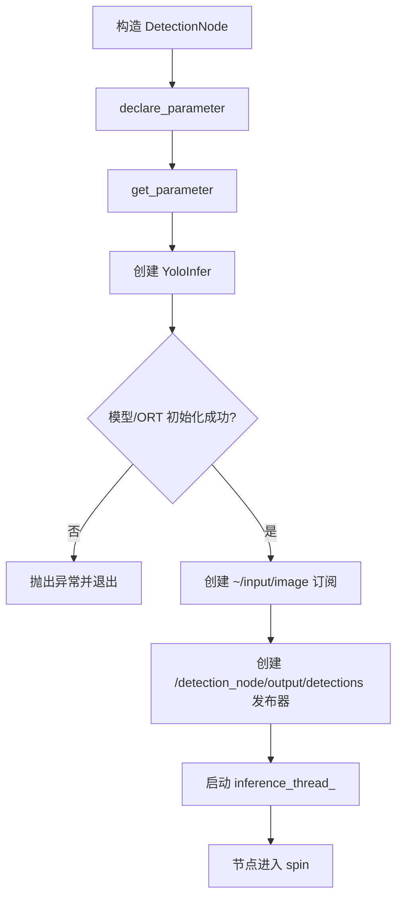
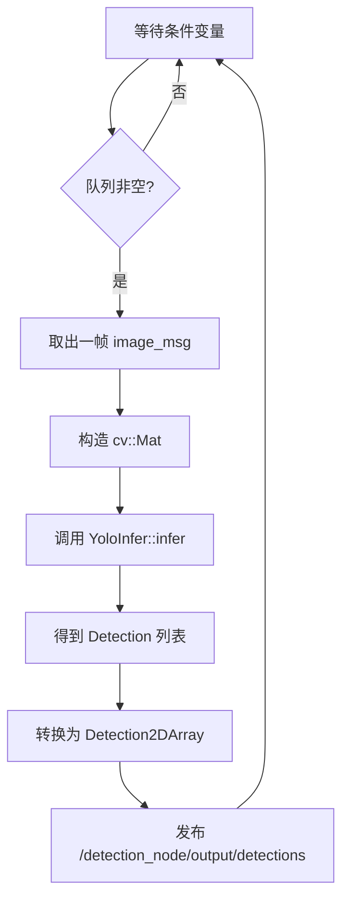

# detection_node 节点中文代码说明文档

本文基于仓库当前源码撰写，分析对象是 `detection_node` 节点，而不是同包中的调试节点 `detection_viz_node`。

源码基线：

- `ros2_ws/src/detection_node/include/detection_node/detection_node.hpp`
- `ros2_ws/src/detection_node/src/detection_node.cpp`
- `ros2_ws/src/detection_node/include/detection_node/yolo_infer.hpp`
- `ros2_ws/src/detection_node/src/yolo_infer.cpp`
- `ros2_ws/src/detection_node/launch/detection.launch.py`
- `ros2_ws/src/detection_node/config/detection.yaml`

## 1. 节点概述

### 1.1 用途

`detection_node` 用来接收相机图像，调用 `YOLOv8 + ONNX Runtime` 执行目标检测，并把检测框结果发布为自定义 ROS 2 消息 `/detection_node/output/detections`。

它的输入是上游 `stereo_splitter_node` 发布的左目图像 `~/input/image`，输出会被下游 `tracker_node` 继续消费，用于目标跟踪。

### 1.2 所属功能包

| 项目 | 内容 |
| --- | --- |
| 功能包名 | `detection_node` |
| 节点类名 | `DetectionNode` |
| 可执行文件 | `detection_node_exe` |
| 主入口文件 | `ros2_ws/src/detection_node/src/detection_node_main.cpp` |

### 1.3 在系统中的角色

在整条视觉链路中，`detection_node` 处于“图像预处理之后、目标跟踪之前”的位置：

```text
gst_receiver_node
  -> stereo_splitter_node
  -> detection_node
  -> tracker_node
  -> behavior_node
```

它的核心职责只有两件事：

1. 把 ROS 图像消息转换为 `OpenCV Mat`
2. 把模型推理结果转换为 ROS 检测消息

> 对初学者来说，可以把这个节点理解为“ROS 世界”和“深度学习推理世界”之间的桥梁。

## 2. 依赖项

### 2.1 ROS 2 版本

根据仓库 `README.md` 和 `SETUP_GUIDE.md`，当前工程基线是 **ROS 2 Jazzy**。

### 2.2 依赖的 ROS 2 功能包

| 依赖包 | 类型 | 作用 |
| --- | --- | --- |
| `rclcpp` | ROS 2 C++ 客户端库 | 提供节点、发布订阅、日志、参数等基础能力 |
| `sensor_msgs` | 官方消息包 | 提供 `sensor_msgs/msg/Image` 图像消息 |
| `robot_interfaces` | 自定义接口包 | 提供检测结果消息 `Detection2D` 和 `Detection2DArray` |
| `opencv` | 包装后的系统依赖 | 在 CMake 中作为 OpenCV 依赖暴露 |

### 2.3 第三方库

| 库 | 用途 |
| --- | --- |
| OpenCV | 图像存储、颜色空间转换、缩放、矩形框表示 |
| ONNX Runtime C++ API | 加载 `.onnx` 模型并执行推理 |
| CUDA Execution Provider（可选） | 如果启用并成功加载，则使用 GPU 推理 |
| C++ 标准库线程组件 | `std::thread`、`std::mutex`、`std::condition_variable` 用于生产者-消费者并发模型 |

### 2.4 自定义消息

#### `robot_interfaces/msg/Detection2D`

| 字段 | 类型 | 含义 |
| --- | --- | --- |
| `center_x` | `float32` | 检测框中心点 x 坐标 |
| `center_y` | `float32` | 检测框中心点 y 坐标 |
| `width` | `float32` | 检测框宽度 |
| `height` | `float32` | 检测框高度 |
| `confidence` | `float32` | 置信度 |
| `class_id` | `int32` | 类别 ID，和 COCO 类别表对应 |
| `track_id` | `string` | 跟踪 ID；本节点发布时为空字符串 |

#### `robot_interfaces/msg/Detection2DArray`

| 字段 | 类型 | 含义 |
| --- | --- | --- |
| `header` | `std_msgs/Header` | 时间戳和坐标系信息 |
| `detections` | `Detection2D[]` | 检测结果数组 |

### 2.5 外部运行时依赖

| 项目 | 要求 |
| --- | --- |
| 模型文件 | 默认 `models/yolov8n.onnx` |
| 类别文件 | `models/coco_classes.txt` |
| 环境变量 | 构建时必须设置 `ONNXRUNTIME_ROOT` |

> 注意：`CMakeLists.txt` 会直接检查 `ONNXRUNTIME_ROOT/include/onnxruntime_cxx_api.h` 和 `ONNXRUNTIME_ROOT/lib/libonnxruntime.so` 是否存在。没有这个环境变量时，包无法构建。

## 3. 节点接口清单

### 3.1 订阅的话题

| 话题名 | 消息类型 | QoS | 回调函数 | 用途 |
| --- | --- | --- | --- | --- |
| `~/input/image` | `sensor_msgs/msg/Image` | `rclcpp::SensorDataQoS()`，即 `KeepLast(5) + BestEffort + Volatile` | `DetectionNode::image_callback` | 接收上游裁切后的左目图像，送入内部待推理队列 |

### 3.2 发布的话题

| 话题名 | 消息类型 | QoS | 发布频率 | 用途 |
| --- | --- | --- | --- | --- |
| `/detection_node/output/detections` | `robot_interfaces/msg/Detection2DArray` | `rclcpp::QoS(10)`，即 `KeepLast(10) + Reliable + Volatile` | 事件驱动，频率约等于 `min(图像输入频率, 推理处理频率)` | 向下游 `tracker_node` 发布检测框数组 |

### 3.3 提供的服务 / 动作

当前 **没有** 提供任何 ROS 2 Service，也 **没有** 提供任何 Action。

| 名称 | 类型 | 用途 |
| --- | --- | --- |
| 无 | 无 | 当前未实现 |

### 3.4 客户端调用的服务 / 动作

当前 **没有** 主动调用任何 Service，也 **没有** 作为 Action Client。

| 名称 | 类型 | 用途 |
| --- | --- | --- |
| 无 | 无 | 当前未实现 |

### 3.5 TF 坐标系

当前节点 **不监听 TF**，也 **不广播 TF**。

| 类型 | 坐标系 | 说明 |
| --- | --- | --- |
| 监听 | 无 | 不使用 `tf2` |
| 广播 | 无 | 不发布任何坐标变换 |

## 4. 参数列表

### 4.1 参数总表

> 对初学者来说，ROS 2 参数是“节点启动时读取的配置项”。本节点没有实现参数动态回调，所以这些参数默认都需要重启节点后才可能生效。

| 参数名 | 类型 | 默认值 | 取值范围 | 含义 | 是否动态可调 | 代码现状 |
| --- | --- | --- | --- | --- | --- | --- |
| `model_path` | `string` | `models/yolov8n.onnx` | 有效文件路径 | ONNX 模型文件路径 | 否 | 已生效，构造函数中传给 `YoloInfer` |
| `conf_threshold` | `float` | `0.25` | 建议 `0.0 ~ 1.0` | 期望控制置信度阈值 | 否 | **当前未真正生效**；只读取和打印，后处理里仍写死阈值 |
| `nms_threshold` | `float` | `0.45` | 建议 `0.0 ~ 1.0` | 期望控制 non_maximum_suppression IoU 阈值 | 否 | **当前未真正生效**；只读取和打印，non_maximum_suppression 仍用默认值 |
| `use_cuda` | `bool` | `true` | `true/false` | 是否尝试启用 CUDA 推理 | 否 | 已生效；失败时会自动回退 CPU |
| `infer_queue_size` | `int` | `2` | 建议正整数 | 期望控制内部待推理队列长度 | 否 | **当前未真正生效**；代码里队列深度写死为 `2` |
| `ort_intra_threads` | `int` | `2` | 建议 `>=1` | ONNX Runtime 算子内线程数 | 否 | 已生效 |
| `ort_inter_threads` | `int` | `1` | 建议 `>=1` | ONNX Runtime 算子间线程数 | 否 | 已生效 |

### 4.2 参数与实际实现的差异

当前代码存在三处“参数已声明，但没有真正控制行为”的情况：

1. `conf_threshold`
2. `nms_threshold`
3. `infer_queue_size`

原因是：

- `DetectionNode` 只读取这些参数并打印日志
- 真正的后处理阈值写死在 `YoloInfer::post_process()`
- 队列长度判断也直接写成了 `2`

因此，**如果你改了 YAML 中这三个参数，节点日志会显示新值，但实际推理结果可能完全不变。**

## 5. 核心代码逻辑

### 5.1 类结构和继承关系

`DetectionNode` 本身很薄，主要负责 ROS 接口和线程调度；`YoloInfer` 负责模型推理细节。

```mermaid
classDiagram
    class rclcpp::Node

    class DetectionNode {
        -unique_ptr<YoloInfer> yolo_infer_
        -Subscription~Image~ sub_image_
        -Publisher~Detection2DArray~ pub_detections_
        -queue~UniquePtr<Image>~ image_queue_
        -mutex queue_mutex_
        -condition_variable queue_condition_
        -thread inference_thread_
        -bool is_running_
        +DetectionNode(options)
        +~DetectionNode()
        -image_callback(msg)
        -InferenceWorker()
    }

    class YoloInfer {
        -string model_path_
        -bool is_cuda_enabled_
        -int num_classes_
        -vector~string~ class_names_
        -Ort::Session session_
        +infer(image)
        +is_cuda_enabled()
        +num_classes()
        -letterbox(img, letterboxed, target_size)
        -post_process(outputs, params)
        -non_maximum_suppression(detections, iou_threshold)
    }

    rclcpp::Node <|-- DetectionNode
    DetectionNode *-- YoloInfer
```

### 5.2 构造函数初始化流程

构造函数位于 `src/detection_node.cpp`，初始化顺序如下：

1. 声明 ROS 参数
2. 读取参数值
3. 打印参数日志
4. 创建 `YoloInfer`，加载 ONNX Runtime 会话
5. 创建图像订阅器 `~/input/image`
6. 创建检测结果发布器 `/detection_node/output/detections`
7. 启动独立推理线程 `inference_thread_`



下面这段代码就是构造函数的核心骨架：

```cpp
declare_parameter<std::string>("model_path", "models/yolov8n.onnx");  // 声明模型路径参数
declare_parameter<bool>("use_cuda", true);                            // 声明是否启用 CUDA

std::string model_path = get_parameter("model_path").as_string();     // 读取参数
bool use_cuda = get_parameter("use_cuda").as_bool();                  // 读取参数

yolo_infer_ = std::make_unique<detection_node::YoloInfer>(                 // 创建推理器并加载模型
    model_path, use_cuda, intra_threads, inter_threads);

sub_image_ = create_subscription<sensor_msgs::msg::Image>(            // 订阅图像
    "~/input/image",
    rclcpp::SensorDataQoS(),
    std::bind(&DetectionNode::image_callback, this, std::placeholders::_1));

pub_detections_ = create_publisher<robot_interfaces::msg::Detection2DArray>(
    "/detection_node/output/detections", 10);                                               // 发布检测结果

inference_thread_ = std::thread(&DetectionNode::InferenceWorker, this);  // 启动后台推理线程
```

### 5.3 主要回调函数处理流程

#### 5.3.1 `image_callback`

**触发条件**

- 收到一帧来自 `~/input/image` 的 `sensor_msgs/msg/Image`

**处理结果**

- 如果内部队列未满，则把图像消息移入队列并唤醒推理线程
- 如果内部队列已满，则直接丢弃这一帧

**处理步骤**

1. 检查节点是否仍处于运行状态
2. 对队列加锁
3. 如果队列长度小于 `2`，则压入图像
4. `notify_one()` 唤醒推理线程
5. 如果队列已满，不阻塞、不等待，直接返回

**关键代码片段**

```cpp
void DetectionNode::image_callback(sensor_msgs::msg::Image::UniquePtr msg) {
    if (!is_running_) return;                              // 节点正在退出时，直接忽略新图像

    std::lock_guard<std::mutex> lock(queue_mutex_);    // 保护共享队列
    if (image_queue_.size() < 2) {                     // 当前实现把队列长度写死为 2
        image_queue_.push(std::move(msg));             // 转移所有权，避免整帧拷贝
        queue_condition_.notify_one();                              // 唤醒后台推理线程
    }                                                  // 队列满时直接丢帧
}
```

#### 5.3.2 `InferenceWorker`

严格来说它不是 ROS 回调，而是节点自己创建的后台工作线程。但它承担了主要计算逻辑，实际比普通回调更重要。

**触发条件**

- 条件变量 `queue_condition_` 被唤醒，且内部图像队列非空

**处理结果**

- 取出一帧图像
- 调用 `YoloInfer::infer()`
- 将检测框转为 `Detection2DArray`
- 发布到 `/detection_node/output/detections`
- 如推理失败，则打印错误日志

**处理步骤**

1. 阻塞等待队列中有数据
2. 从队列头部取出一帧图像
3. 用图像缓冲区构造 `cv::Mat`
4. 调用 `yolo_infer_->infer(img)`
5. 把每个检测框转成 `Detection2D`
6. 填充 `header`
7. 发布结果



#### 5.3.3 回调与工作线程的配合关系

这个节点使用的是典型的 **生产者-消费者模型**：

- `image_callback` 是生产者：只负责收图、入队
- `InferenceWorker` 是消费者：只负责取图、推理、发布

这样做的好处是：

1. ROS 订阅线程不会被推理阻塞太久
2. 可以通过有限长度队列控制积压
3. 当模型较慢时，系统会“丢旧帧保实时性”

### 5.4 关键算法说明

#### 5.4.1 图像预处理：letterbox

YOLOv8 的 ONNX 模型输入固定为 `640x640`，而真实图像尺寸不一定正好是正方形，所以代码先做 `letterbox`：

1. 按比例缩放原图
2. 把缩放后的图贴到 `640x640` 画布中央
3. 空白区域填充为灰色 `(114, 114, 114)`
4. 记录缩放比例 `scale` 和 padding `padding_x/padding_y`

这样可以避免直接拉伸图像导致目标形变。

#### 5.4.2 输入张量准备

模型输入不是 OpenCV 默认的 `HWC/BGR` 格式，而是 `NCHW/RGB/float32`。所以要做下面几步转换：

1. `BGR -> RGB`
2. `uint8 -> float32`
3. 归一化到 `[0, 1]`
4. `HWC -> CHW`
5. 增加 batch 维度，得到 `[1, 3, 640, 640]`

**关键代码片段**

```cpp
cv::cvtColor(letterboxed, rgb_img, cv::COLOR_BGR2RGB);   // OpenCV 默认是 BGR，模型通常期望 RGB
rgb_img.convertTo(float_img, CV_32F, 1.0 / 255.0);       // 像素归一化到 [0,1]

for (int c = 0; c < 3; ++c) {                            // HWC -> CHW
    for (int h = 0; h < 640; ++h) {
        for (int w = 0; w < 640; ++w) {
            model_input.push_back(float_img.at<cv::Vec3f>(h, w)[c]);
        }
    }
}
```

#### 5.4.3 ONNX Runtime 推理

`YoloInfer` 在构造时创建 `Ort::Session`。推理时通过：

1. 构造输入 `Ort::Value`
2. 调用 `session_->Run(...)`
3. 读取输出 Tensor

如果 `use_cuda=true`，代码会尝试附加 `CUDAExecutionProvider`。如果附加失败，不会报错退出，而是自动退回 CPU。

#### 5.4.4 后处理

模型输出被当前代码视为 `[1, 84, 8400]`，然后转置成 `[8400, 84]`，这样每一行就代表一个候选框：

- 前 4 个值：框中心点和宽高
- 第 5 个值：objectness
- 后续值：各类别分数

后处理步骤如下：

1. 遍历 8400 个候选框
2. 先按 `conf_threshold=0.25` 做第一次过滤
3. 在类别分数中取最大值
4. 计算 `confidence = objectness * max_class_prob`
5. 再按 `confidence >= 0.5` 做第二次过滤
6. 把 `640x640` 模型坐标映射回原图坐标
7. 执行 non_maximum_suppression 去除重叠框

#### 5.4.5 non_maximum_suppression（非极大值抑制）

non_maximum_suppression 的逻辑是：

1. 先按置信度从高到低排序
2. 依次取最高分框
3. 计算它和已保留框的 IoU
4. 如果 IoU 超过阈值，则丢弃当前框
5. 否则保留

> 初学者可以把 non_maximum_suppression 理解成“同一个目标附近可能有很多相似框，最后只保留最有代表性的那一个”。

### 5.5 本节点是否有状态机

严格来说，`detection_node` **没有显式状态机**。它更像是一个持续运行的数据流节点。

如果一定要抽象，可以把它看成下面三个运行状态：

1. `初始化阶段`：加载参数、模型、创建通信对象
2. `运行阶段`：收图、排队、推理、发布
3. `退出阶段`：设置 `is_running_ = false`，通知线程并 `join()`

## 6. 生命周期与线程模型

### 6.1 生命周期类型

本节点是普通 `rclcpp::Node`，**不是** `rclcpp_lifecycle::LifecycleNode`。

这意味着它没有 `configure / activate / deactivate / cleanup` 这些生命周期状态，也没有生命周期转换接口。

### 6.2 执行器类型

默认独立运行方式中，主入口 `detection_node_main.cpp` 调用的是：

```cpp
project_shared::spin_single_node_main<DetectionNode>(...);
```

而 `spin_single_node_main()` 内部使用的是：

```cpp
rclcpp::spin(node);
```

因此，**单独运行时可以视为 SingleThreadedExecutor 语义**。

### 6.3 回调组

当前代码 **没有显式创建 callback group**，所以 ROS 回调都在默认回调组中运行。

不过要注意，本节点额外自己创建了一条 `std::thread`：

- ROS 执行器线程：负责订阅回调 `image_callback`
- 后台推理线程：负责 `InferenceWorker`

所以它虽然在 ROS 层看起来像单线程执行器，但在进程内部其实是 **两条并发执行路径**。

### 6.4 定时器

当前节点 **没有定时器**。

### 6.5 线程模型总结

| 线程/执行路径 | 负责内容 |
| --- | --- |
| ROS 执行器线程 | 接收 `~/input/image` 并调用 `image_callback` |
| 后台推理线程 | 从队列取图、执行 ONNX 推理、发布 `/detection_node/output/detections` |

### 6.6 进程内组合模式的补充说明

仓库中还有一个实验入口 `robot_bringup/src/vision_front_main.cpp`，它把多个视觉节点放进同一进程，并使用：

- `rclcpp::NodeOptions().use_intra_process_comms(true)`
- `rclcpp::executors::MultiThreadedExecutor`

这不是默认部署方式，但如果你以后看到同一个 `DetectionNode` 在多线程执行器中运行，不要意外。

## 7. 启动方式

### 7.1 `ros2 run` 命令示例

先准备环境：

```bash
source /opt/ros/jazzy/setup.bash
export ONNXRUNTIME_ROOT=/path/to/onnxruntime
cd /home/peter/dog/dog_dev/ros2_ws
colcon build --packages-select detection_node
source install/setup.bash
```

直接运行：

```bash
ros2 run detection_node detection_node_exe \
  --ros-args \
  --params-file /home/peter/dog/dog_dev/ros2_ws/src/detection_node/config/detection.yaml
```

如果要打开更详细的调试日志：

```bash
ros2 run detection_node detection_node_exe \
  --ros-args \
  --params-file /home/peter/dog/dog_dev/ros2_ws/src/detection_node/config/detection.yaml \
  --log-level debug
```

### 7.2 launch 文件示例

单独启动 `detection_node`：

```bash
ros2 launch detection_node detection.launch.py
```

`detection.launch.py` 的核心内容如下：

```python
detection_node = Node(
    package='detection_node',          # 功能包名
    executable='detection_node_exe',   # 可执行文件
    name='detection_node',             # ROS 节点名
    parameters=[config_file],          # 加载 YAML 参数
    output='screen'                    # 日志输出到终端
)
```

如果要在完整视觉链路中启动：

```bash
ros2 launch robot_bringup vision_stack.launch.py
```

### 7.3 参数 YAML 配置示例

当前仓库自带配置：

```yaml
detection_node:
  ros__parameters:
    model_path: "models/yolov8n.onnx"
    conf_threshold: 0.25
    nms_threshold: 0.45
    use_cuda: true
    infer_queue_size: 2
    ort_intra_threads: 2
    ort_inter_threads: 1
```

### 7.4 启动前的常见前置条件

| 前置条件 | 说明 |
| --- | --- |
| 模型文件存在 | `models/yolov8n.onnx` 路径必须可访问 |
| 类别文件存在 | `models/coco_classes.txt` 最好存在，否则类别名列表为空 |
| 上游图像存在 | `~/input/image` 必须有数据输入 |
| ONNX Runtime 已配置 | 构建阶段必须能找到 `ONNXRUNTIME_ROOT` |

## 8. 调试与排错

### 8.1 常用诊断命令

#### 查看节点和接口

```bash
ros2 node list
ros2 node info /detection_node
ros2 topic list
ros2 topic info ~/input/image
ros2 topic info /detection_node/output/detections
```

#### 查看数据流是否正常

```bash
ros2 topic hz ~/input/image
ros2 topic hz /detection_node/output/detections
ros2 topic echo /detection_node/output/detections --once
```

#### 查看日志

```bash
ros2 run detection_node detection_node_exe --ros-args --log-level debug
```

### 8.2 推荐的可视化工具

| 工具 | 建议用途 |
| --- | --- |
| `rqt_graph` | 看清楚 `~/input/image -> /detection_node/output/detections` 的拓扑关系 |
| `rqt_image_view` | 查看原始图像或调试叠加图像 |
| `detection_viz_node_exe` | 把检测/跟踪结果画到图像上，发布 `/camera/image_detected` |
| RViz2 | 如果你后续把检测结果转成 Marker 或 TF，可继续扩展；当前节点本身不直接面向 RViz2 |

调试可视化推荐组合：

```bash
ros2 run detection_node detection_viz_node_exe
ros2 run rqt_image_view rqt_image_view /camera/image_detected
```

### 8.3 常见问题与排查建议

#### 问题 1：节点启动就退出

**常见原因**

- `model_path` 指向的模型文件不存在
- ONNX Runtime 初始化失败
- CUDA Provider 无法加载且代码在别处抛出了异常

**排查建议**

1. 检查 `models/yolov8n.onnx` 是否存在
2. 检查 `ONNXRUNTIME_ROOT` 是否正确
3. 先把 `use_cuda` 改为 `false`，确认 CPU 模式能否启动

#### 问题 2：有图像输入，但 `/detection_node/output/detections` 没数据

**常见原因**

- 推理报错
- 模型输出解析不匹配
- 场景中没有达到阈值的目标
- 上游图像编码不是预期的 `bgr8`

**排查建议**

1. `ros2 topic echo ~/input/image --once`
2. 检查图像 `encoding` 字段
3. 打开 `debug` 日志，观察是否持续输出推理错误

#### 问题 3：检测频率明显低于相机频率

这是当前设计中的正常现象之一。

原因是：

- 推理线程比相机慢
- 队列深度只有 `2`
- 队列满后新帧会被直接丢弃

这属于“牺牲完整帧率，保证实时性”的常见工程取舍。

#### 问题 4：明明把参数改了，结果却没变化

重点检查以下三个参数：

- `conf_threshold`
- `nms_threshold`
- `infer_queue_size`

它们在当前版本里**没有完全接入实际逻辑**。出现“日志变了但行为没变”是符合当前实现的。

### 8.4 初学者容易忽略的实现细节

| 细节 | 说明 |
| --- | --- |
| 图像编码假设 | `InferenceWorker` 直接按 `CV_8UC3` 构造 `cv::Mat`，默认假设输入是 3 通道 8 位彩色图 |
| 相对路径依赖 | `model_path` 和 `models/coco_classes.txt` 都是相对路径，对启动目录有依赖 |
| `track_id` 为空 | 本节点只做检测，不做跟踪，所以输出的 `track_id` 是空字符串 |
| 置信度两次过滤 | 先判断 objectness，再判断 `objectness * class_prob`，这一点要和纯 YOLO 教程区分开 |

## 9. 单元测试与集成测试说明

### 9.1 当前已有测试/验证文件

| 文件 | 类型 | 说明 |
| --- | --- | --- |
| `ros2_ws/src/detection_node/src/test_yolo_infer.cpp` | C++ 独立测试程序 | 测试 `YoloInfer` 初始化、类别加载和可选的图片推理 |
| `tests/test_detection/test_onnx_cpp.cpp` | C++ 离线验证 | 不走 ROS，只验证 ONNX Runtime 推理链路 |
| `tests/test_detection/test_onnx_python.py` | Python 离线验证 | 用 Python 版 ONNX Runtime 复核输入输出 |
| `tests/test_detection/test_yolo_gpu.py` | Python GPU 验证 | 验证 CUDA 和 YOLOv8 推理环境 |
| `scripts/verify_tracking.sh` | 系统联调脚本 | 端到端检查节点、话题频率和误差数据 |

### 9.2 这些测试的特点

当前测试体系更偏向“验证脚本”和“独立可执行程序”，而不是标准的 `gtest + colcon test` 自动化单元测试。

例如：

- `test_yolo_infer.cpp` 虽然会被编译，但没有通过 `ament_add_gtest()` 接入标准测试框架
- 离线测试依赖模型文件、图片文件、GPU 环境
- 端到端测试依赖完整 ROS 2 运行图

所以它们对开发排错很有帮助，但自动化程度还不够高。

### 9.3 建议的测试顺序

对初学者，推荐按下面顺序验证：

1. 先跑离线 ONNX 测试，确认模型能推理
2. 再单独启动 `detection_node`，确认 `/detection_node/output/detections` 有输出
3. 最后跑 `vision_stack.launch.py`，做完整链路联调

## 10. 变更记录与待办事项

### 10.1 变更记录

| 日期 | 变更 |
| --- | --- |
| 2026-04-29 | 基于当前仓库源码补充 `detection_node` 中文代码说明文档 |

### 10.2 当前待办事项

| 待办项 | 原因 |
| --- | --- |
| 让 `conf_threshold` 真正传入后处理逻辑 | 现在参数只读取不生效 |
| 让 `nms_threshold` 真正控制 non_maximum_suppression | 现在仍使用函数默认值 |
| 让 `infer_queue_size` 真正控制队列长度 | 当前队列判断写死为 `2` |
| 检查并显式处理图像 `encoding` | 当前默认按 `bgr8 / CV_8UC3` 解释图像 |
| 把模型和类别文件路径改成更稳妥的绝对路径或包内资源路径 | 目前相对路径依赖启动目录 |
| 增加标准化单元测试 | 目前更多是验证脚本，不是完整自动化测试 |

### 10.3 维护建议

以后只要以下任一项发生变化，这份文档都应该同步更新：

1. 话题名或消息类型变化
2. 参数是否真正生效发生变化
3. 模型输入输出格式变化
4. 线程模型变化
5. launch 或 YAML 路径变化

