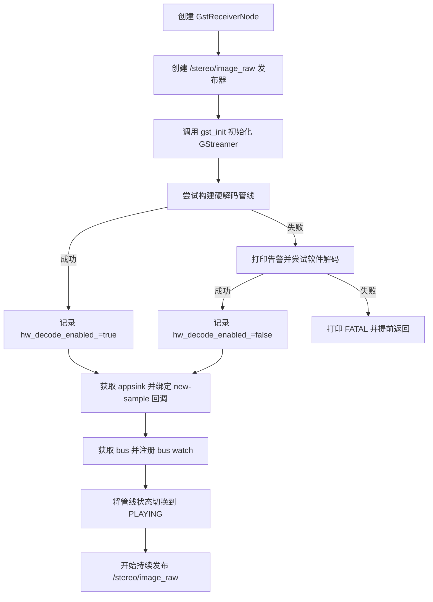
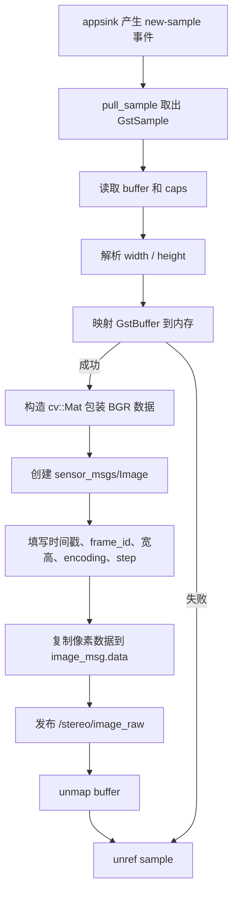

# gst_receiver_node 代码说明文档

## 1. 节点概述

### 1.1 用途

`gst_receiver_node` 的职责是从网络上接收 Raspberry Pi 推送过来的 `UDP/RTP/H.264` 视频流，完成解码和像素格式转换，再把结果封装成 ROS 2 图像消息并发布到 `/stereo/image_raw`。

对初学者来说，可以把它理解成一个“视频输入适配器”：

| 角色 | 说明 |
| --- | --- |
| 网络输入端 | 从 `5600/UDP` 端口接收视频，不是从 ROS topic 收数据 |
| 解码端 | 优先尝试 NVIDIA 硬解码，失败后回退到软件解码 |
| ROS 输出端 | 把每一帧转换成 `sensor_msgs/msg/Image` 并发布 |

### 1.2 所属功能包

| 项目 | 内容 |
| --- | --- |
| 功能包名 | `gst_receiver` |
| 主源码文件 | `ros2_ws/src/gst_receiver/src/gst_receiver_node.cpp` |
| 头文件 | `ros2_ws/src/gst_receiver/include/gst_receiver/gst_receiver_node.hpp` |
| 入口文件 | `ros2_ws/src/gst_receiver/src/gst_receiver_main.cpp` |
| 启动文件 | `ros2_ws/src/gst_receiver/launch/gst_receiver.launch.py` |

### 1.3 在系统中的角色

在当前系统默认链路中，`gst_receiver_node` 位于视觉栈最前端：

```text
Raspberry Pi 摄像头推流
  -> UDP/H.264
  -> gst_receiver_node
  -> /stereo/image_raw
  -> stereo_splitter_node
  -> detection_node
  -> tracker_node
  -> ...
```

它本身不做目标检测、跟踪或控制，只负责把“网络码流”变成“ROS 图像消息”。

## 2. 依赖项

### 2.1 ROS 2 版本与功能包依赖

> 说明：仓库顶层 `README.md` 标明当前项目基于 `ROS 2 Jazzy`；包级依赖来自 `gst_receiver/package.xml` 和 `CMakeLists.txt`。

| 类别 | 名称 | 来源 | 在本节点中的作用 |
| --- | --- | --- | --- |
| ROS 2 发行版 | `ROS 2 Jazzy` | 顶层文档 | 提供 `rclcpp`、launch、QoS 等基础能力 |
| ROS 2 C++ 客户端库 | `rclcpp` | `package.xml` | 提供节点、发布器、日志、时间戳 |
| 标准消息包 | `sensor_msgs` | `package.xml` | 发布 `sensor_msgs/msg/Image` |
| 图像桥接包 | `cv_bridge` | `package.xml` | 当前源码未直接使用，但已作为构建依赖声明 |
| OpenCV | `opencv` / `OpenCV` | `package.xml` / `CMakeLists.txt` | 用 `cv::Mat` 包装已解码的 BGR 图像缓冲区 |
| GStreamer 核心库 | `gstreamer-1.0` | `package.xml` / `pkg_check_modules` | 搭建视频接收与解码管线 |
| GStreamer AppSink | `gstreamer-app-1.0` | `package.xml` / `pkg_check_modules` | 通过 `appsink` 把视频帧取回 C++ 代码 |
| 共享入口辅助 | `shared/ros2_single_node_main.hpp` | 本仓库共享代码 | 复用单节点 `main()` 启动模板 |

### 2.2 第三方库和运行期组件

| 名称 | 类型 | 说明 |
| --- | --- | --- |
| `nvh264dec` | GStreamer 解码插件 | NVIDIA 硬件 H.264 解码器；存在时优先使用 |
| `avdec_h264` | GStreamer 解码插件 | 软件 H.264 解码器；硬解不可用时回退到它 |
| `rtpjitterbuffer` | GStreamer 网络缓冲插件 | 处理 RTP 抖动，当前延迟固定为 `50 ms` |
| `videoconvert` | GStreamer 像素格式转换插件 | 把解码结果转成 `BGR`，便于 OpenCV/ROS 使用 |
| `appsink` | GStreamer 输出端 | 从 GStreamer 管线取出一帧一帧的图像数据 |

### 2.3 自定义消息

| 名称 | 是否使用 | 说明 |
| --- | --- | --- |
| 自定义消息 / 服务 / 动作 | 否 | 当前节点只使用标准消息 `sensor_msgs/msg/Image` |

## 3. 节点接口清单

### 3.1 非 ROS 外部输入

`gst_receiver_node` 没有 ROS 订阅者，但它有一个很重要的“外部输入”：

| 来源 | 协议 / 格式 | 配置位置 | 用途 |
| --- | --- | --- | --- |
| `UDP:5600` | `RTP/H.264`，`payload=96` | `gst_receiver_node.cpp` 中硬编码 | 接收 Raspberry Pi 推流的视频 |

### 3.2 订阅的话题

| 名称 | 消息类型 | QoS | 回调函数 | 用途 |
| --- | --- | --- | --- | --- |
| 无 | - | - | - | 当前节点不通过 ROS topic 接收数据，输入来自 GStreamer `udpsrc` |

### 3.3 发布的话题

| 名称 | 消息类型 | QoS | 发布频率 | 用途 |
| --- | --- | --- | --- | --- |
| `/stereo/image_raw` | `sensor_msgs/msg/Image` | `SensorDataQoS`，即 `KeepLast(5) + BestEffort + Volatile` | 事件驱动；通常约等于上游相机推流帧率 | 发布已解码的双目拼接彩色图像，供 `stereo_splitter_node` 继续处理 |

补充说明：

| 项目 | 当前值 | 说明 |
| --- | --- | --- |
| `header.frame_id` | `"camera"` | 在 `on_new_sample()` 中硬编码 |
| `encoding` | `"bgr8"` | 由 `videoconvert` 和消息填充逻辑共同保证 |
| `step` | `width * 3` | 每像素 3 字节，BGR 三通道 |

### 3.4 提供的服务 / 动作

| 名称 | 类型 | 用途 |
| --- | --- | --- |
| 无 | - | 当前节点不提供 ROS service 或 action |

### 3.5 客户端调用的服务 / 动作

| 名称 | 类型 | 用途 |
| --- | --- | --- |
| 无 | - | 当前节点不主动调用其他节点的 service 或 action |

### 3.6 TF 坐标系

| 类型 | 坐标系 | 用途 |
| --- | --- | --- |
| 监听 | 无 | 当前节点不监听 TF |
| 广播 | 无 | 当前节点不广播 TF |

## 4. 参数列表

当前源码中没有调用 `declare_parameter()`、`get_parameter()` 或动态参数回调接口，因此 **没有 ROS 参数**。

| 参数名 | 类型 | 默认值 | 取值范围 | 含义 | 是否动态可调 |
| --- | --- | --- | --- | --- | --- |
| 无 | - | - | - | 当前节点的端口、topic 名称、帧 ID、解码策略都写死在源码里 | 否 |

虽然没有 ROS 参数，但下面这些“关键运行值”是硬编码常量，后续非常适合改造成参数：

| 硬编码项 | 当前值 | 位置 | 影响 |
| --- | --- | --- | --- |
| UDP 端口 | `5600` | `try_build_pipeline()` | 改推流端口时必须改代码 |
| RTP 抖动缓冲 | `latency=50` | `try_build_pipeline()` | 影响时延与抗抖动能力 |
| 发布 topic | `/stereo/image_raw` | 构造函数 | 影响下游订阅者 |
| 帧 ID | `camera` | `on_new_sample()` | 影响坐标系语义和可视化显示 |
| 解码优先级 | 先硬解后软解 | 构造函数 | 影响性能和部署环境要求 |

## 5. 核心代码逻辑

### 5.1 类结构和继承关系

`GstReceiverNode` 的类定义很简单，但职责比较集中：

| 成员 / 方法 | 类型 | 作用 |
| --- | --- | --- |
| `GstReceiverNode` | `public rclcpp::Node` | ROS 2 节点主体 |
| `pipeline_` | `GstElement *` | GStreamer 管线对象 |
| `bus_` | `GstBus *` | GStreamer 总线，用于接收错误和 EOS 消息 |
| `image_pub_` | ROS 发布器 | 发布 `/stereo/image_raw` |
| `hw_decode_enabled_` | `bool` | 记录当前是否启用了硬解码 |
| `try_build_pipeline()` | 成员函数 | 负责按硬解/软解方案构造管线 |
| `on_bus_message()` | 静态回调 | 处理 GStreamer bus 消息 |
| `on_new_sample()` | 静态回调 | 处理 `appsink` 新帧事件并发布 ROS 图像 |

继承关系可以简化为：

```text
rclcpp::Node
  └── GstReceiverNode
```

### 5.2 构造函数初始化流程

构造函数负责完成节点绝大部分初始化工作，流程如下：



对应的关键代码如下：

```cpp
image_pub_ = this->create_publisher<sensor_msgs::msg::Image>(
  "/stereo/image_raw",
  rclcpp::SensorDataQoS());  // 传感器图像通常优先低延迟，而不是强可靠

gst_init(nullptr, nullptr);  // 初始化 GStreamer 全局运行环境

if (!try_build_pipeline(true)) {  // 先尝试 NVIDIA 硬解码
  RCLCPP_WARN(this->get_logger(),
              "nvh264dec unavailable, falling back to software decoding");
  if (!try_build_pipeline(false)) {  // 硬解失败后再回退到软件解码
    RCLCPP_FATAL(this->get_logger(),
                 "Both hardware and software decoding pipelines failed");
    return;  // 提前返回：节点对象仍存在，但不会有有效视频输出
  }
}
```

### 5.3 `try_build_pipeline()` 的处理逻辑

这个函数是节点的核心 helper，用来构造 GStreamer 管线，并验证管线至少可以进入 `PAUSED` 状态。

### 5.3.1 管线阶段说明

| 阶段 | 硬解码路径 | 软解码路径 | 作用 |
| --- | --- | --- | --- |
| 网络输入 | `udpsrc port=5600` | `udpsrc port=5600` | 从本机 `5600` 端口收 UDP 包 |
| RTP 抖动处理 | `rtpjitterbuffer latency=50` | `rtpjitterbuffer latency=50` | 平滑网络抖动 |
| RTP 解包 | `rtph264depay` | `rtph264depay` | 从 RTP 负载中取出 H.264 码流 |
| H.264 解析 | `h264parse` | 无 | 为硬解码路径补充码流解析 |
| H.264 解码 | `nvh264dec` | `avdec_h264 max-threads=0` | 把压缩视频还原为原始图像 |
| GPU 下载 | `cudadownload` | 无 | 把 GPU 侧图像拉回主存 |
| 像素格式转换 | `videoconvert ! video/x-raw,format=BGR` | 同左 | 统一输出为 OpenCV 友好的 BGR |
| 应用层取帧 | `appsink` | `appsink` | 把帧交给 C++ 回调 |

### 5.3.2 为什么先切到 `PAUSED`

函数在 `gst_parse_launch()` 成功后，会先执行：

```cpp
GstStateChangeReturn ret = gst_element_set_state(p, GST_STATE_PAUSED);
if (ret == GST_STATE_CHANGE_FAILURE) {
  gst_element_set_state(p, GST_STATE_NULL);  // 失败时先回收资源
  gst_object_unref(p);                       // 释放临时管线对象
  return false;                              // 通知上层尝试回退方案
}
```

这样做的目的，是在真正 `PLAYING` 之前尽早发现插件缺失、链接失败或状态切换失败。

### 5.3.3 处理结果

| 场景 | 结果 |
| --- | --- |
| 硬解码可用 | `pipeline_` 指向硬解管线，`hw_decode_enabled_=true` |
| 硬解码不可用，但软解可用 | `pipeline_` 指向软解管线，`hw_decode_enabled_=false` |
| 两种方案都失败 | 构造函数打印 `FATAL` 并提前返回 |

### 5.4 主要回调函数的处理流程

先说明一个基础概念：**回调函数** 就是“某个事件发生时自动被调用的函数”。本节点的两个主要回调都不是 ROS 订阅回调，而是 GStreamer 回调。

### 5.4.1 `on_new_sample()`：收到一帧图像时发布 ROS 消息

| 项目 | 内容 |
| --- | --- |
| 触发条件 | `appsink` 收到一帧完整图像，且 `emit-signals=true` |
| 输入 | `GstSample`，内部包含 `GstBuffer` 和图像尺寸信息 |
| 输出 | 向 `/stereo/image_raw` 发布一条 `sensor_msgs/msg/Image` |
| 处理结果 | 成功时发布一帧图像；失败时本次帧被丢弃，不会重试 |

处理流程如下：



关键代码片段如下：

```cpp
if (gst_buffer_map(buffer, &map, GST_MAP_READ)) {   // 把 GStreamer buffer 映射到可读内存
  cv::Mat frame(height, width, CV_8UC3, map.data);  // 按 BGR 三通道包装成 OpenCV 矩阵

  auto image_msg = std::make_unique<sensor_msgs::msg::Image>();
  image_msg->header.stamp = node->now();            // 使用当前 ROS 时间作为时间戳
  image_msg->header.frame_id = "camera";            // 当前实现固定写死为 camera
  image_msg->encoding = "bgr8";                     // 明确声明图像编码
  image_msg->step = width * 3;                      // 每行字节数 = 宽度 * 3 通道
  image_msg->data.assign(frame.data,
                         frame.data + (height * width * 3));  // 拷贝像素数据到 ROS 消息

  node->image_pub_->publish(std::move(image_msg));  // 发布给下游 ROS 节点
  gst_buffer_unmap(buffer, &map);                   // 释放映射
}
```

初学者容易忽略的一点是：这里虽然创建了 `cv::Mat`，但 **没有做图像算法处理**，只是借助 OpenCV 用一种方便的方式描述内存布局。

### 5.4.2 `on_bus_message()`：处理 GStreamer 总线消息

| 项目 | 内容 |
| --- | --- |
| 触发条件 | GStreamer bus 上出现错误消息或 EOS 消息，并且 watch 被调度执行 |
| 输入 | `GstMessage` |
| 输出 | ROS 日志 |
| 处理结果 | 只记录日志，不做自动恢复、重连或重建管线 |

处理分支如下：

| 消息类型 | 处理逻辑 | 结果 |
| --- | --- | --- |
| `GST_MESSAGE_ERROR` | 调用 `gst_message_parse_error()` 解析错误内容 | 打印 `RCLCPP_ERROR` 日志 |
| `GST_MESSAGE_EOS` | 记录流结束信息 | 打印 `RCLCPP_INFO` 日志 |
| 其他消息 | 忽略 | 无额外动作 |

这里要注意：当前实现只负责“报错”，不负责“自愈”。如果视频流断开，节点不会自动重建管线。

### 5.5 关键机制说明

严格来说，这个节点没有复杂的业务算法，也没有独立状态机；它更像是一个“事件驱动的数据搬运节点”。真正值得理解的是下面三个机制：

| 机制 | 说明 | 对系统的影响 |
| --- | --- | --- |
| 硬解码优先，软解码回退 | 优先用 `nvh264dec`，失败后改用 `avdec_h264` | 提升可移植性，同一份代码能在有/无 NVIDIA 插件的机器上运行 |
| 低延迟优先 | `appsink sync=false max-buffers=2 drop=true` | 当下游来不及处理时，优先丢旧帧，减少实时跟踪的拖尾感 |
| 固定输出 BGR | 强制 `video/x-raw,format=BGR` | 简化与 OpenCV、ROS 图像消息的对接 |

## 6. 生命周期与线程模型

### 6.1 生命周期

| 阶段 | 发生位置 | 说明 |
| --- | --- | --- |
| 创建节点 | 构造函数 | 创建发布器、初始化 GStreamer、构建管线、绑定回调、启动播放 |
| 运行中 | `PLAYING` 状态 | 持续等待 GStreamer 新帧，并按帧发布 ROS 图像 |
| 销毁节点 | 析构函数 | 将管线切回 `NULL`，释放 `pipeline_` 与 `bus_`，调用 `gst_deinit()` |

析构代码的意图很直接：

```cpp
if (pipeline_) {
  gst_element_set_state(pipeline_, GST_STATE_NULL);  // 先停掉管线
  gst_object_unref(pipeline_);                       // 再释放 GStreamer 对象
}
if (bus_) {
  gst_object_unref(bus_);                            // 释放总线对象
}
gst_deinit();                                        // 反初始化 GStreamer
```

### 6.2 执行器类型

| 运行方式 | 入口 | 执行器模型 | 说明 |
| --- | --- | --- | --- |
| 单独运行 `gst_receiver_node` | `gst_receiver_main.cpp` -> `spin_single_node_main()` | 等价于单节点 `rclcpp::spin()` | 这是默认启动方式 |
| 作为 `vision_front` 组合节点运行 | `robot_bringup/src/vision_front_main.cpp` | `MultiThreadedExecutor` | 仅用于实验性单进程组合运行 |

对初学者来说，**执行器（executor）** 可以理解为“ROS 回调调度器”。它负责让 ROS 的订阅、定时器、service 等回调有机会执行。

### 6.3 回调组与定时器

| 项目 | 当前实现 |
| --- | --- |
| 回调组（Callback Group） | 未显式创建 |
| ROS 订阅回调 | 无 |
| 定时器（Timer） | 无 |
| Service / Action 回调 | 无 |

### 6.4 实际线程模型

虽然默认入口是单线程 `rclcpp::spin()`，但这个节点的图像处理并不是靠 ROS executor 驱动的，而是靠 GStreamer 内部线程驱动的：

| 线程来源 | 执行内容 |
| --- | --- |
| ROS executor 线程 | 维持节点生命周期，处理未来可能出现的 ROS 事件 |
| GStreamer streaming 线程 | 触发 `on_new_sample()`，拉取和发布图像 |
| GLib / GStreamer bus 相关线程或主循环上下文 | 分发 `on_bus_message()`（取决于 bus watch 是否被正常调度） |

这意味着：

1. `on_new_sample()` 不是 ROS 订阅回调。
2. 即使节点没有任何 ROS 订阅者，它也能持续发布图像。
3. 当前 `gst_bus_add_watch()` 依赖 GLib main context；源码里没有显式运行独立的 GLib main loop，后续如果发现错误日志没有按预期出现，应优先检查这一点。

## 7. 启动方式

### 7.1 `ros2 run` 命令示例

先在 WSL2 侧准备 ROS 环境：

```bash
source /opt/ros/jazzy/setup.bash
cd /home/peter/dog/dog_dev
source ros2_ws/install/setup.bash
export ROBOT_DDS_ROLE=wsl
source scripts/ros2_network_env.sh
ros2 run gst_receiver gst_receiver_node
```

启动前提：

| 条件 | 说明 |
| --- | --- |
| Raspberry Pi 正在推流 | 需要把 H.264/RTP 推到当前主机的 `5600/UDP` |
| 本机已完成工作区构建 | `ros2_ws/install/setup.bash` 必须存在 |
| GStreamer 插件齐全 | 至少要有 `avdec_h264`；若想硬解还要有 `nvh264dec` |

### 7.2 launch 文件示例

当前仓库中的最简 launch 文件如下：

```python
from launch import LaunchDescription
from launch_ros.actions import Node

def generate_launch_description():
    return LaunchDescription([
        Node(
            package='gst_receiver',          # 节点所属功能包
            executable='gst_receiver_node',  # 可执行文件名
            name='gst_receiver_node',        # ROS 节点名
            output='screen',                 # 日志打印到终端
        )
    ])
```

如果要启动完整视觉链路，使用系统级 launch：

```bash
ros2 launch robot_bringup vision_stack.launch.py
```

### 7.3 参数 YAML 配置示例

当前节点没有 ROS 参数，因此 YAML 只能写成“占位配置”：

```yaml
gst_receiver_node:
  ros__parameters: {}  # 当前源码没有 declare_parameter()，这里不会改变节点行为
```

如果后续把端口、帧 ID、topic 名称改成参数，推荐从下面这些键开始：

```yaml
gst_receiver_node:
  ros__parameters:
    udp_port: 5600
    topic_name: "/stereo/image_raw"
    frame_id: "camera"
    prefer_hw_decode: true
    jitter_latency_ms: 50
```

> 上面这一段是“建议的未来参数化方向”，不是当前源码已经支持的配置项。

## 8. 调试与排错

### 8.1 常见问题

| 现象 | 可能原因 | 排查方法 | 处理建议 |
| --- | --- | --- | --- |
| 节点启动了，但 `/stereo/image_raw` 没有数据 | Raspberry Pi 没有推流；端口不对；管线构建失败 | 看终端启动日志；执行 `ros2 topic hz /stereo/image_raw` | 先确认 Pi 侧推流目标 IP 和端口是当前主机 `5600` |
| 启动时出现 `nvh264dec unavailable` | 本机没有 NVIDIA 硬解码插件 | 这是告警不是致命错误 | 只要后面能回退到 `avdec_h264`，节点仍可工作 |
| 启动时出现 `Both hardware and software decoding pipelines failed` | 硬解、软解都不可用，或 GStreamer 管线无法进入 `PAUSED` | 检查 GStreamer 依赖是否安装完整 | 优先验证 `avdec_h264` 是否存在 |
| 节点存在但仍无图像发布 | 构造函数提前返回后，节点对象仍可能被 `spin` 保持存活 | `ros2 node list` 能看到节点，但 `ros2 topic hz /stereo/image_raw` 为 0 | 重点看节点启动最早期的 `WARN/FATAL` 日志 |
| 图像有明显延迟 | 网络抖动、软解码 CPU 压力大、下游处理过慢 | 观察 `ros2 topic hz /stereo/image_raw`，结合 `top` / `nvidia-smi` | 优先确认是否进入硬解码模式 |
| `frame_id` 不符合下游预期 | 当前代码把 `frame_id` 写死为 `camera` | `ros2 topic echo /stereo/image_raw --once` | 如需统一 TF 语义，建议把它改成参数 |
| GStreamer 错误日志没有按预期打印 | bus watch 依赖 GLib main context | 对照源码检查 `gst_bus_add_watch()` 的使用方式 | 后续可改为主动轮询 bus 或显式集成 GLib 主循环 |

### 8.2 日志与命令行排查方法

| 目的 | 命令 |
| --- | --- |
| 查看节点是否启动 | `ros2 node list` |
| 查看节点接口 | `ros2 node info /gst_receiver_node` |
| 查看图像 topic 是否存在 | `ros2 topic list | grep stereo` |
| 查看图像发布频率 | `ros2 topic hz /stereo/image_raw` |
| 查看单帧消息头 | `ros2 topic echo /stereo/image_raw --once` |
| 检查硬解插件 | `gst-inspect-1.0 nvh264dec` |
| 检查软解插件 | `gst-inspect-1.0 avdec_h264` |

### 8.3 可视化工具建议

| 工具 | 用途 | 建议 |
| --- | --- | --- |
| `rqt_graph` | 看节点和 topic 连接关系 | 先确认 `/gst_receiver_node -> /stereo/image_raw -> /stereo_splitter_node` 链路是否存在 |
| `rqt_image_view` | 直接查看图像内容 | 这是排查图像是否正常的首选工具 |
| `rviz2` | 通过 `Image` 显示图像 | 适合在后续叠加 TF、标记框或其他调试信息 |
| `rqt_console` | 观察日志流 | 适合集中查看 `WARN/ERROR` 级别日志 |

## 9. 单元测试与集成测试说明

### 9.1 当前测试现状

| 类型 | 当前状态 | 说明 |
| --- | --- | --- |
| 单元测试 | 无 | `gst_receiver` 包内没有 `ament_add_gtest()` 或专门的测试源码 |
| 包级 lint | 有 | `CMakeLists.txt` 中启用了 `ament_lint_auto` |
| 节点级自动化集成测试 | 无 | 当前没有对 RTP 输入和图像发布进行自动验证 |
| 仓库级烟雾测试 | 有，但较弱 | `scripts/test_vision_stack.sh` 只检查包可用性和 launch 可加载性，且使用前应先确认脚本中的 `setup.bash` 路径是否与本地工作区一致 |
| 端到端联调脚本 | 有 | `scripts/verify_tracking.sh` 可用于整条链路联调时观察 `/stereo/image_raw` 等结果 |

### 9.2 现有可参考测试方式

```bash
# 1. 检查视觉栈 launch 是否可加载
# 使用前先确认脚本里的 setup.bash 路径已经匹配当前工作区
bash scripts/test_vision_stack.sh

# 2. 启动完整视觉链路后，检查图像频率
ros2 topic hz /stereo/image_raw

# 3. 用图像工具查看内容是否正常
rqt_image_view
```

### 9.3 后续建议补充的测试

| 建议项 | 价值 |
| --- | --- |
| 伪造 RTP/H.264 输入流的自动化测试 | 能验证管线是否能真正收到并发布图像 |
| 针对 `on_new_sample()` 的消息字段检查 | 能验证 `encoding`、`frame_id`、`step` 是否正确 |
| 插件缺失场景测试 | 能验证“硬解失败 -> 软解回退”逻辑是否符合预期 |

## 10. 变更记录与待办事项

### 10.1 本文档对应代码基线

| 项目 | 内容 |
| --- | --- |
| 文档编写日期 | `2026-04-29` |
| 代码基线 | 当前工作区中的 `gst_receiver` 包源码 |
| 主要参考文件 | `gst_receiver_node.hpp`、`gst_receiver_node.cpp`、`gst_receiver_main.cpp`、`gst_receiver.launch.py`、`package.xml`、`CMakeLists.txt` |

### 10.2 当前待办事项

| 优先级 | 待办项 | 原因 |
| --- | --- | --- |
| 高 | 把 `udp_port`、`frame_id`、`topic_name`、`prefer_hw_decode`、`latency` 改成 ROS 参数 | 当前全是硬编码，部署灵活性较差 |
| 高 | 增加管线失败后的恢复策略 | 现在只报错，不自动重连或重建管线 |
| 中 | 为 `appsink` 获取失败增加显式错误日志 | 当前 `gst_bin_get_by_name()` 失败时不会提示 |
| 中 | 明确 bus 消息处理线程模型，必要时接入 GLib 主循环或主动轮询 | 提高错误日志和 EOS 处理的确定性 |
| 中 | 增加 `CameraInfo` 或更明确的相机坐标语义 | 便于后续视觉算法和可视化使用 |
| 低 | 清理未使用依赖，如评估 `cv_bridge` 是否仍需要保留 | 减少维护成本 |
| 低 | 补充包描述和许可证信息 | `package.xml` 里目前仍是 `TODO` |

### 10.3 适合初学者继续阅读的源码入口

| 阅读顺序 | 文件 | 建议关注点 |
| --- | --- | --- |
| 1 | `ros2_ws/src/gst_receiver/include/gst_receiver/gst_receiver_node.hpp` | 先看类有哪些成员和回调 |
| 2 | `ros2_ws/src/gst_receiver/src/gst_receiver_node.cpp` | 再看构造、管线创建和图像发布全过程 |
| 3 | `ros2_ws/src/gst_receiver/src/gst_receiver_main.cpp` | 最后看节点是如何被 `ros2 run` 启动的 |
| 4 | `ros2_ws/src/gst_receiver/launch/gst_receiver.launch.py` | 理解 launch 怎样把可执行文件包装成 ROS 节点 |
