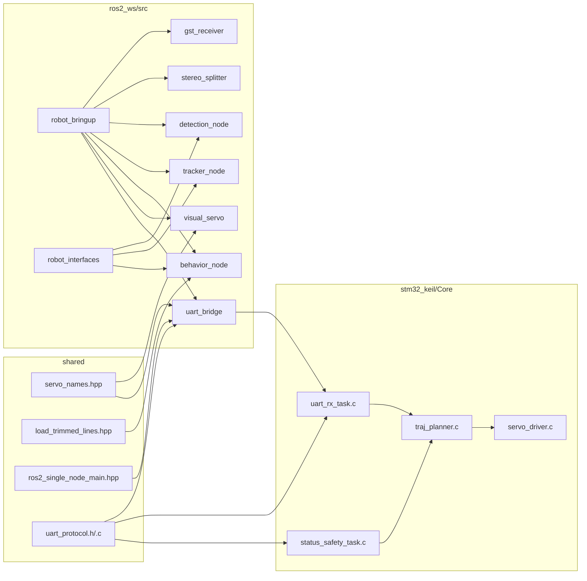

# 模块交互

这个视图面向源码阅读，不是运行时拓扑图。

## 1. 主要依赖边界

## 2. 读图要点

- `robot_bringup` 只做编排，不承载业务逻辑
- `robot_interfaces` 是视觉链路与行为链路之间的接口层
- `shared/servo_names.hpp` 是 ROS 侧和串口桥之间的舵机命名契约
- `shared/uart_protocol.h` 是 Pi 与 STM32 的共同协议边界
- STM32 侧真正执行顺序是 `uart_rx_task -> traj_planner -> servo_driver`

## 3. 当前值得注意的地方

- `behavior_node` 会从 `models/coco_classes.txt` 读取 COCO 标签名
- `leg_motion_node` 已经替代旧的 `visual_servo_node` 成为实际控制入口
- `uart_bridge` 被拆成 `transport / protocol / time_sync` 三个实现文件
