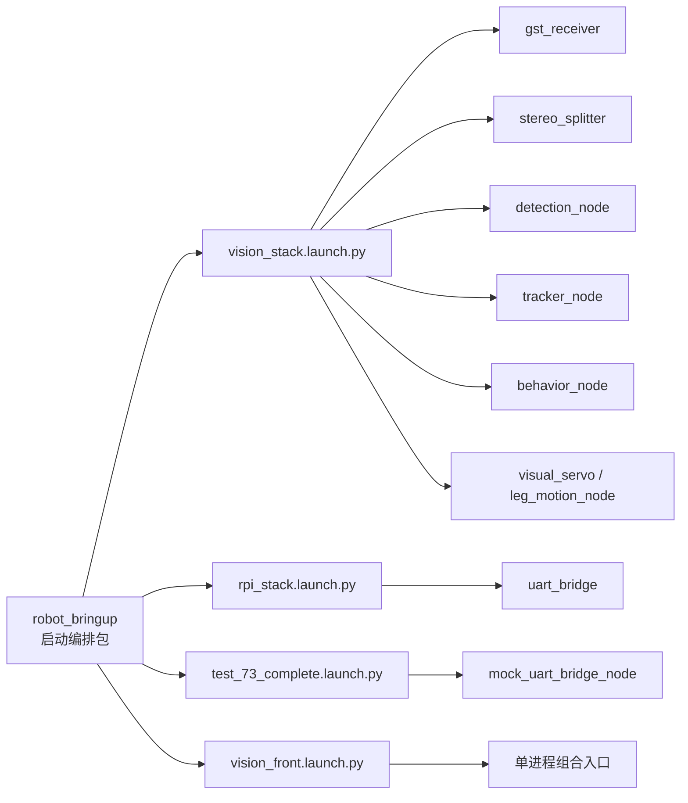
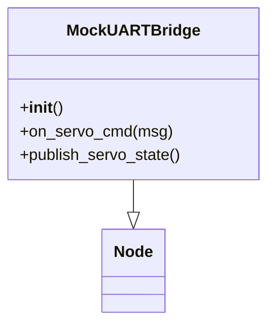
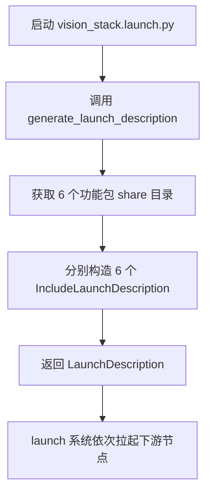

# robot_bringup 代码说明文档

> 文档范围说明：`robot_bringup` 从严格意义上说不是一个“单一 ROS 2 业务节点”，而是一个 **bringup 启动包**。
> 它的主要职责是把多个子包的 launch 文件组合起来，形成完整系统启动入口。
> 这个包内部真正会直接参与 Topic 通信的代码，只有测试用的 `mock_uart_bridge_node`。
> 因此本文档会分成两层来讲：
>
> 1. `robot_bringup` 作为 **启动编排包** 的行为
> 2. `robot_bringup` 包内自带的 **可执行体 / 测试节点**：`mock_uart_bridge` 和可选的 `vision_front`

## 1. 节点概述

### 1.1 用途、所属功能包、系统角色

| 项目 | 说明 |
| --- | --- |
| 功能包名 | `robot_bringup` |
| 源码路径 | `ros2_ws/src/robot_bringup` |
| 构建系统 | `ament_cmake` |
| 主要职责 | 组织系统启动，而不是承载具体算法 |
| 在系统中的角色 | 统一入口，负责把视觉链路、串口桥接链路、测试链路拼装起来 |
| 是否是传统 ROS 2 Node | **不是主业务节点**；主要是 launch 文件集合 |
| 包内附带的真实 ROS 节点 | `mock_uart_bridge_node`（测试用） |
| 包内附带的可选进程入口 | `vision_front`（实验性单进程组合入口） |

对初级 ROS 2 开发者来说，可以把 `robot_bringup` 理解成“总开关”：

- **Topic / Service / Timer / 算法** 主要存在于别的功能包里
- `robot_bringup` 负责决定“**哪些节点一起启动**”
- 启动顺序和配置文件路径也由它间接组织

### 1.2 包内主要文件

| 文件 | 作用 |
| --- | --- |
| `package.xml` | 功能包元信息 |
| `CMakeLists.txt` | 安装 launch 文件、可选构建 `vision_front`、安装 `mock_uart_bridge` |
| `launch/vision_stack.launch.py` | 启动 WSL2 视觉主链 |
| `launch/rpi_stack.launch.py` | 启动 Raspberry Pi 侧串口桥节点 |
| `launch/test_73_complete.launch.py` | 启动视觉主链 + 模拟 UART 节点 |
| `launch/vision_front.launch.py` | 启动单进程实验入口 `vision_front` |
| `src/vision_front_main.cpp` | 进程内组合 `gst_receiver + stereo_splitter + detection_node` |
| `scripts/mock_uart_bridge.py` | 测试用模拟串口桥脚本，安装后名为 `mock_uart_bridge` |

### 1.3 在系统中的位置



### 1.4 四个启动入口的职责差异

| 启动入口 | 运行位置 | 启动内容 | 典型用途 |
| --- | --- | --- | --- |
| `vision_stack.launch.py` | WSL2 / PC | `gst_receiver + stereo_splitter + detection + tracker + behavior + visual_servo` | 正常视觉控制主链 |
| `rpi_stack.launch.py` | Raspberry Pi | `uart_bridge` | 真机串口桥接 |
| `test_73_complete.launch.py` | WSL2 / PC | 视觉主链 + `mock_uart_bridge_node` | 无硬件联调 |
| `vision_front.launch.py` | WSL2 / PC | `vision_front` 单进程程序 | 实验性性能验证 |

## 2. 依赖项

### 2.1 ROS 2 版本

从仓库中的启动脚本和文档可见，当前工程基于 **ROS 2 Jazzy**。

常见证据包括：

- `source /opt/ros/jazzy/setup.bash`
- 部署脚本和快速开始文档均以 Jazzy 为基础

### 2.2 `package.xml` 中显式声明的依赖

| 依赖名 | 类型 | 说明 |
| --- | --- | --- |
| `ament_cmake` | `buildtool_depend` | CMake 构建系统 |
| `ros2launch` | `exec_depend` | 运行 launch 文件需要 |
| `uart_bridge` | `exec_depend` | `rpi_stack.launch.py` 直接依赖 |

### 2.3 代码实际使用到的运行时依赖

虽然 `package.xml` 里只显式写了部分依赖，但从 launch 文件实际代码来看，`robot_bringup` 运行时还依赖下列功能包：

| 依赖功能包 | 被谁使用 | 用途 |
| --- | --- | --- |
| `gst_receiver` | `vision_stack.launch.py`、`vision_front_main.cpp` | 接收 UDP 视频流 |
| `stereo_splitter` | `vision_stack.launch.py`、`vision_front_main.cpp` | 裁剪双目图像 |
| `detection_node` | `vision_stack.launch.py`、`vision_front_main.cpp` | 目标检测 |
| `tracker_node` | `vision_stack.launch.py` | 目标跟踪 |
| `behavior_node` | `vision_stack.launch.py` | 目标选择与像素误差计算 |
| `visual_servo` | `vision_stack.launch.py` | 视觉误差转舵机命令 |
| `uart_bridge` | `rpi_stack.launch.py` | 真机串口桥 |
| `robot_interfaces` | 下游节点间接使用 | 自定义消息与服务接口 |
| `rclpy` | `mock_uart_bridge.py` | Python ROS 2 节点 |
| `sensor_msgs` | `mock_uart_bridge.py` | 使用 `JointState` |

### 2.4 第三方库依赖

这些依赖主要来自可选的 `vision_front`，不是 `robot_bringup` 默认启动所必需：

| 第三方库 | 作用 | 是否默认必需 |
| --- | --- | --- |
| OpenCV | 图像处理支持 | 否，仅 `vision_front` |
| GStreamer (`gstreamer-1.0`, `gstreamer-app-1.0`) | 视频流接收 | 否，仅 `vision_front` |
| ONNX Runtime | 目标检测推理 | 否，仅 `vision_front` |
| `pkg-config` | 查找 GStreamer | 否，仅 `vision_front` |

### 2.5 自定义消息 / 服务依赖

`robot_bringup` 自己不定义消息，也不直接创建自定义消息发布者；但它启动的下游节点会使用 `robot_interfaces`。

| 类型 | 名称 | `robot_bringup` 是否直接使用 | 说明 |
| --- | --- | --- | --- |
| 标准消息 | `sensor_msgs/msg/JointState` | 是（`mock_uart_bridge_node`） | 舵机命令和状态 |
| 自定义消息 | `robot_interfaces/msg/...` | 否（间接） | 由检测、跟踪、行为节点使用 |
| 自定义服务 | `robot_interfaces/srv/SetTargetClass` | 否（间接） | 由 `behavior_node` 提供 |

## 3. 节点接口清单

### 3.1 先理解一个关键点

ROS 2 中只有真正继承 `rclcpp::Node` 或 `rclpy.node.Node` 的对象，才会直接参与 Topic、Service、Timer、TF 等通信。

因此：

- `vision_stack.launch.py`
- `rpi_stack.launch.py`
- `test_73_complete.launch.py`
- `vision_front.launch.py`

这些文件本身都只是 **启动描述文件**，不是 ROS 节点。

### 3.2 `robot_bringup` 包级接口（launch 文件自身）

#### 3.2.1 订阅的话题

| 名称 | 消息类型 | QoS | 回调函数 | 用途 |
| --- | --- | --- | --- | --- |
| 无 | - | - | - | launch 文件本身不直接订阅 Topic |

#### 3.2.2 发布的话题

| 名称 | 消息类型 | QoS | 发布频率 | 用途 |
| --- | --- | --- | --- | --- |
| 无 | - | - | - | launch 文件本身不直接发布 Topic |

#### 3.2.3 提供的服务 / 动作

| 名称 | 类型 | 用途 |
| --- | --- | --- |
| 无 | - | launch 文件本身不提供 Service / Action |

#### 3.2.4 客户端调用的服务 / 动作

| 名称 | 类型 | 用途 |
| --- | --- | --- |
| 无 | - | launch 文件本身不主动发起 Service / Action 调用 |

#### 3.2.5 TF 坐标系（监听 / 广播）

| 类型 | 内容 |
| --- | --- |
| 监听 | 无 |
| 广播 | 无 |

### 3.3 `mock_uart_bridge_node` 接口

`mock_uart_bridge_node` 只会在 `test_73_complete.launch.py` 启动时被拉起，目的是在没有 Raspberry Pi 和 UART 硬件时，模拟 `/uart_bridge_node/output/servo_state` 反馈。

#### 3.3.1 订阅的话题

| 名称 | 消息类型 | QoS | 回调函数 | 用途 |
| --- | --- | --- | --- | --- |
| `/leg_motion_node/output/servo_command` | `sensor_msgs/msg/JointState` | `RELIABLE`, depth=10 | `on_servo_cmd` | 接收腿部舵机目标角，模拟舵机响应 |

#### 3.3.2 发布的话题

| 名称 | 消息类型 | QoS | 发布频率 | 用途 |
| --- | --- | --- | --- | --- |
| `/uart_bridge_node/output/servo_state` | `sensor_msgs/msg/JointState` | `RELIABLE`, depth=10 | 50 Hz | 模拟舵机当前位置反馈 |

#### 3.3.3 提供的服务 / 动作

| 名称 | 类型 | 用途 |
| --- | --- | --- |
| 无 | - | 未实现 |

#### 3.3.4 客户端调用的服务 / 动作

| 名称 | 类型 | 用途 |
| --- | --- | --- |
| 无 | - | 未实现 |

#### 3.3.5 TF 坐标系（监听 / 广播）

| 类型 | 内容 |
| --- | --- |
| 监听 | 无 |
| 广播 | 无 |

### 3.4 `vision_front` 进程接口说明

`vision_front` 是一个 **可执行进程入口**，不是单独的 ROS 节点名。
它在一个进程里直接实例化了：

- `GstReceiverNode`
- `StereoSplitterNode`
- `DetectionNode`

所以：

- 它**不会新增一个叫 `vision_front` 的 Topic 接口层**
- 真正的话题仍然由这 3 个下游节点各自发布和订阅

## 4. 参数列表

### 4.1 `robot_bringup` 自身的 ROS 参数

当前 `robot_bringup` **没有通过 `declare_parameter()` 声明自己的 ROS 参数**，其 launch 文件也没有定义 `DeclareLaunchArgument`。

| 参数名 | 类型 | 默认值 | 取值范围 | 含义 | 是否动态可调 |
| --- | --- | --- | --- | --- | --- |
| 无 | - | - | - | 本包自身没有 ROS 参数 | 否 |

### 4.2 本包相关的“固定配置项”

这些值虽然不是 ROS 参数，但会影响功能包行为，初学者经常会混淆：

| 名称 | 类型 | 默认值 | 取值范围 | 含义 | 是否动态可调 |
| --- | --- | --- | --- | --- | --- |
| `BUILD_VISION_FRONT` | CMake 选项 | `OFF` | `ON/OFF` | 是否构建实验性单进程入口 `vision_front` | 否，编译期 |
| `ONNXRUNTIME_ROOT` | CMake 路径 | 空 | 合法目录路径 | `vision_front` 构建时查找 ONNX Runtime | 否，编译期 |
| `mock_uart_bridge` 定时器周期 | 固定常量 | `0.02 s` | 正数 | 模拟状态反馈频率，等价 50 Hz | 否，代码写死 |
| `servo_angles` 初值 | 固定常量 | `[90, 90, 90, 90]` | 角度数组 | 模拟四个舵机的初始角度 | 否，代码写死 |

### 4.3 `robot_bringup` 间接加载的下游参数文件

虽然本包自己没参数，但它启动的下游节点会通过各自 launch 文件加载 YAML：

| 下游包 | 参数文件 | 被哪个入口间接使用 | 典型参数 |
| --- | --- | --- | --- |
| `detection_node` | `share/detection_node/config/detection.yaml` | `vision_stack.launch.py` | `inference.model_path`、`inference.confidence_threshold` |
| `tracker_node` | `share/tracker_node/config/tracker.yaml` | `vision_stack.launch.py` | `tracking.confidence_threshold`、`tracking.track_buffer` |
| `behavior_node` | `share/behavior_node/config/behavior.yaml` | `vision_stack.launch.py` | `image.width`、`image.center_x` |
| `visual_servo` | `share/visual_servo/config/visual_servo.yaml` | `vision_stack.launch.py` | `controller.control_rate_hz`、PID 参数 |
| `uart_bridge` | `share/uart_bridge/config/uart_bridge.yaml` | `rpi_stack.launch.py` | `uart.device`、`uart.baudrate` |

## 5. 核心代码逻辑

### 5.1 类结构和继承关系

`robot_bringup` 的代码结构比较特殊：大部分文件都不是类，而是“返回 LaunchDescription 的函数”。



包内代码可以分为三类：

| 类型 | 文件 | 特点 |
| --- | --- | --- |
| 启动脚本 | `launch/*.launch.py` | 只有 `generate_launch_description()`，无 ROS 回调 |
| 进程入口 | `src/vision_front_main.cpp` | `main()` 中组装多个节点到同一执行器 |
| 测试节点 | `scripts/mock_uart_bridge.py` | 真正的 ROS 2 节点类 |

### 5.2 `vision_stack.launch.py` 初始化流程

`vision_stack.launch.py` 的逻辑非常直接：查找包路径，然后逐个包含下游 launch 文件。

```python
gst_receiver_dir = get_package_share_directory('gst_receiver')  # 找到包的 share 目录
gst_receiver_launch = IncludeLaunchDescription(
    PythonLaunchDescriptionSource(
        os.path.join(gst_receiver_dir, 'launch', 'gst_receiver.launch.py')  # 拼出子 launch 路径
    )
)
```

完整流程如下：



处理步骤可以概括成：

1. 通过 `get_package_share_directory()` 定位每个子包的安装目录
2. 用 `PythonLaunchDescriptionSource()` 指向子包自己的 launch 文件
3. 用 `IncludeLaunchDescription()` 把子 launch 纳入当前启动树
4. 最后把所有动作放进 `LaunchDescription([...])` 返回

这意味着 `robot_bringup` 并不重新实现视觉处理逻辑，只是把已经存在的节点组合起来。

### 5.3 `rpi_stack.launch.py` 初始化流程

这个文件是最简单的入口，只包含一个子 launch：

1. 找到 `uart_bridge` 包的 share 目录
2. 引入 `uart_bridge.launch.py`
3. 返回只包含一个动作的 `LaunchDescription`

这个入口适合部署在 Raspberry Pi 上，因为 Pi 侧只需要负责 `/leg_motion_node/output/servo_command <-> UART <-> /uart_bridge_node/output/servo_state` 的桥接。

### 5.4 `test_73_complete.launch.py` 初始化流程

这个入口本质上是：

- 先启动完整视觉主链
- 再额外启动一个 `mock_uart_bridge_node`

```mermaid
flowchart TD
    A[启动 test_73_complete.launch.py]
    B[引入 6 个视觉相关 launch]
    C[创建 Node(package=robot_bringup, executable=mock_uart_bridge)]
    D[返回 LaunchDescription]
    E[视觉主链运行]
    F[模拟串口桥开始发布 /uart_bridge_node/output/servo_state]

    A --> B --> C --> D --> E --> F
```

这个入口适合以下场景：

- 还没有 Raspberry Pi
- 串口链路还没打通
- 只想验证 `/behavior_node/output/pixel_error -> /leg_motion_node/output/servo_command -> /uart_bridge_node/output/servo_state` 的 ROS 2 闭环

### 5.5 `vision_front_main.cpp` 初始化流程

`vision_front` 是一个实验性的 **单进程组合入口**。
它把 3 个节点放进同一个 `MultiThreadedExecutor` 中运行，并打开进程内通信优化。

```cpp
rclcpp::NodeOptions opts;
opts.use_intra_process_comms(true);  // 开启进程内通信，减少同进程节点之间的拷贝

auto executor = std::make_shared<rclcpp::executors::MultiThreadedExecutor>();  // 多线程执行器
executor->add_node(std::make_shared<GstReceiverNode>(opts));                    // 视频接收节点
executor->add_node(std::make_shared<StereoSplitterNode>(opts));                 // 图像裁切节点
executor->add_node(std::make_shared<DetectionNode>(opts));                      // 检测节点

executor->spin();  // 进入事件循环，等待回调执行
```

处理流程：

1. `rclcpp::init(argc, argv)` 初始化 ROS 2 客户端库
2. 创建 `NodeOptions`
3. 打开 `use_intra_process_comms(true)`，减少同一进程内节点间的消息复制
4. 创建 `MultiThreadedExecutor`
5. 把 `GstReceiverNode`、`StereoSplitterNode`、`DetectionNode` 加入执行器
6. 调用 `spin()` 持续处理回调

要注意：`vision_front` 本身没有额外算法，它只是“把原本多个进程中的三个节点搬到同一个进程里”。

### 5.6 `MockUARTBridge` 构造函数初始化流程

`mock_uart_bridge.py` 是本包里最像传统 ROS 2 节点的代码。

#### 5.6.1 构造函数关键代码

```python
qos_profile = QoSProfile(
    reliability=ReliabilityPolicy.RELIABLE,  # 可靠传输，适合控制链路
    depth=10                                 # 队列深度 10
)

self.servo_cmd_sub = self.create_subscription(
    JointState,           # 订阅消息类型
    '/leg_motion_node/output/servo_command',         # 订阅的话题名
    self.on_servo_cmd,    # 消息到达时调用的回调
    qos_profile           # QoS 配置
)

self.servo_state_pub = self.create_publisher(
    JointState,           # 发布消息类型
    '/uart_bridge_node/output/servo_state',       # 发布的话题名
    qos_profile           # 和订阅侧保持一致的 QoS
)

self.timer = self.create_timer(0.02, self.publish_servo_state)  # 50 Hz 定时发布状态
```

#### 5.6.2 初始化步骤

1. 调用 `super().__init__('mock_uart_bridge_node')` 注册节点名
2. 创建 `RELIABLE + depth=10` 的 QoS
3. 订阅 `/leg_motion_node/output/servo_command`
4. 创建 `/uart_bridge_node/output/servo_state` 发布器
5. 初始化 4 路舵机角度为 `90°`
6. 创建一个 `0.02 s` 周期定时器，也就是 `50 Hz`
7. 打印日志，提示订阅和发布关系已经建立

### 5.7 主要回调函数处理流程

本包里真正的 ROS 回调主要有两个，全部来自 `MockUARTBridge`。

#### 5.7.1 `on_servo_cmd(self, msg)`

| 项目 | 说明 |
| --- | --- |
| 触发条件 | 收到 `/leg_motion_node/output/servo_command` 的 `sensor_msgs/msg/JointState` 消息 |
| 输入 | `msg.name`、`msg.position`、`msg.effort` |
| 处理结果 | 更新内部 `self.servo_angles`，但不立即发布；等待定时器统一发布 `/uart_bridge_node/output/servo_state` |

处理步骤：

1. 遍历 `msg.position`
2. 将每个关节角从 **弧度转成角度**
3. 读取当前模拟角度 `current`
4. 读取目标角度 `target`
5. 使用 `step = (target - current) * 0.2` 做一个简单的一阶平滑
6. 把结果写回 `self.servo_angles[i]`

这不是严格的物理仿真，而是一个“够用的假反馈模型”。

```mermaid
flowchart TD
    A[/收到 /leg_motion_node/output/servo_command/]
    B[读取 JointState.position]
    C[弧度转角度]
    D[读取当前角度 current]
    E[计算 target]
    F[step = (target - current) * 0.2]
    G[更新 self.servo_angles]
    H[等待定时器发布 /uart_bridge_node/output/servo_state]

    A --> B --> C --> D --> E --> F --> G --> H
```

#### 5.7.2 `publish_servo_state(self)`

| 项目 | 说明 |
| --- | --- |
| 触发条件 | `create_timer(0.02, ...)` 周期性触发 |
| 触发频率 | 50 Hz |
| 输入 | 当前内部数组 `self.servo_angles` |
| 处理结果 | 发布 `/uart_bridge_node/output/servo_state`，供下游控制节点读取 |

处理步骤：

1. 创建新的 `JointState`
2. 写入时间戳 `msg.header.stamp`
3. 写入四个关节名字
4. 把内部角度从 **度转回弧度**
5. `velocity` 和 `effort` 填 0
6. 发布到 `/uart_bridge_node/output/servo_state`

#### 5.7.3 本包中“没有回调”的函数

需要强调一点：

- `generate_launch_description()` 不是 Topic 回调
- `main()` 也不是 Topic 回调

它们是启动入口函数，只在启动阶段执行一次。

### 5.8 关键算法或状态机说明

#### 5.8.1 `robot_bringup` 包本体没有复杂算法

本包本体没有：

- 路径规划算法
- 感知算法
- 控制状态机
- TF 变换计算

它的核心逻辑是“**编排**”。

#### 5.8.2 `mock_uart_bridge_node` 的简化反馈模型

它唯一的“算法味道”来自下面这行代码：

```python
step = (target - current) * 0.2  # 每次只朝目标靠近 20%
```

这表示：

- 角度不会瞬间跳到目标值
- 而是每次回调只前进一小步
- 这样下游看到的 `/uart_bridge_node/output/servo_state` 会更接近“机械系统逐渐响应”的效果

#### 5.8.3 它没有真实串口桥的握手状态机

真实的 `uart_bridge_node` 会有：

- UART 打开
- 握手
- ACTIVE 状态判断
- 丢包检测

而 `mock_uart_bridge_node` **没有** 这些流程，它只是一个最小可用的模拟节点。

## 6. 生命周期与线程模型

### 6.1 是否使用 ROS 2 Lifecycle Node

没有。
当前 `robot_bringup` 包内代码没有使用 `rclcpp_lifecycle::LifecycleNode` 或 `nav2` 常见的生命周期模式。

### 6.2 执行器与线程模型总览

| 入口 / 节点 | 执行器类型 | 回调组 | 定时器 | 说明 |
| --- | --- | --- | --- | --- |
| `vision_stack.launch.py` | 无 | 无 | 无 | 只是 launch 描述文件 |
| `rpi_stack.launch.py` | 无 | 无 | 无 | 只是 launch 描述文件 |
| `test_73_complete.launch.py` | 无 | 无 | 无 | 只是 launch 描述文件 |
| `vision_front` | `MultiThreadedExecutor` | 未显式定义 | 无（本文件中） | 同进程运行 3 个节点 |
| `mock_uart_bridge_node` | `rclpy.spin()` 默认单线程 | 未显式定义，使用默认组 | 50 Hz | 一个订阅回调 + 一个定时器回调 |

### 6.3 `mock_uart_bridge_node` 的线程模型解释

对初学者来说，可以这样理解：

- `rclpy.spin(node)` 会进入事件循环
- 当 `/leg_motion_node/output/servo_command` 来消息时，执行 `on_servo_cmd`
- 当定时器到期时，执行 `publish_servo_state`
- 因为代码里没有显式创建多线程执行器，所以可以按“默认单线程串行处理”来理解

### 6.4 `vision_front` 的线程模型解释

`vision_front` 明确创建了 `MultiThreadedExecutor`，说明作者希望：

- 同一个进程中允许多个节点回调并发执行
- 配合 `use_intra_process_comms(true)` 提升前端视觉链路效率

但需要注意：

- 这个多线程能力属于 `vision_front` 进程
- 具体每个节点内部怎么处理回调，仍然取决于这些节点各自的实现

## 7. 启动方式

### 7.1 `ros2 run` 命令示例

#### 7.1.1 直接运行测试用模拟节点

```bash
source /opt/ros/jazzy/setup.bash
cd /home/peter/dog/dog_dev
source ros2_ws/install/setup.bash
ros2 run robot_bringup mock_uart_bridge
```

适用场景：

- 想单独验证 `/leg_motion_node/output/servo_command -> /uart_bridge_node/output/servo_state`
- 不想启动完整视觉链路

#### 7.1.2 运行 `vision_front`（需要先启用构建）

```bash
colcon build --packages-select robot_bringup --cmake-args -DBUILD_VISION_FRONT=ON
source ros2_ws/install/setup.bash
ros2 run robot_bringup vision_front
```

注意：

- 还需要正确设置 `ONNXRUNTIME_ROOT`
- 这是实验性入口，不是默认部署方式

### 7.2 `ros2 launch` 命令示例

#### 7.2.1 启动视觉主链

```bash
source /opt/ros/jazzy/setup.bash
cd /home/peter/dog/dog_dev
source ros2_ws/install/setup.bash
export ROBOT_DDS_ROLE=wsl
source scripts/ros2_network_env.sh
ros2 launch robot_bringup vision_stack.launch.py
```

#### 7.2.2 启动 Raspberry Pi 串口桥

```bash
source /opt/ros/jazzy/setup.bash
source ros2_ws/install/setup.bash
export ROBOT_DDS_ROLE=rpi
source scripts/ros2_network_env.sh
ros2 launch robot_bringup rpi_stack.launch.py
```

#### 7.2.3 启动无硬件完整测试链

```bash
source /opt/ros/jazzy/setup.bash
cd /home/peter/dog/dog_dev
source ros2_ws/install/setup.bash
ros2 launch robot_bringup test_73_complete.launch.py
```

#### 7.2.4 启动单进程实验入口

```bash
ros2 launch robot_bringup vision_front.launch.py
```

前提是 `vision_front` 已经被成功构建。

### 7.3 自定义 launch 文件示例

如果你想在自己的 launch 文件里复用 `robot_bringup`：

```python
from launch import LaunchDescription
from launch.actions import IncludeLaunchDescription
from launch.launch_description_sources import PythonLaunchDescriptionSource
from ament_index_python.packages import get_package_share_directory
import os

def generate_launch_description():
    bringup_dir = get_package_share_directory('robot_bringup')  # 找到 robot_bringup 安装目录

    return LaunchDescription([
        IncludeLaunchDescription(
            PythonLaunchDescriptionSource(
                os.path.join(bringup_dir, 'launch', 'vision_stack.launch.py')  # 复用现成视觉主链入口
            )
        )
    ])
```

### 7.4 参数 YAML 配置示例

`robot_bringup` 自己没有 YAML，但它间接依赖的下游参数文件很重要。下面给出两个最常用示例。

#### 7.4.1 `behavior.yaml`

```yaml
behavior_node:
  ros__parameters:
    image.width: 320   # 输入图像宽度，单位：像素
    image.height: 480  # 输入图像高度，单位：像素
    image.center_x: 160      # 期望目标中心 x
    image.center_y: 240      # 期望目标中心 y
```

#### 7.4.2 `uart_bridge.yaml`

```yaml
uart_bridge_node:
  ros__parameters:
    uart.device: "/dev/ttyAMA0"  # 串口设备路径
    uart.baudrate: 921600        # 波特率
```

#### 7.4.3 `visual_servo.yaml`

```yaml
leg_motion_node:
  ros__parameters:
    controller.control_rate_hz: 30.0         # 控制循环频率
    controller.deadband_pixels: 5.0              # 死区像素，误差小于该值时不动作
    servo.neutral_angle_deg: 90.0       # 舵机中位角
    gait.frequency_hz: 2.0        # 步态频率
    target.timeout_sec: 0.5       # 目标丢失超时
```

## 8. 调试与排错

### 8.1 常见问题

| 现象 | 可能原因 | 排查建议 |
| --- | --- | --- |
| `ros2 launch robot_bringup vision_stack.launch.py` 失败 | 下游包未构建或未安装 | 用 `ros2 pkg prefix <pkg>` 检查 `gst_receiver`、`detection_node` 等 |
| `rpi_stack.launch.py` 启动后没有 `/uart_bridge_node/output/servo_state` | Pi 串口未连通或 STM32 未握手 | 检查 `/dev/ttyAMA0`、波特率、供电、连线 |
| `test_73_complete.launch.py` 运行了但舵机状态不变化 | `/leg_motion_node/output/servo_command` 没有数据或目标未被检测到 | `ros2 topic echo /leg_motion_node/output/servo_command`、检查 `behavior_node` 输出 |
| `ros2 run robot_bringup vision_front` 找不到 | 没有用 `-DBUILD_VISION_FRONT=ON` 编译 | 重新构建 `robot_bringup` |
| `vision_front` 编译失败 | `ONNXRUNTIME_ROOT` 未设置或依赖库缺失 | 检查 CMake 配置与库路径 |
| launch 能跑但参数不生效 | 下游包配置文件未安装或路径写错 | 检查 `share/<pkg>/config/*.yaml` 是否存在 |

### 8.2 日志查看方法

#### 8.2.1 查看节点列表

```bash
ros2 node list
```

#### 8.2.2 查看话题列表

```bash
ros2 topic list
```

#### 8.2.3 查看话题频率

```bash
ros2 topic hz /stereo/image_raw
ros2 topic hz /tracker_node/output/tracked_objects
ros2 topic hz /uart_bridge_node/output/servo_state
```

#### 8.2.4 直接查看消息内容

```bash
ros2 topic echo /leg_motion_node/output/servo_command
ros2 topic echo /uart_bridge_node/output/servo_state
ros2 topic echo /behavior_node/output/pixel_error
```

#### 8.2.5 查看已安装的 launch 文件

```bash
PKG_PREFIX=$(ros2 pkg prefix robot_bringup)
find "$PKG_PREFIX/share/robot_bringup/launch" -maxdepth 1 -type f
```

#### 8.2.6 查看 launch 参数帮助

```bash
ros2 launch --show-args robot_bringup rpi_stack.launch.py
```

### 8.3 可视化工具建议

| 工具 | 推荐用途 | 说明 |
| --- | --- | --- |
| `rqt_graph` | 看节点与话题拓扑 | 最适合理解 `robot_bringup` 的编排效果 |
| `rqt_image_view` | 看图像话题 | 检查 `/stereo/image_raw`、`~/input/image` |
| `rqt_plot` | 看数值曲线 | 检查 `/behavior_node/output/pixel_error/x`、`/behavior_node/output/pixel_error/y` |
| `rviz2` | 组合可视化 | 本包不涉及 TF，但可用于展示图像、轨迹等下游结果 |

### 8.4 推荐调试顺序

对于初学者，建议按下面顺序排查：

1. `ros2 node list` 看节点是否都起来了
2. `ros2 topic list` 看关键话题是否存在
3. `ros2 topic hz /stereo/image_raw` 看数据流是否持续
4. `ros2 topic echo /tracker_node/output/tracked_objects` 看感知链路是否产出
5. `ros2 topic echo /leg_motion_node/output/servo_command` 看控制链路是否产出
6. `ros2 topic echo /uart_bridge_node/output/servo_state` 看执行反馈是否闭环

## 9. 单元测试与集成测试说明

### 9.1 当前已有的测试 / 验证脚本

`robot_bringup` 目前没有看到专门的 `gtest` / `pytest` 单元测试源码，但仓库提供了几个非常实用的脚本级验证入口。

| 脚本 | 类型 | 主要检查内容 |
| --- | --- | --- |
| `scripts/test_launch_files.sh` | 快速检查 | 包是否可见、launch 文件语法、launch 列表 |
| `scripts/test_vision_stack.sh` | 入口验证 | `vision_stack` 所需下游包是否存在、能否装载 LaunchDescription |
| `scripts/test_73_wsl2_launch.sh` | 联调启动脚本 | 启动 WSL2 视觉主链 |
| `scripts/verify_tracking.sh` | 端到端验证 | 节点存在、话题频率、追踪输出、像素误差收敛 |

### 9.2 `test_launch_files.sh` 在测什么

这个脚本主要做 4 件事：

1. 检查 `robot_bringup` 是否已被 ROS 2 识别
2. 检查 `vision_stack.launch.py` Python 语法
3. 检查 `rpi_stack.launch.py` Python 语法
4. 尝试确认 launch 入口是否已安装

说明：

- 当前脚本最后一步使用的是 `ros2 launch robot_bringup --list`
- 这不是当前 ROS 2 CLI 的通用有效写法
- 手工排查时更建议直接查看 `share/robot_bringup/launch/` 目录

### 9.3 `test_vision_stack.sh` 在测什么

这个脚本面向“视觉主链能否被装载”：

1. 检查 `gst_receiver`、`stereo_splitter`、`detection_node`、`tracker_node`、`behavior_node`、`visual_servo` 是否全部存在
2. 尝试短时间执行 `ros2 launch robot_bringup vision_stack.launch.py`
3. 在 Python 里调用 `generate_launch_description()`，验证能否成功生成 launch 动作

说明：

- 当前脚本使用 `from robot_bringup.vision_stack import generate_launch_description`
- 但 `robot_bringup` 不是一个可直接这样导入的 Python 包
- 所以这一项在当前仓库结构下可能失败，不一定代表 launch 文件本身语法错误

### 9.4 当前测试覆盖缺口

目前还缺少：

- `robot_bringup` 包级 `launch_testing` 自动化测试
- `mock_uart_bridge_node` 的单元测试
- `vision_front` 的构建开关与运行测试
- “参数文件缺失时是否给出清晰报错”的自动测试

## 10. 变更记录与待办事项

### 10.1 当前实现状态总结

| 项目 | 当前状态 |
| --- | --- |
| 视觉主链统一入口 | 已实现（`vision_stack.launch.py`） |
| Pi 侧串口桥入口 | 已实现（`rpi_stack.launch.py`） |
| 无硬件闭环测试入口 | 已实现（`test_73_complete.launch.py`） |
| 单进程实验入口 | 已实现但默认不构建（`vision_front`） |
| 模拟 UART 节点 | 已实现（`mock_uart_bridge_node`） |

### 10.2 建议的待办事项

| 待办项 | 原因 |
| --- | --- |
| 在 `package.xml` 中补全 `vision_stack` 实际依赖的 `exec_depend` | 当前 launch 实际依赖多于显式声明，容易让部署者误判 |
| 为 `vision_stack.launch.py` 增加 `DeclareLaunchArgument` | 便于按需开关某些节点或切换配置文件 |
| 为 `mock_uart_bridge_node` 增加 ROS 参数 | 例如反馈频率、初始角度、平滑系数目前都写死在代码中 |
| 为 `vision_front` 增加文档和自动测试 | 当前是实验入口，初学者容易不知道构建前提 |
| 增加 `launch_testing` | 提高 bringup 包回归验证能力 |

### 10.3 面向初学者的结论

如果你刚开始读这个包，只要先记住一句话：

> `robot_bringup` 的重点不是“算法怎么写”，而是“系统怎么被一起启动”。

阅读顺序建议：

1. 先看 `vision_stack.launch.py` 和 `rpi_stack.launch.py`
2. 再看 `test_73_complete.launch.py`
3. 如果要理解本包中唯一直接参与 Topic 通信的代码，再看 `scripts/mock_uart_bridge.py`
4. 如果要研究进程内组合优化，再看 `src/vision_front_main.cpp`
