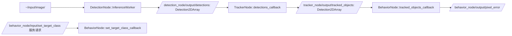

robot_interfaces 接口包代码说明文档

这份文档先说明一个关键事实：`robot_interfaces` 在当前仓库里不是可执行 ROS 2 节点，而是一个**纯接口功能包**。它的职责是集中定义消息（`msg`）和服务（`srv`）类型，供 `detection_node`、`tracker_node`、`behavior_node` 等真正运行的节点共同使用。

因此，下面仍然按“节点代码说明文档”的章节结构来写，但会明确标注哪些部分对 `robot_interfaces` 来说是“不适用”，以及这些接口在系统里究竟由谁发布、订阅和处理。

## 1. 节点概述

### 1.1 用途

`robot_interfaces` 的主要用途是给整个机器人视觉链路提供统一的数据契约，避免不同节点各自定义重复结构。

对初级 ROS 2 开发者来说，可以把它理解成：

- `detection_node` 负责“检测出什么目标”
- `tracker_node` 负责“给目标分配稳定轨迹 ID”
- `behavior_node` 负责“从这些目标里选出当前要跟踪的那个”
- `robot_interfaces` 负责“约定这些节点之间到底传什么数据、字段叫什么、类型是什么”

### 1.2 所属功能包

| 项目 | 内容 |
| --- | --- |
| 功能包名 | `robot_interfaces` |
| 功能包路径 | `ros2_ws/src/robot_interfaces` |
| 包类型 | `rosidl_interface_packages` |
| 是否为可执行节点包 | 否 |
| 是否包含 `main()` / `src/*.cpp` | 否 |
| 是否包含 launch 文件 | 否 |

### 1.3 在系统中的角色

系统主链路如下：

```text
gst_receiver -> stereo_splitter -> detection_node -> tracker_node -> behavior_node -> visual_servo -> uart_bridge -> STM32
```

`robot_interfaces` 不直接参与计算，但它位于这条链路的“接口层”：

- 为 `/detection_node/output/detections` 提供消息类型 `robot_interfaces/msg/Detection2DArray`
- 为 `/tracker_node/output/tracked_objects` 提供消息类型 `robot_interfaces/msg/Detection2DArray`
- 为 `/behavior_node/input/set_target_class` 提供服务类型 `robot_interfaces/srv/SetTargetClass`
- 为未来的 `/calibrate_center` 提供服务类型 `robot_interfaces/srv/CalibrateCenter`

如果把系统比作流水线，那么 `robot_interfaces` 不是某台加工机器，而是这条线上的“标准包装箱规格”。

## 2. 依赖项

### 2.1 ROS 2 版本

根据仓库顶层文档，当前项目默认环境是 **ROS 2 Jazzy**。

### 2.2 功能包依赖

`robot_interfaces` 的依赖很轻，核心只围绕 ROS 2 接口生成。

| 类别 | 名称 | 作用 |
| --- | --- | --- |
| 构建工具 | `ament_cmake` | ROS 2 的 CMake 构建系统 |
| 接口生成器 | `rosidl_default_generators` | 根据 `.msg` / `.srv` 生成 C++ / Python 类型支持 |
| 运行时依赖 | `rosidl_default_runtime` | 让其他节点在运行时正确加载这些接口类型 |
| 标准消息包 | `std_msgs` | `Detection2DArray` 和 `TargetInfo` 使用了 `std_msgs/Header` |

### 2.3 第三方库

| 名称 | 是否依赖 | 说明 |
| --- | --- | --- |
| OpenCV | 否 | 本包不做图像处理 |
| ONNX Runtime | 否 | 本包不做推理 |
| Eigen / PCL / TF2 | 否 | 本包只定义接口，不做数值计算和坐标变换 |
| C++ 标准库 | 间接 | 由生成后的消息/服务代码在编译期使用 |

### 2.4 自定义消息与服务

| 类型 | 名称 | 说明 | 当前仓库中的使用状态 |
| --- | --- | --- | --- |
| 消息 | `robot_interfaces/msg/Detection2D` | 单个检测框，包含中心点、尺寸、置信度、类别和轨迹 ID | 已使用 |
| 消息 | `robot_interfaces/msg/Detection2DArray` | 检测框数组，带 `Header` | 已使用 |
| 消息 | `robot_interfaces/msg/TargetInfo` | 目标摘要信息，包含类别名、轨迹 ID、框信息和锁定状态 | 当前未发现直接使用 |
| 服务 | `robot_interfaces/srv/SetTargetClass` | 按类别名切换目标类别 | 已使用 |
| 服务 | `robot_interfaces/srv/CalibrateCenter` | 设置画面中心点 | 当前只有定义，没有服务端 |

### 2.5 关键构建代码片段

下面是解释性摘录，加入了行内注释，帮助理解接口包是怎么生成代码的：

```cmake
find_package(ament_cmake REQUIRED)                 # 使用 ROS 2 的 CMake 构建系统
find_package(rosidl_default_generators REQUIRED)   # 启用 msg/srv 代码生成
find_package(std_msgs REQUIRED)                    # 引入 Header 所在包

rosidl_generate_interfaces(${PROJECT_NAME}
  "msg/TargetInfo.msg"                 # 目标摘要消息
  "msg/Detection2D.msg"            # 单个检测框
  "msg/Detection2DArray.msg"     # 检测框数组
  "srv/SetTargetClass.srv"             # 切换目标类别服务
  "srv/CalibrateCenter.srv"            # 设置图像中心服务
  DEPENDENCIES std_msgs                # 这些接口依赖 std_msgs/Header
)
```

## 3. 节点接口清单

### 3.1 本包自身订阅的话题

`robot_interfaces` 本身不是节点，所以它**不直接订阅任何话题**。

| 名称 | 消息类型 | QoS | 回调函数 | 用途 |
| --- | --- | --- | --- | --- |
| 无 | 无 | 无 | 无 | 本包只提供类型定义，不创建订阅者 |

### 3.2 本包自身发布的话题

`robot_interfaces` 本身也**不直接发布任何话题**。

| 名称 | 消息类型 | QoS | 发布频率 | 用途 |
| --- | --- | --- | --- | --- |
| 无 | 无 | 无 | 无 | 本包只提供类型定义，不创建发布者 |

### 3.3 本包自身提供的服务 / 动作

它定义了服务**类型**，但不创建服务端对象。

| 名称 | 类型 | 用途 |
| --- | --- | --- |
| 无 | 无 | 本包本身不提供服务端或 Action Server |

### 3.4 本包自身作为客户端调用的服务 / 动作

| 名称 | 类型 | 用途 |
| --- | --- | --- |
| 无 | 无 | 本包本身不创建客户端或 Action Client |

### 3.5 TF 坐标系（监听 / 广播）

| 类型 | 内容 |
| --- | --- |
| 监听 TF | 无 |
| 广播 TF | 无 |

说明：TF 用于坐标系变换，而 `robot_interfaces` 只负责定义消息/服务结构，不持有运行时坐标系逻辑。

### 3.6 系统中实际使用这些接口的运行时通道

虽然 `robot_interfaces` 自己不发布/订阅，但下面这些真实节点在运行时直接使用它定义的接口。

**3.6.1 使用 `robot_interfaces` 消息类型的话题**

| 话题名 | 接口类型 | 发布端 | 发布 QoS | 订阅端 | 订阅 QoS | 相关回调 / 线程 | 用途 |
| --- | --- | --- | --- | --- | --- | --- | --- |
| `/detection_node/output/detections` | `robot_interfaces/msg/Detection2DArray` | `detection_node` | `rclcpp::QoS(10)`，默认 `Reliable + KeepLast(10)` | `tracker_node` | `SensorDataQoS`，常见等价可理解为 `BestEffort + KeepLast(5)` | 发布侧：`DetectionNode::InferenceWorker()`；订阅侧：`TrackerNode::detections_callback()` | 传递原始检测结果 |
| `/tracker_node/output/tracked_objects` | `robot_interfaces/msg/Detection2DArray` | `tracker_node` | `rclcpp::QoS(5).reliable()` | `behavior_node` | `SensorDataQoS` | 发布侧：`TrackerNode::detections_callback()`；订阅侧：`BehaviorNode::tracked_objects_callback()` | 传递带 `track_id` 的跟踪结果 |

**3.6.2 使用 `robot_interfaces` 服务类型的服务**

| 服务名 | 接口类型 | 服务端节点 | 回调函数 | 当前状态 | 用途 |
| --- | --- | --- | --- | --- | --- |
| `/behavior_node/input/set_target_class` | `robot_interfaces/srv/SetTargetClass` | `behavior_node` | `BehaviorNode::set_target_class_callback()` | 已实现 | 按类别名切换跟踪目标 |
| `/calibrate_center` | `robot_interfaces/srv/CalibrateCenter` | 无 | 无 | 仅定义，未实现 | 预留给画面中心校准 |

**3.6.3 当前未绑定运行时通道的接口**

| 接口名 | 类型 | 当前状态 | 备注 |
| --- | --- | --- | --- |
| `robot_interfaces/msg/TargetInfo` | 消息 | 未发现发布者 / 订阅者 | 更像为未来“目标锁定摘要”预留 |

## 4. 参数列表

### 4.1 本包参数结论

`robot_interfaces` 没有 `rclcpp::Node` 类，也没有 `declare_parameter()` 调用，因此**没有 ROS 参数**。

| 参数名 | 类型 | 默认值 | 取值范围 | 含义 | 是否动态可调 |
| --- | --- | --- | --- | --- | --- |
| 无 | 无 | 无 | 无 | 本包没有参数系统 | 否 |

### 4.2 为什么这里没有参数

对初学者来说，一个常见误区是：只要是 ROS 2 功能包，就应该有参数。

实际上不是这样：

- **节点包**通常有参数，因为它们要运行
- **接口包**通常没有参数，因为它们只定义数据结构

如果未来需要给消息结构加版本、阈值或行为配置，通常也不应该写进 `robot_interfaces` 参数里，而应写到真正使用这些接口的节点参数里。

## 5. 核心代码逻辑

### 5.1 类结构和继承关系

这里要先明确：`robot_interfaces` **没有任何 C++ 节点类**，因此不存在 `class XxxNode : public rclcpp::Node` 这样的继承关系。

它的“核心结构”其实是下面这组文件：

| 文件 | 角色 | 说明 |
| --- | --- | --- |
| `package.xml` | 包元数据 | 声明依赖、许可证、维护者、包类型 |
| `CMakeLists.txt` | 构建入口 | 调用 `rosidl_generate_interfaces()` 生成接口代码 |
| `msg/Detection2D.msg` | 消息定义 | 单目标检测框 |
| `msg/Detection2DArray.msg` | 消息定义 | 检测框数组 |
| `msg/TargetInfo.msg` | 消息定义 | 目标摘要 |
| `srv/SetTargetClass.srv` | 服务定义 | 按类别名切换目标 |
| `srv/CalibrateCenter.srv` | 服务定义 | 设置画面中心 |

### 5.2 构造函数初始化流程

本包没有构造函数，也没有启动后执行的初始化流程。与之对应的“初始化”发生在**构建期**，而不是运行期。

下面这个流程更接近 `robot_interfaces` 的真实工作方式：

```mermaid
flowchart TD
    A[colcon build --packages-select robot_interfaces] --> B[读取 package.xml]
    B --> C[读取 CMakeLists.txt]
    C --> D[rosidl_generate_interfaces]
    D --> E[根据 .msg / .srv 生成头文件与类型支持]
    E --> F[安装到 install 目录]
    F --> G[其他节点 find_package(robot_interfaces)]
    G --> H[其他节点 include 生成后的消息/服务头文件]
```

也就是说：

1. `colcon build` 触发 CMake 配置
2. `rosidl_generate_interfaces()` 读取接口定义文件
3. ROS 2 自动生成类型支持代码
4. 下游节点在编译和运行时复用这些生成结果

### 5.3 主要回调函数的处理流程

`robot_interfaces` 自己没有回调函数，因为它不运行。

但为了让初学者真正理解这些接口“活起来”之后是怎么被处理的，下面列出仓库里最重要的几个**直接使用这些接口的回调 / 线程**。每一行都包含触发条件和处理结果。

| 所在节点 | 函数名 | 触发条件 | 输入接口 | 处理结果 |
| --- | --- | --- | --- | --- |
| `detection_node` | `DetectionNode::InferenceWorker()` | 后台推理线程从图像队列取到一帧图像 | 输出 `Detection2DArray` | 把 YOLO 检测框写入 `detections[]`，并发布到 `/detection_node/output/detections`；此时 `track_id` 为空字符串 |
| `tracker_node` | `TrackerNode::detections_callback()` | 收到 `/detection_node/output/detections` 话题消息 | 输入 `Detection2DArray`，输出 `Detection2DArray` | 调用跟踪器更新轨迹，把整型轨迹号转成字符串写入 `track_id`，发布到 `/tracker_node/output/tracked_objects` |
| `behavior_node` | `BehaviorNode::tracked_objects_callback()` | 收到 `/tracker_node/output/tracked_objects` 话题消息 | 输入 `Detection2DArray` | 按当前目标类别筛选检测框，选面积最大的目标，计算像素偏差并发布 `/behavior_node/output/pixel_error` |
| `behavior_node` | `BehaviorNode::set_target_class_callback()` | 外部节点调用 `/behavior_node/input/set_target_class` 服务 | 输入 `SetTargetClass::Request`，输出 `SetTargetClass::Response` | 把类别名转成 `class_id`，切换当前目标类别，重置当前跟踪状态 |
| 无 | `/calibrate_center` 对应回调 | 理论上应在收到 `/calibrate_center` 服务请求时触发 | `CalibrateCenter::Request` | 当前仓库还没有服务端，因此不会触发 |

关键运行时流程如下：



### 5.4 关键算法或状态机说明

`robot_interfaces` 自己没有算法，也没有状态机；它的核心价值在于**字段约定**。这些约定一旦变动，整个系统上下游都可能同时受影响。

**5.4.1 `Detection2D.msg` 的字段约定**

下面是解释性摘录，加入了行内注释：

```text
float32 center_x      # 检测框中心点 x，单位是像素
float32 center_y      # 检测框中心点 y，单位是像素
float32 width         # 检测框宽度，单位是像素
float32 height        # 检测框高度，单位是像素
float32 confidence    # 检测置信度，通常在 0.0 到 1.0 之间
int32 class_id        # 目标类别 ID，当前与 COCO 类别表配套使用
string track_id       # 轨迹 ID，检测阶段通常为空，跟踪阶段通常写成数字字符串
```

这里最值得注意的是：

- 框的表达方式是**中心点 + 宽高**，不是 `x1, y1, x2, y2`
- `track_id` 类型是 `string`，不是 `int32`
- 这意味着不同节点可以自由决定 `track_id` 的编码方式，但当前仓库实际上假设它是“可转成整数的字符串”

**5.4.2 `Detection2DArray.msg` 的字段约定**

```text
std_msgs/Header header     # 时间戳和 frame_id，便于上下游按帧对齐
Detection2D[] detections  # 当前帧中全部检测/跟踪目标
```

这个数组消息的意义在于：

- `header.stamp` 能把一整帧检测结果与原图像对应起来
- `header.frame_id` 能保留图像所属坐标系或来源标识
- `detections[]` 则保存这一帧中所有目标

**5.4.3 `SetTargetClass.srv` 的字段约定**

```text
string class_name   # 请求：按类别名切换目标，例如 "person" 或 "cup"
---
bool success        # 响应：切换是否成功
string message      # 响应：成功信息或失败原因
```

这里的设计选择是“按类别名切换”，而不是“按 `class_id` 切换”。这样做对调用者更友好，因为人更容易记住 `person`，而不是 `0`。

**5.4.4 `CalibrateCenter.srv` 的字段约定**

```text
int32 center_x      # 请求：新的画面中心 x
int32 center_y      # 请求：新的画面中心 y
---
bool success        # 响应：设置是否成功
string message      # 响应：说明信息
```

这个服务定义本身没有问题，但当前没有任何节点实现它，所以目前它只起到“保留接口”的作用。

**5.4.5 `TargetInfo.msg` 的字段约定**

```text
std_msgs/Header header  # 时间戳和来源信息
string class_name       # 类别名
string track_id         # 轨迹 ID
float32 confidence      # 置信度
int32 bounding_box_center_x           # 框中心 x
int32 bounding_box_center_y           # 框中心 y
int32 bounding_box_width            # 框宽
int32 bounding_box_height            # 框高
bool is_locked             # 当前是否已锁定该目标
```

从字段设计看，`TargetInfo` 很适合做“当前目标摘要消息”，但当前仓库中还没有发布者或订阅者真正使用它。

## 6. 生命周期与线程模型

### 6.1 本包自己的执行模型

因为 `robot_interfaces` 不是运行节点，所以它没有常见的 ROS 2 执行器概念。

| 项目 | 结论 |
| --- | --- |
| 执行器类型 | 不适用 |
| 回调组 | 不适用 |
| 定时器 | 无 |
| 后台线程 | 无 |
| 生命周期节点 | 否 |

### 6.2 为什么这里没有执行器

只有真正运行的 ROS 2 节点才会涉及：

- `rclcpp::spin()`
- 单线程 / 多线程执行器
- 回调组
- 定时器
- 生命周期状态切换

而 `robot_interfaces` 只在**编译阶段生成代码**，运行时由别的节点来使用这些类型，所以它没有自己的线程模型。

## 7. 启动方式

### 7.1 `ros2 run` 命令示例

严格来说，`robot_interfaces` **不能直接 `ros2 run`**，因为它没有可执行文件。

下面这个写法是**不适用示例**：

```bash
# 这条命令在当前仓库中没有对应可执行文件
ros2 run robot_interfaces <executable_name>
```

对这个包更有意义的命令是“构建 + 查看接口”：

```bash
source /opt/ros/jazzy/setup.bash
cd /home/peter/dog/dog_dev/ros2_ws
colcon build --packages-select robot_interfaces
source install/setup.bash

ros2 interface show robot_interfaces/msg/Detection2D
ros2 interface show robot_interfaces/msg/Detection2DArray
ros2 interface show robot_interfaces/srv/SetTargetClass
ros2 interface show robot_interfaces/srv/CalibrateCenter
```

### 7.2 launch 文件示例

`robot_interfaces` 自己没有 launch 文件，因为它不启动进程。

如果你想看到这些接口在系统里真正工作，应该启动使用它们的节点。例如：

```bash
source /opt/ros/jazzy/setup.bash
cd /home/peter/dog/dog_dev
source ros2_ws/install/setup.bash
ros2 launch robot_bringup vision_stack.launch.py
```

这条命令会启动整条视觉链路，届时：

- `detection_node` 会发布 `/detection_node/output/detections`
- `tracker_node` 会订阅 `/detection_node/output/detections` 并发布 `/tracker_node/output/tracked_objects`
- `behavior_node` 会提供 `/behavior_node/input/set_target_class`

如果只想验证服务接口，也可以单独启动行为节点：

```bash
source /opt/ros/jazzy/setup.bash
cd /home/peter/dog/dog_dev
source ros2_ws/install/setup.bash
ros2 launch behavior_node behavior.launch.py
```

### 7.3 参数 YAML 配置示例

本包没有参数，因此没有真正需要加载的 YAML。可以把它理解成下面这种“空配置”：

```yaml
# robot_interfaces 是纯接口包
# 不声明 ros__parameters
# 因此这里没有任何可配置参数
```

如果你看到别的节点有 `behavior.yaml`、`tracker.yaml`、`detection.yaml`，那是**消费这些接口的节点**自己的配置，不是 `robot_interfaces` 的配置。

## 8. 调试与排错

### 8.1 常见问题

| 现象 | 常见原因 | 排查方法 | 处理建议 |
| --- | --- | --- | --- |
| `ros2 interface show robot_interfaces/msg/Detection2D` 失败 | 包未构建或环境未 `source` | 先执行 `colcon build --packages-select robot_interfaces`，再 `source install/setup.bash` | 重新构建并加载环境 |
| 编译下游节点时报找不到 `robot_interfaces/...hpp` | 下游包漏写 `find_package(robot_interfaces REQUIRED)` 或 `ament_target_dependencies()` | 检查下游 `CMakeLists.txt` 和 `package.xml` | 补齐构建依赖 |
| `/behavior_node/input/set_target_class` 不存在 | `behavior_node` 没启动 | `ros2 service list -t | rg set_target_class` | 启动 `behavior_node` 或 `vision_stack` |
| `/calibrate_center` 不存在 | 当前仓库没有服务端实现 | `ros2 service list -t | rg calibrate_center` | 这是已知缺口，不是网络问题 |
| `behavior_node` 处理跟踪结果时报异常 | 自定义发布者写入了非数字格式的 `track_id` | 检查 `/tracker_node/output/tracked_objects` 中 `track_id` 内容 | 保持与 `tracker_node` 一致，写成可 `stoi` 的数字字符串 |
| `TargetInfo` 一直没有消息 | 当前仓库没有任何节点发布它 | `ros2 topic list -t | rg TargetInfo` | 属于未启用接口，不是故障 |

### 8.2 日志与命令行排查方法

下面这些命令对接口问题很有用：

```bash
# 查看接口包里有哪些类型
ros2 interface list | rg robot_interfaces

# 查看指定接口的字段定义
ros2 interface show robot_interfaces/msg/Detection2DArray
ros2 interface show robot_interfaces/srv/SetTargetClass

# 查看系统里哪些 topic / service 正在使用这些接口
ros2 topic list -t | rg robot_interfaces
ros2 service list -t | rg robot_interfaces

# 查看实际消息内容
ros2 topic echo /detection_node/output/detections
ros2 topic echo /tracker_node/output/tracked_objects

# 调用已实现的服务
ros2 service call /behavior_node/input/set_target_class robot_interfaces/srv/SetTargetClass "{class_name: 'cup'}"
```

### 8.3 可视化工具建议

| 工具 | 适用场景 | 建议 |
| --- | --- | --- |
| `rqt_graph` | 看接口连接关系 | 非常适合确认 `/detection_node/output/detections -> /tracker_node/output/tracked_objects -> /behavior_node/output/pixel_error` 这条链是否连通 |
| `rqt_console` | 看 ROS 日志 | 适合观察 `behavior_node` 是否成功切换类别 |
| `rqt_image_view` | 看图像效果 | 如果启动了 `detection_viz_node`，可查看 `/camera/image_detected` |
| `rviz2` | 空间可视化 | 当前接口包本身不含 TF/Marker，RViz 不是首选；若后续把检测结果转成 Marker，可再接入 RViz |

## 9. 单元测试与集成测试说明

### 9.1 当前状态

在当前仓库里，没有发现 `robot_interfaces` 自己的专用测试目录，也没有看到专门针对它的：

- `ament_add_gtest(...)`
- `ament_add_pytest_test(...)`
- 接口兼容性自动化测试

所以目前可以认为：

| 测试类型 | 当前情况 |
| --- | --- |
| 单元测试 | 无 |
| 接口 schema 测试 | 无独立测试 |
| 集成测试 | 主要依赖整链路启动后的运行验证 |

### 9.2 推荐的最小集成验证步骤

如果你要确认 `robot_interfaces` 没有被改坏，推荐至少做下面几步：

1. 重新构建接口包和依赖它的节点
2. 启动 `vision_stack.launch.py`
3. 确认 `/detection_node/output/detections` 和 `/tracker_node/output/tracked_objects` 类型正确
4. 调用 `/behavior_node/input/set_target_class`，确认服务类型和返回值正确

示例命令：

```bash
source /opt/ros/jazzy/setup.bash
cd /home/peter/dog/dog_dev/ros2_ws
colcon build --packages-select robot_interfaces detection_node tracker_node behavior_node
source install/setup.bash

cd /home/peter/dog/dog_dev
ros2 launch robot_bringup vision_stack.launch.py
```

另一个终端中验证：

```bash
source /opt/ros/jazzy/setup.bash
cd /home/peter/dog/dog_dev
source ros2_ws/install/setup.bash

ros2 topic info /detection_node/output/detections
ros2 topic info /tracker_node/output/tracked_objects
ros2 service type /behavior_node/input/set_target_class
```

## 10. 变更记录与待办事项

### 10.1 变更记录

| 日期 | 变更 | 说明 |
| --- | --- | --- |
| `2026-04-29` | 首次整理文档 | 在 `docs/robot_interfaces/` 下新增本说明文档 |

### 10.2 当前待办事项

| 待办项 | 当前状态 | 影响 |
| --- | --- | --- |
| 为 `/calibrate_center` 实现服务端 | 未完成 | 文档里定义了服务，但系统运行时没有对应服务 |
| 明确 `TargetInfo.msg` 的去留 | 未完成 | 当前接口存在但没有发布者/订阅者，容易让新开发者困惑 |
| 增加接口兼容性自动测试 | 未完成 | 修改字段后，容易在编译通过但运行逻辑不一致时才暴露问题 |
| 统一 `track_id` 的语义 | 未完成 | 现在消息类型是 `string`，但下游逻辑实际按整数解析，建议补充约束或改成更明确的类型 |

### 10.3 给初学者的维护建议

修改 `robot_interfaces` 时要特别谨慎，因为它的影响面通常比普通节点更大。一个字段名、字段类型或服务请求结构的变化，往往会同时影响：

- 下游节点编译是否通过
- 话题回调能否正确解析数据
- 服务调用方能否继续工作
- 现有录包、调试脚本和文档是否仍然成立

比较稳妥的做法是：

1. 先改接口定义
2. 立即全量搜索引用点
3. 同步修改相关节点
4. 重新构建并跑最小集成验证
5. 最后更新文档
