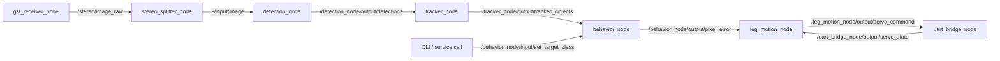

# ROS 2 拓扑

## 1. 包与节点

| 包 | 节点 / 可执行文件 | 默认是否启动 |
| --- | --- | --- |
| `gst_receiver` | `gst_receiver_node` | 是 |
| `stereo_splitter` | `stereo_splitter_node` | 是 |
| `detection_node` | `detection_node_exe` | 是 |
| `detection_node` | `detection_viz_node_exe` | 否 |
| `tracker_node` | `tracker_node_exe` | 是 |
| `behavior_node` | `behavior_node_exe` | 是 |
| `visual_servo` | `visual_servo_node_exe` (`leg_motion_node`) | 是 |
| `uart_bridge` | `uart_bridge_node` | Raspberry Pi 侧是 |
| `robot_bringup` | launch 文件集合 | 入口包 |

## 2. Topics

| Topic | 类型 | 发布者 | 订阅者 |
| --- | --- | --- | --- |
| `/stereo/image_raw` | `sensor_msgs/Image` | `gst_receiver_node` | `stereo_splitter_node` |
| `~/input/image` | `sensor_msgs/Image` | `stereo_splitter_node` | `detection_node` |
| `/detection_node/output/detections` | `robot_interfaces/msg/Detection2DArray` | `detection_node` | `tracker_node` |
| `/tracker_node/output/tracked_objects` | `robot_interfaces/msg/Detection2DArray` | `tracker_node` | `behavior_node` |
| `/behavior_node/output/pixel_error` | `geometry_msgs/Vector3` | `behavior_node` | `leg_motion_node` |
| `/leg_motion_node/output/servo_command` | `sensor_msgs/JointState` | `leg_motion_node` | `uart_bridge_node` |
| `/uart_bridge_node/output/servo_state` | `sensor_msgs/JointState` | `uart_bridge_node` | `leg_motion_node` |

## 3. Services

| Service | 类型 | 服务端 | 备注 |
| --- | --- | --- | --- |
| `/behavior_node/input/set_target_class` | `robot_interfaces/srv/SetTargetClass` | `behavior_node` | 已实现 |
| `/calibrate_center` | `robot_interfaces/srv/CalibrateCenter` | 无 | 仅保留接口定义 |

## 4. Launch 对应关系

| Launch | 包含内容 |
| --- | --- |
| `vision_stack.launch.py` | 视觉主链全部节点 |
| `rpi_stack.launch.py` | `uart_bridge_node` |
| `test_73_complete.launch.py` | 视觉主链 + `mock_uart_bridge_node` |

## 5. ROS 图

