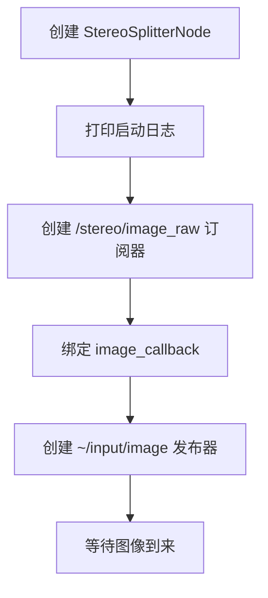
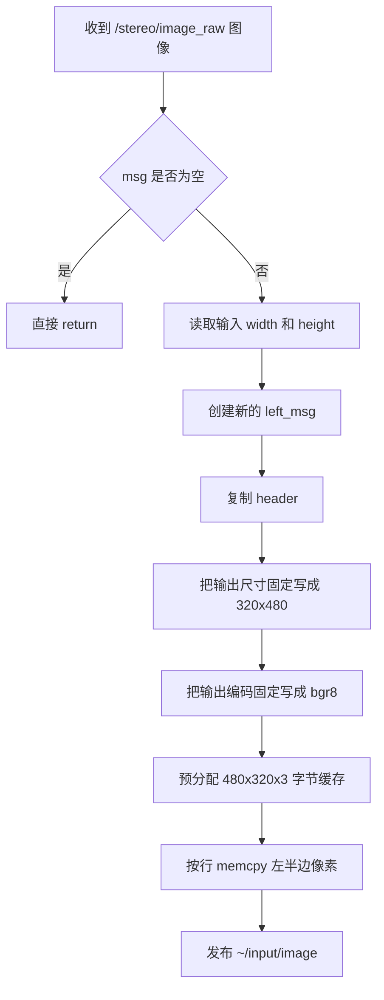

# stereo_splitter_node 代码说明文档

## 1. 节点概述

### 1.1 用途

`stereo_splitter_node` 的职责是订阅上游 `gst_receiver_node` 发布的双目拼接图像 `/stereo/image_raw`，从中裁出左半边图像，再把结果发布到 `~/input/image`，供下游 `detection_node` 做目标检测。

对初级 ROS 2 开发者来说，可以把它理解成一个“图像预处理节点”：

| 角色 | 说明 |
| --- | --- |
| ROS 图像订阅端 | 接收双目拼接彩色图像 |
| 图像裁切端 | 只保留左目区域 |
| ROS 图像发布端 | 把裁切结果继续发布给下游节点 |

### 1.2 所属功能包

| 项目 | 内容 |
| --- | --- |
| 功能包名 | `stereo_splitter` |
| 主源码文件 | `ros2_ws/src/stereo_splitter/src/stereo_splitter_node.cpp` |
| 头文件 | `ros2_ws/src/stereo_splitter/include/stereo_splitter/stereo_splitter_node.hpp` |
| 入口文件 | `ros2_ws/src/stereo_splitter/src/stereo_splitter_main.cpp` |
| 启动文件 | `ros2_ws/src/stereo_splitter/launch/stereo_splitter.launch.py` |

### 1.3 在系统中的角色

在当前默认视觉链路中，`stereo_splitter_node` 位于视频接收之后、目标检测之前：

```text
gst_receiver_node
  -> /stereo/image_raw
  -> stereo_splitter_node
  -> ~/input/image
  -> detection_node
  -> tracker_node
  -> ...
```

它本身不负责解码、检测或跟踪，只负责把双目拼接图像裁成检测节点可直接消费的左目图像。

## 2. 依赖项

### 2.1 ROS 2 版本与功能包依赖

> 说明：仓库顶层 `README.md` 标明当前项目基于 `ROS 2 Jazzy`；本节点的包级依赖来自 `stereo_splitter/package.xml` 与 `CMakeLists.txt`。

| 类别 | 名称 | 来源 | 在本节点中的作用 |
| --- | --- | --- | --- |
| ROS 2 发行版 | `ROS 2 Jazzy` | 顶层文档 | 提供节点、topic、QoS、launch 等基础能力 |
| ROS 2 C++ 客户端库 | `rclcpp` | `package.xml` | 创建节点、订阅器、发布器、日志 |
| 标准消息包 | `sensor_msgs` | `package.xml` | 订阅和发布 `sensor_msgs/msg/Image` |
| 图像桥接包 | `cv_bridge` | `package.xml` | 当前源码未直接使用，但已作为构建依赖声明 |
| OpenCV | `opencv` / `OpenCV` | `package.xml` / `CMakeLists.txt` | 当前源码仅 `#include <opencv2/opencv.hpp>`，实际裁切逻辑没有调用 `cv::Mat` |
| 共享入口辅助 | `shared/ros2_single_node_main.hpp` | 本仓库共享代码 | 复用单节点 `main()` 启动模板 |

### 2.2 第三方库

| 名称 | 类型 | 说明 |
| --- | --- | --- |
| OpenCV | 第三方图像库 | 已链接，但当前实现没有真正用 OpenCV 做裁切，而是直接按字节 `memcpy` |

### 2.3 自定义消息

| 名称 | 是否使用 | 说明 |
| --- | --- | --- |
| 自定义消息 / 服务 / 动作 | 否 | 当前节点只使用标准消息 `sensor_msgs/msg/Image` |

## 3. 节点接口清单

### 3.1 订阅的话题

| 名称 | 消息类型 | QoS | 回调函数 | 用途 |
| --- | --- | --- | --- | --- |
| `/stereo/image_raw` | `sensor_msgs/msg/Image` | `SensorDataQoS`，即 `KeepLast(5) + BestEffort + Volatile` | `StereoSplitterNode::image_callback` | 接收上游发布的双目拼接图像，裁出左目区域 |

### 3.2 发布的话题

| 名称 | 消息类型 | QoS | 发布频率 | 用途 |
| --- | --- | --- | --- | --- |
| `~/input/image` | `sensor_msgs/msg/Image` | `SensorDataQoS`，即 `KeepLast(5) + BestEffort + Volatile` | 事件驱动；通常约等于输入图像帧率 | 发布裁切后的左目图像，供 `detection_node` 使用 |

补充说明：

| 项目 | 当前值 | 说明 |
| --- | --- | --- |
| `header` | 直接继承输入消息 | 会保留上游时间戳和 `frame_id` |
| `encoding` | `"bgr8"` | 虽然 topic 名叫 `image_mono`，但当前输出并不是灰度图 |
| `is_bigendian` | `false` | 当前实现固定按小端字节序填写 |
| `width` | `320` | 写死在源码中 |
| `height` | `480` | 写死在源码中 |
| `step` | `320 * 3 = 960` | 三通道 BGR，每像素 3 字节 |

### 3.3 提供的服务 / 动作

| 名称 | 类型 | 用途 |
| --- | --- | --- |
| 无 | - | 当前节点不提供 ROS service 或 action |

### 3.4 客户端调用的服务 / 动作

| 名称 | 类型 | 用途 |
| --- | --- | --- |
| 无 | - | 当前节点不主动调用其他节点的 service 或 action |

### 3.5 TF 坐标系

| 类型 | 坐标系 | 用途 |
| --- | --- | --- |
| 监听 | 无 | 当前节点不监听 TF |
| 广播 | 无 | 当前节点不广播 TF |

## 4. 参数列表

当前源码中没有调用 `declare_parameter()`、`get_parameter()` 或动态参数回调接口，因此 **没有 ROS 参数**。

| 参数名 | 类型 | 默认值 | 取值范围 | 含义 | 是否动态可调 |
| --- | --- | --- | --- | --- | --- |
| 无 | - | - | - | 当前节点的输入 topic、输出 topic、裁切区域、输出编码都写死在源码中 | 否 |

虽然没有 ROS 参数，但下面这些运行值是硬编码常量，后续很适合改造成参数：

| 硬编码项 | 当前值 | 位置 | 影响 |
| --- | --- | --- | --- |
| 输入 topic | `/stereo/image_raw` | 构造函数 | 上游改 topic 后需要改代码 |
| 输出 topic | `~/input/image` | 构造函数 | 下游依赖这个名字 |
| 裁切宽度 | `320` | `image_callback()` | 假定左目图宽固定为 320 |
| 裁切高度 | `480` | `image_callback()` | 假定输入图至少有 480 行 |
| 输出编码 | `bgr8` | `image_callback()` | 下游会按彩色三通道图解释这条消息 |

## 5. 核心代码逻辑

### 5.1 类结构和继承关系

`StereoSplitterNode` 的类定义很小，几乎全部职责都集中在一个订阅回调里：

| 成员 / 方法 | 类型 | 作用 |
| --- | --- | --- |
| `StereoSplitterNode` | `public rclcpp::Node` | ROS 2 节点主体 |
| `image_sub_` | ROS 订阅器 | 订阅 `/stereo/image_raw` |
| `left_pub_` | ROS 发布器 | 发布 `~/input/image` |
| `image_callback()` | 成员函数 | 收到图像后裁切左半边并发布 |

继承关系可以简化为：

```text
rclcpp::Node
  └── StereoSplitterNode
```

### 5.2 构造函数初始化流程

构造函数完成的事情很直接：创建一个订阅器和一个发布器。



关键代码片段如下：

```cpp
image_sub_ = this->create_subscription<sensor_msgs::msg::Image>(
  "/stereo/image_raw",                     // 输入 topic
  rclcpp::SensorDataQoS(),                // 传感器图像通常优先低延迟
  std::bind(&StereoSplitterNode::image_callback,
            this,
            std::placeholders::_1));      // 收到图像时进入裁切回调

left_pub_ = this->create_publisher<sensor_msgs::msg::Image>(
  "~/input/image",                   // 输出 topic
  rclcpp::SensorDataQoS());               // 输出也沿用传感器型 QoS
```

### 5.3 `image_callback()` 的处理流程

先解释一个基础概念：**订阅回调** 是“收到某个 topic 的一条消息后自动执行的函数”。本节点只有这一个核心回调。

| 项目 | 内容 |
| --- | --- |
| 触发条件 | 收到一条来自 `/stereo/image_raw` 的 `sensor_msgs/msg/Image` |
| 输入 | `sensor_msgs::msg::Image::UniquePtr` |
| 输出 | 向 `~/input/image` 发布一条新的 `sensor_msgs::msg::Image` |
| 处理结果 | 成功时发布固定 `320x480` 的左目图像；失败时直接返回或产生错误结果 |

处理流程如下：



关键代码片段如下：

```cpp
if (!msg) return;                            // 防御式检查：空消息直接忽略

auto left_msg = std::make_unique<sensor_msgs::msg::Image>();
left_msg->header = msg->header;              // 继承输入图像的时间戳和 frame_id
left_msg->height = 480;                      // 当前实现固定输出高 480
left_msg->width = 320;                       // 当前实现固定输出宽 320
left_msg->encoding = "bgr8";                 // 输出仍是三通道彩色图
left_msg->is_bigendian = false;              // 当前实现固定按小端格式填写
left_msg->step = 320 * 3;                    // 每行字节数 = 320 像素 * 3 字节
left_msg->data.resize(480 * 320 * 3);        // 提前分配输出缓存

for (int r = 0; r < 480; ++r) {
  std::memcpy(left_msg->data.data() + r * (320 * 3),
              msg->data.data() + r * msg->step,
              320 * 3);                      // 每行只拷贝左边 320 个像素
}

left_pub_->publish(std::move(left_msg));     // 发布给下游检测节点
```

### 5.4 当前裁切策略说明

这个节点没有复杂算法，真正的核心逻辑是“固定区域裁切”。当前实现可以概括成下面这张表：

| 项目 | 当前行为 |
| --- | --- |
| 输入图像语义 | 假定是左右拼接的双目图 |
| 裁切区域 | 左上角开始的 `[0, 320) x [0, 480)` |
| 输出内容 | 左半边图像 |
| 输出编码 | `bgr8` |
| 输出大小 | `320x480` |

这意味着节点隐含地假定上游输入满足以下条件：

| 假设 | 说明 |
| --- | --- |
| 输入至少有 `480` 行 | 否则按 `r < 480` 拷贝时会越界读取 |
| 每行至少有 `320 * 3` 字节有效像素 | 否则左半边拷贝会读取非法内存 |
| 输入图像是三通道彩色布局 | 当前输出直接声明为 `bgr8` |
| 左目就在图像最左边 | 如果输入布局变化，当前节点不会自适应 |

### 5.5 为什么按行 `memcpy`

源码没有直接对整块内存 `clone`，而是选择逐行拷贝：

| 做法 | 原因 |
| --- | --- |
| 按行 `memcpy` | 可以正确处理 `msg->step` 大于 `width * channels` 的情况 |
| 不直接整块复制前半段 | 因为 ROS 图像可能带有行对齐或 padding，整块截取不一定可靠 |

这对初学者很重要：**图像宽度不等于每行字节数**。在 ROS 图像消息里，真正代表“每行占多少字节”的字段是 `step`。

## 6. 生命周期与线程模型

### 6.1 生命周期

| 阶段 | 发生位置 | 说明 |
| --- | --- | --- |
| 创建节点 | 构造函数 | 创建订阅器和发布器 |
| 运行中 | 订阅回调 | 每收到一帧输入图像，就裁切并发布一次 |
| 销毁节点 | 默认析构 | 当前类没有自定义析构函数，也没有额外资源释放逻辑 |

### 6.2 执行器类型

| 运行方式 | 入口 | 执行器模型 | 说明 |
| --- | --- | --- | --- |
| 单独运行 `stereo_splitter_node` | `stereo_splitter_main.cpp` -> `spin_single_node_main()` | 等价于单节点 `rclcpp::spin()` | 这是默认启动方式 |
| 作为 `vision_front` 组合节点运行 | `robot_bringup/src/vision_front_main.cpp` | `MultiThreadedExecutor` | 仅用于实验性单进程组合运行 |

对初学者来说，**执行器（executor）** 可以理解为“ROS 回调调度器”。本节点的回调只有一个，所以默认运行方式已经足够简单。

### 6.3 回调组、定时器与后台线程

| 项目 | 当前实现 |
| --- | --- |
| 回调组（Callback Group） | 未显式创建 |
| 订阅回调 | 只有 `image_callback()` 一个 |
| 定时器（Timer） | 无 |
| 后台工作线程 | 无 |
| Service / Action 回调 | 无 |

### 6.4 实际线程模型

当前节点没有自己的工作线程，也没有内部队列；它完全依赖 ROS executor 在线程里执行订阅回调：

| 线程来源 | 执行内容 |
| --- | --- |
| ROS executor 线程 | 接收 `/stereo/image_raw` 并执行 `image_callback()` |

这意味着：

1. 每来一帧图像，就在回调里完成一次完整裁切和发布。
2. 如果输入帧率很高，而 CPU 很忙，回调处理会直接影响输出实时性。
3. 当前实现没有缓存队列，也没有“丢旧帧保新帧”的自定义策略，实际行为主要由 ROS QoS 和 executor 调度决定。

## 7. 启动方式

### 7.1 `ros2 run` 命令示例

先准备 ROS 环境：

```bash
source /opt/ros/jazzy/setup.bash
cd /home/peter/dog/dog_dev
source ros2_ws/install/setup.bash
export ROBOT_DDS_ROLE=wsl
source scripts/ros2_network_env.sh
ros2 run stereo_splitter stereo_splitter_node
```

启动前提：

| 条件 | 说明 |
| --- | --- |
| 上游图像存在 | `/stereo/image_raw` 必须持续有数据 |
| 本机已完成工作区构建 | `ros2_ws/install/setup.bash` 必须存在 |
| 上下游 topic 名匹配 | 上游必须发布 `/stereo/image_raw`，下游默认订阅 `~/input/image` |

### 7.2 launch 文件示例

当前仓库中的最简 launch 文件如下：

```python
from launch import LaunchDescription
from launch_ros.actions import Node

def generate_launch_description():
    return LaunchDescription([
        Node(
            package='stereo_splitter',          # 功能包名
            executable='stereo_splitter_node',  # 可执行文件名
            name='stereo_splitter_node',        # ROS 节点名
            output='screen',                    # 日志输出到终端
        )
    ])
```

如果要启动完整视觉主链，使用系统级 launch：

```bash
ros2 launch robot_bringup vision_stack.launch.py
```

### 7.3 参数 YAML 配置示例

当前节点没有 ROS 参数，因此 YAML 只能写成占位形式：

```yaml
stereo_splitter_node:
  ros__parameters: {}  # 当前源码没有 declare_parameter()，这里不会改变节点行为
```

如果后续把裁切范围和 topic 名参数化，建议从下面这些键开始：

```yaml
stereo_splitter_node:
  ros__parameters:
    input_topic: "/stereo/image_raw"
    output_topic: "~/input/image"
    crop_x: 0
    crop_y: 0
    crop_width: 320
    crop_height: 480
    output_encoding: "bgr8"
```

> 上面这一段是“建议的未来参数化方向”，不是当前源码已经支持的配置项。

## 8. 调试与排错

### 8.1 常见问题

| 现象 | 可能原因 | 排查方法 | 处理建议 |
| --- | --- | --- | --- |
| `~/input/image` 没有数据 | 上游 `/stereo/image_raw` 没有发布 | `ros2 topic hz /stereo/image_raw` | 先确认 `gst_receiver_node` 正常工作 |
| 节点启动正常，但下游检测结果异常 | 输入图像编码或布局不符合当前假设 | `ros2 topic echo /stereo/image_raw --once` | 确认上游确实输出三通道彩色双目拼接图 |
| 图像颜色不对 | topic 名叫 `image_mono`，但实际输出是 `bgr8` | `ros2 topic echo ~/input/image --once` 看 `encoding` | 不要仅凭 topic 名判断它是灰度图 |
| 输入分辨率变化后程序行为异常 | 代码把输出裁切范围写死成 `320x480` | 查看上游图像实际宽高 | 为输入尺寸和编码增加检查，或把裁切参数改成可配置 |
| 输出图像不是想要的左目内容 | 输入不再是“左右拼接，左目在最左边”的布局 | 用 `rqt_image_view` 同时看输入和输出 | 重新定义裁切区域 |
| 回调运行但处理效率下降 | 每帧都做一次内存分配和逐行拷贝 | 看 `~/input/image` 实际频率 | 如有必要可引入缓冲复用或进程内优化 |

### 8.2 日志与命令行排查方法

| 目的 | 命令 |
| --- | --- |
| 查看节点是否启动 | `ros2 node list` |
| 查看节点接口 | `ros2 node info /stereo_splitter_node` |
| 查看输入 topic 频率 | `ros2 topic hz /stereo/image_raw` |
| 查看输出 topic 频率 | `ros2 topic hz ~/input/image` |
| 查看输入消息头和编码 | `ros2 topic echo /stereo/image_raw --once` |
| 查看输出消息头和编码 | `ros2 topic echo ~/input/image --once` |

### 8.3 可视化工具建议

| 工具 | 用途 | 建议 |
| --- | --- | --- |
| `rqt_graph` | 看 topic 拓扑 | 先确认 `/stereo/image_raw -> /stereo_splitter_node -> ~/input/image` 是否成立 |
| `rqt_image_view` | 直接查看输入和输出图像 | 这是验证裁切是否正确的首选工具 |
| `rviz2` | 通过 `Image` 显示图像 | 适合联调时观察上下游图像 |
| `rqt_console` | 看节点日志 | 适合集中查看启动与调试日志 |

## 9. 单元测试与集成测试说明

### 9.1 当前测试现状

| 类型 | 当前状态 | 说明 |
| --- | --- | --- |
| 单元测试 | 无 | `stereo_splitter` 包内没有 `ament_add_gtest()` 或专门的测试源码 |
| 包级 lint | 有 | `CMakeLists.txt` 中启用了 `ament_lint_auto` |
| 节点级自动化集成测试 | 无 | 当前没有用伪造图像自动验证裁切结果 |
| 仓库级烟雾测试 | 有，但较弱 | `scripts/test_vision_stack.sh` 只检查包可用性和 launch 可加载性，且使用前应先确认脚本中的 `setup.bash` 路径是否与本地工作区一致 |
| 端到端联调脚本 | 有，间接覆盖 | `scripts/verify_tracking.sh` 主要检查整条链路，不专门验证 `~/input/image` 的像素内容 |

### 9.2 现有可参考测试方式

```bash
# 1. 启动完整视觉链路
ros2 launch robot_bringup vision_stack.launch.py

# 2. 检查输入输出频率是否都存在
ros2 topic hz /stereo/image_raw
ros2 topic hz ~/input/image

# 3. 直接查看裁切结果
rqt_image_view
```

### 9.3 后续建议补充的测试

| 建议项 | 价值 |
| --- | --- |
| 构造固定像素图的单元测试 | 能精确验证左半边裁切是否正确 |
| 输入尺寸非法场景测试 | 能避免分辨率变化时越界读取 |
| 编码一致性检查 | 能验证输出 `encoding` 与真实像素布局是否匹配 |
| 性能测试 | 能评估逐行 `memcpy` 在高帧率下的开销 |

## 10. 变更记录与待办事项

### 10.1 本文档对应代码基线

| 项目 | 内容 |
| --- | --- |
| 文档编写日期 | `2026-04-29` |
| 代码基线 | 当前工作区中的 `stereo_splitter` 包源码 |
| 主要参考文件 | `stereo_splitter_node.hpp`、`stereo_splitter_node.cpp`、`stereo_splitter_main.cpp`、`stereo_splitter.launch.py`、`package.xml`、`CMakeLists.txt` |

### 10.2 当前待办事项

| 优先级 | 待办项 | 原因 |
| --- | --- | --- |
| 高 | 为输入图像尺寸、`step` 和 `encoding` 增加显式校验 | 当前实现对输入格式有强假设，但没有检查 |
| 高 | 把裁切区域改成 ROS 参数 | 现在固定写死为 `320x480`，适应性差 |
| 中 | 明确 `~/input/image` 的语义 | 现在 topic 名带 `mono`，但实际输出是 `bgr8` |
| 中 | 清理未使用变量 `width`、`height`，并评估是否保留 OpenCV / `cv_bridge` 依赖 | 代码和依赖里有冗余成分 |
| 中 | 在高帧率场景下优化内存分配 | 当前每帧都新建输出消息并重新分配缓存 |
| 低 | 补充包描述和许可证信息 | `package.xml` 里目前仍是 `TODO` |

### 10.3 适合初学者继续阅读的源码入口

| 阅读顺序 | 文件 | 建议关注点 |
| --- | --- | --- |
| 1 | `ros2_ws/src/stereo_splitter/include/stereo_splitter/stereo_splitter_node.hpp` | 先看类里有哪些成员和回调 |
| 2 | `ros2_ws/src/stereo_splitter/src/stereo_splitter_node.cpp` | 再看订阅、裁切、发布的完整过程 |
| 3 | `ros2_ws/src/stereo_splitter/src/stereo_splitter_main.cpp` | 理解 `ros2 run` 如何启动节点 |
| 4 | `ros2_ws/src/stereo_splitter/launch/stereo_splitter.launch.py` | 理解 launch 如何包装节点 |
