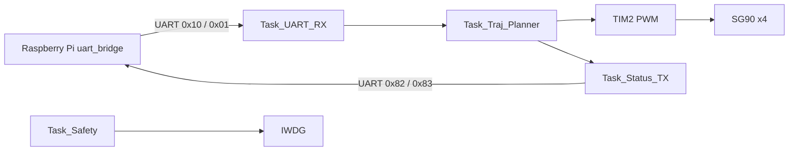
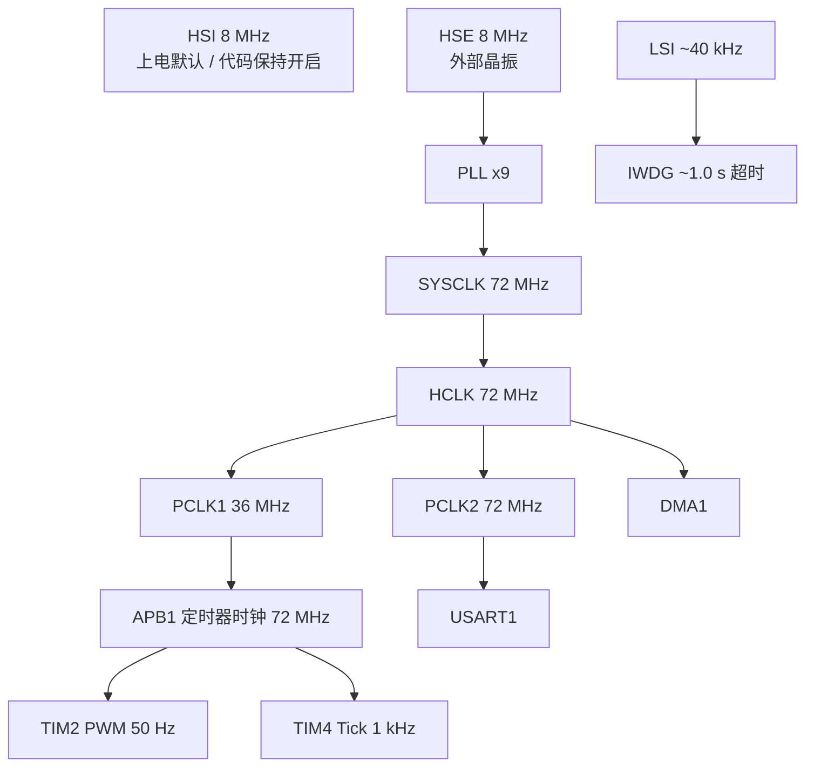
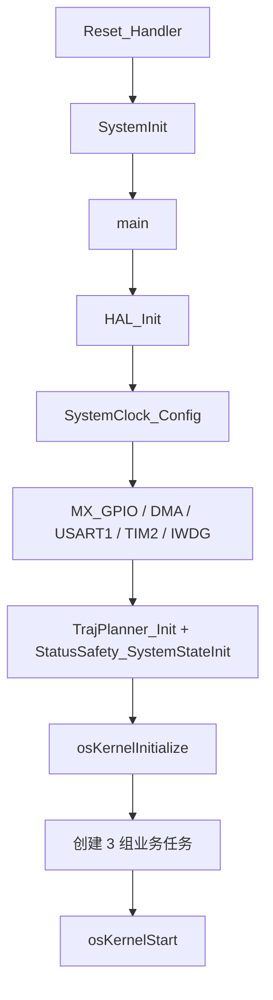
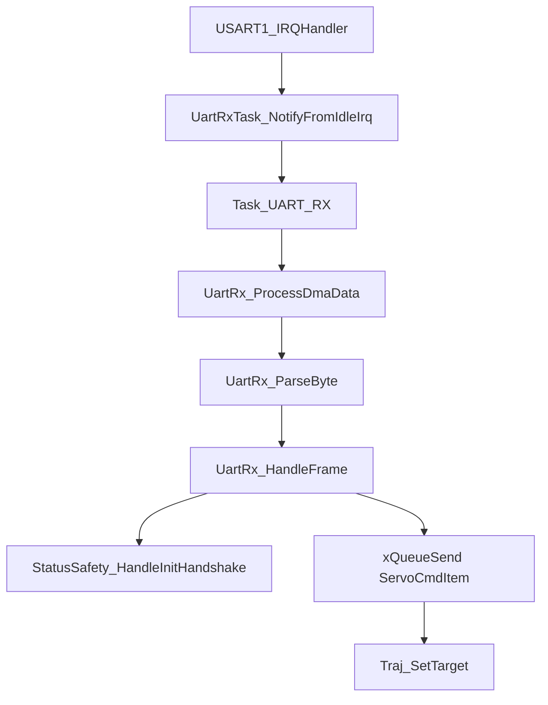
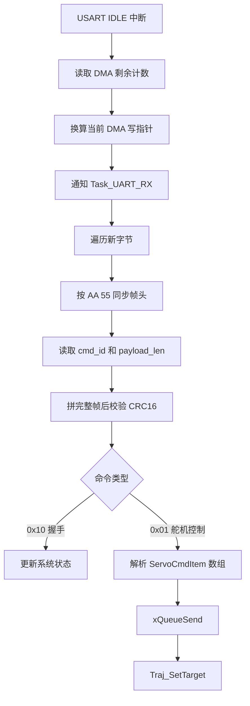
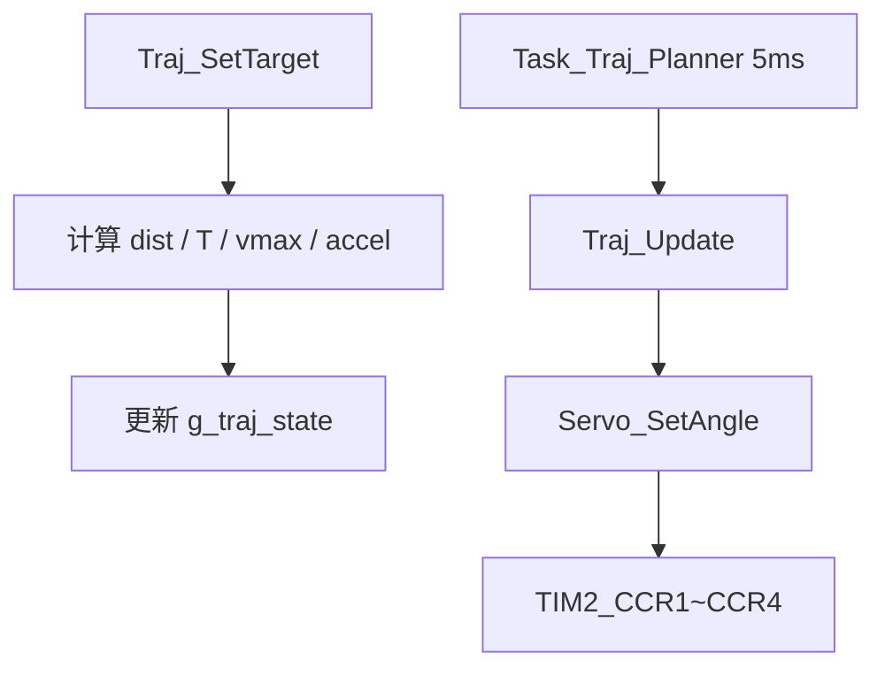
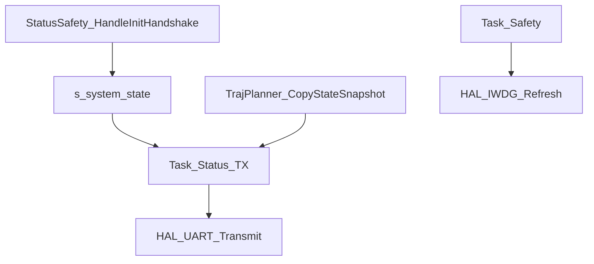
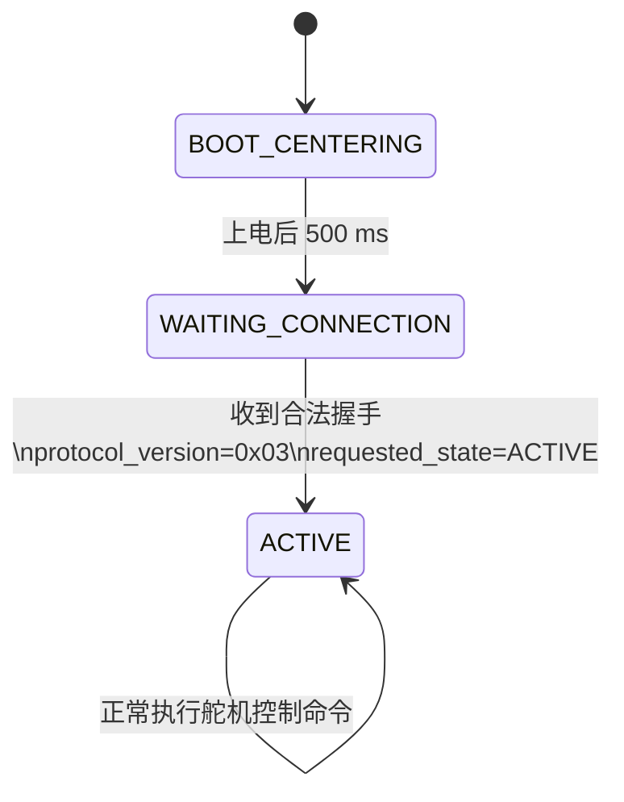
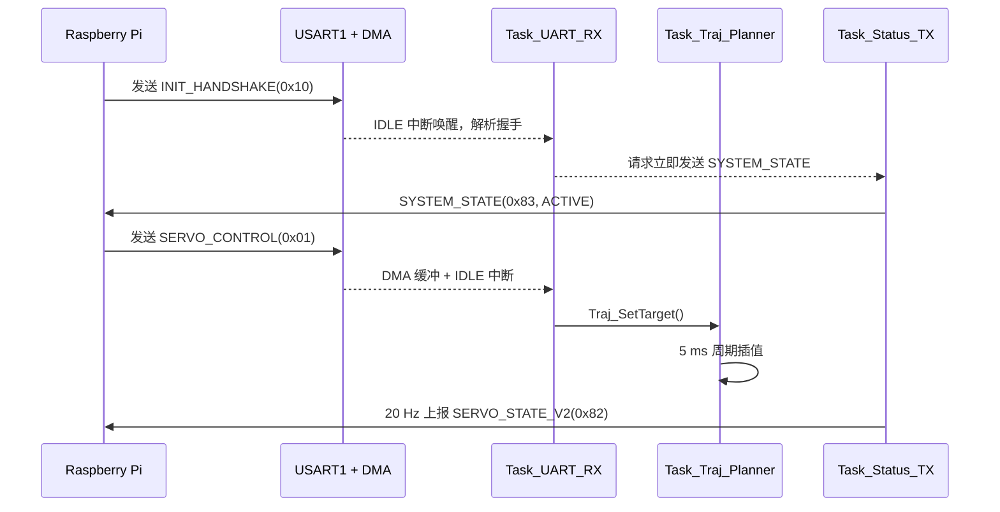

# STM32F103 舵机控制固件代码说明

> 文档基于仓库内 `stm32_keil/` 工程源码整理，编写日期：2026-04-29。  
> 未在当前环境执行实际 Keil 编译、烧录与板级联调；凡无法仅从源码确定的信息，均明确标注为“待确认”或“按工程推断”。

| 项目 | 内容 |
| --- | --- |
| 工程路径 | `stm32_keil/` |
| 主控芯片 | `STM32F103C8T6`，LQFP48 |
| 开发板 | 仓库未明确标注；按接线图与时钟配置推断为自制最小系统板或 Blue Pill 类最小系统，待确认 |
| 关键外部器件 | `SG90` 舵机 4 路、Raspberry Pi UART 链路、外部 `8 MHz HSE` 晶振、`ST-Link`/`CMSIS-DAP` SWD 调试口 |
| 开发框架 | `HAL` |
| IDE / 工具链 | `STM32CubeMX + Keil MDK-ARM (ARMCC5)` |
| RTOS | `FreeRTOS + CMSIS-RTOS2` |
| 项目用途 | 桌面目标跟随机器人下位机，负责四路舵机轨迹规划、PWM 输出、握手状态机、状态回传、看门狗保活 |

## 项目概述

### 项目用途

该固件是整套桌面目标跟随机器人中的 STM32 下位机部分。上位链路在 WSL2/PC 与 Raspberry Pi 上完成视觉检测、目标跟踪和 `/servo_cmd` 生成；本固件负责：

1. 从 Raspberry Pi 通过 `USART1` 接收二进制舵机控制帧。
2. 对 4 路舵机目标角执行梯形速度轨迹插值。
3. 通过 `TIM2_CH1~CH4` 产生 `50 Hz` PWM，驱动 `SG90` 舵机。
4. 周期上报 `SERVO_STATE_V2` 和 `SYSTEM_STATE`。
5. 在系统运行期间定期喂 `IWDG`，避免固件失控。

### 整体架构



### 主控芯片选型理由

以下判断基于现有源码和接线需求推断：

| 需求 | `STM32F103C8T6` 对应能力 |
| --- | --- |
| 4 路独立舵机 PWM | `TIM2` 原生提供 4 个通道，刚好覆盖 4 路舵机 |
| 高波特率串口 | `USART1` 运行在 `PCLK2=72 MHz`，可稳定配置到 `921600 8N1` |
| 轻量 RTOS + 协议解析 + 插值 | `72 MHz Cortex-M3` 足以覆盖当前任务负载 |
| 成本与复杂度控制 | F103C8T6 生态成熟、调试方便、适合最小系统板 |
| 调试口保留 | `PA13/PA14` 保留 SWD，JTAG 被关闭但不影响在线调试 |

### 软件分层

| 层级 | 主要文件 | 职责 |
| --- | --- | --- |
| BSP / 启动层 | `main.c`、`system_stm32f1xx.c`、`startup_stm32f103xb.s` | 复位启动、时钟树、向量表、堆栈定义 |
| HAL 外设层 | `gpio.c`、`dma.c`、`usart.c`、`tim.c`、`iwdg.c`、`stm32f1xx_hal_timebase_tim.c` | GPIO、DMA、USART、TIM、IWDG 初始化 |
| RTOS 封装层 | `freertos.c`、`FreeRTOSConfig.h` | 内核初始化、任务创建、优先级与堆配置 |
| 驱动层 | `servo_driver.c` | 舵机角度到 CCR 的映射与 PWM 输出 |
| 中间件 / 协议层 | `uart_protocol.c`、`uart_protocol.h`、`uart_rx_task.c` | CRC16、帧解析、DMA+IDLE 接收、命令分发 |
| 应用层 | `traj_planner.c`、`status_safety_task.c` | 轨迹规划、状态机、状态发送、看门狗喂狗 |

## 硬件资源分配表

### GPIO / 引脚资源

> `PD0/PD1` 未出现在 `gpio.c` 中，是因为 HSE 晶振由 RCC 接管，不作为普通 GPIO 初始化。

| 引脚号 | 引脚名 | 复用功能 / 模式 | 连接器件 | 用途 | 电气特性 |
| --- | --- | --- | --- | --- | --- |
| `PD0` | `OSC_IN` | HSE 输入 | 8 MHz 晶振 | 系统主时钟输入 | 模拟振荡引脚，非 GPIO |
| `PD1` | `OSC_OUT` | HSE 输出 | 8 MHz 晶振 | 系统主时钟输出 | 模拟振荡引脚，非 GPIO |
| `PA0` | `TIM2_CH1` | 复用推挽输出 | `SG90 front_left` | 舵机 PWM 1 | `GPIO_SPEED_FREQ_LOW`，F1 下约等效 2 MHz 输出能力 |
| `PA1` | `TIM2_CH2` | 复用推挽输出 | `SG90 front_right` | 舵机 PWM 2 | 同上 |
| `PA2` | `TIM2_CH3` | 复用推挽输出 | `SG90 rear_left` | 舵机 PWM 3 | 同上 |
| `PA3` | `TIM2_CH4` | 复用推挽输出 | `SG90 rear_right` | 舵机 PWM 4 | 同上 |
| `PA9` | `USART1_TX` | 复用推挽输出 | Raspberry Pi `RXD` | 串口发送 | `GPIO_SPEED_FREQ_HIGH`，适合 `921600 bps` |
| `PA10` | `USART1_RX` | 复用输入 + 上拉 | Raspberry Pi `TXD` | 串口接收 | 上拉，空闲高电平，抗悬空 |
| `PA13` | `SWDIO` | `JTMS-SWDIO` | 调试器 | SWD 数据线 | 保留调试功能 |
| `PA14` | `SWCLK` | `JTCK-SWCLK` | 调试器 | SWD 时钟线 | 保留调试功能 |

### 供电与非 GPIO 连接

| 信号 | 连接关系 | 说明 |
| --- | --- | --- |
| `3.3V` | Raspberry Pi / 板载 LDO -> STM32 逻辑电源 | STM32 与 UART 逻辑侧工作在 `3.3V` |
| `5V` | 独立电源 -> 4 路 SG90 | 舵机电源不应直接取自树莓派 USB |
| `GND` | Pi / STM32 / 舵机电源共地 | UART 与 PWM 参考地必须统一 |
| `NRST` | 调试器 / 复位按钮 | 工程未显式配置，但板级调试建议引出 |
| `BOOT0` | 上拉/下拉网络 | 工程未显式配置，建议固定为正常 Flash 启动 |

### DMA 通道分配

| DMA 控制器 | 通道 | 请求源 | 方向 | 模式 | 数据宽度 | 优先级 | 说明 |
| --- | --- | --- | --- | --- | --- | --- | --- |
| `DMA1` | `Channel4` | `USART1_TX` | 内存到外设 | `Normal` | 字节/字节 | `Medium` | 代码中已初始化，但当前状态发送实际仍调用阻塞式 `HAL_UART_Transmit()` |
| `DMA1` | `Channel5` | `USART1_RX` | 外设到内存 | `Circular` | 字节/字节 | `Medium` | 与 `USART IDLE` 中断配合，形成环形收包缓冲 |

### 定时器分配

| 定时器 | 通道 | 作用 | 输入时钟 | 关键参数 | 输出结果 |
| --- | --- | --- | --- | --- | --- |
| `TIM2` | `CH1~CH4` | 4 路舵机 PWM | `72 MHz` | `PSC=71`，`ARR=19999` | 计数频率 `1 MHz`，PWM 周期 `20 ms`，频率 `50 Hz` |
| `TIM4` | 基本定时 | HAL `uwTick` 时基 | `72 MHz` | `PSC=71`，`ARR=999` | `1 kHz` 更新中断，1 ms Tick |

## 时钟树配置

### 主时钟参数

| 项目 | 配置值 | 计算依据 |
| --- | --- | --- |
| `HSE` | `8 MHz` | `HSE_VALUE=8000000`，外部晶振 |
| `HSI` | `8 MHz` | 作为上电默认时钟，代码中保持开启 |
| `PLL Source` | `HSE` | `RCC_PLLSOURCE_HSE` |
| `PLL Mul` | `x9` | `8 MHz x 9 = 72 MHz` |
| `SYSCLK` | `72 MHz` | PLL 输出 |
| `HCLK` | `72 MHz` | `AHB = SYSCLK / 1` |
| `PCLK1` | `36 MHz` | `APB1 = HCLK / 2` |
| `PCLK2` | `72 MHz` | `APB2 = HCLK / 1` |
| `APB1 Timer Clock` | `72 MHz` | 当 `PPRE1 != 1` 时，定时器时钟 = `2 x PCLK1` |
| `Flash Latency` | `2 WS` | `FLASH_LATENCY_2`，满足 `72 MHz` 运行要求 |

### 外设时钟来源

| 外设 | 时钟来源 | 最终频率 |
| --- | --- | --- |
| `USART1` | `PCLK2` | `72 MHz` |
| `TIM2` | `APB1 Timer Clock` | `72 MHz` |
| `TIM4` | `APB1 Timer Clock` | `72 MHz` |
| `DMA1` | `AHB` | `72 MHz` |
| `IWDG` | `LSI` | 典型 `40 kHz`，受工艺与温度漂移影响 |

### 时钟树文字图



### 关键时钟配置代码

```c
RCC_OscInitStruct.OscillatorType = RCC_OSCILLATORTYPE_HSE;   // 选择外部高速时钟
RCC_OscInitStruct.HSEState = RCC_HSE_ON;                     // RCC_CR.HSEON = 1
RCC_OscInitStruct.HSEPredivValue = RCC_HSE_PREDIV_DIV1;      // 8 MHz 不再预分频
RCC_OscInitStruct.HSIState = RCC_HSI_ON;                     // 保留 HSI，便于回退
RCC_OscInitStruct.PLL.PLLState = RCC_PLL_ON;                 // RCC_CR.PLLON = 1
RCC_OscInitStruct.PLL.PLLSource = RCC_PLLSOURCE_HSE;         // RCC_CFGR.PLLSRC = HSE
RCC_OscInitStruct.PLL.PLLMUL = RCC_PLL_MUL9;                 // RCC_CFGR.PLLMULL = x9

RCC_ClkInitStruct.SYSCLKSource = RCC_SYSCLKSOURCE_PLLCLK;    // RCC_CFGR.SW = PLL
RCC_ClkInitStruct.AHBCLKDivider = RCC_SYSCLK_DIV1;           // HCLK = SYSCLK
RCC_ClkInitStruct.APB1CLKDivider = RCC_HCLK_DIV2;            // PCLK1 = 36 MHz
RCC_ClkInitStruct.APB2CLKDivider = RCC_HCLK_DIV1;            // PCLK2 = 72 MHz
HAL_RCC_ClockConfig(&RCC_ClkInitStruct, FLASH_LATENCY_2);    // FLASH_ACR.LATENCY = 2
```

关键寄存器位说明：

| 寄存器位 | 作用 |
| --- | --- |
| `RCC_CR.HSEON` | 打开外部高速晶振 |
| `RCC_CR.PLLON` | 打开 PLL |
| `RCC_CFGR.PLLSRC` | 选择 PLL 输入源 |
| `RCC_CFGR.PLLMULL` | 选择 PLL 倍频系数 |
| `RCC_CFGR.SW / SWS` | 系统时钟切换到 PLL，并可读回当前源 |
| `RCC_CFGR.PPRE1` | APB1 分频；影响 TIM2/TIM4 输入时钟 |
| `FLASH_ACR.LATENCY` | Flash 读等待周期 |

## 外设配置详解

### GPIO / AFIO

#### 工作模式

- `PA0~PA3`：`TIM2_CH1~CH4` 复用推挽输出。
- `PA9`：`USART1_TX` 复用推挽输出。
- `PA10`：`USART1_RX` 复用输入，上拉。
- `PA13/PA14`：保留 SWD。
- 全局 AFIO 中执行 `NOJTAG` 重映射，仅关闭 JTAG，保留 SWD。

#### 关键初始化点

```c
__HAL_RCC_AFIO_CLK_ENABLE();                 // 打开 AFIO，支持 SWJ 重映射
__HAL_AFIO_REMAP_SWJ_NOJTAG();               // 关闭 JTAG，保留 SWDIO/SWCLK

GPIO_InitStruct.Pin = GPIO_PIN_0|GPIO_PIN_1|GPIO_PIN_2|GPIO_PIN_3;
GPIO_InitStruct.Mode = GPIO_MODE_AF_PP;      // TIM2 PWM 输出
GPIO_InitStruct.Speed = GPIO_SPEED_FREQ_LOW; // F1 下为低速推挽，足够 50 Hz PWM

GPIO_InitStruct.Pin = GPIO_PIN_10;
GPIO_InitStruct.Mode = GPIO_MODE_AF_INPUT;   // USART1_RX 输入
GPIO_InitStruct.Pull = GPIO_PULLUP;          // 空闲高电平，避免悬空
```

#### 中断优先级

- GPIO 本身未启用 EXTI 中断。
- AFIO 仅用于 SWJ 配置。

#### DMA 配置

- GPIO/AFIO 无 DMA。

#### 引脚映射

| 引脚 | 模式 | 映射 |
| --- | --- | --- |
| `PA0~PA3` | AF Push-Pull | `TIM2_CH1~CH4` |
| `PA9` | AF Push-Pull | `USART1_TX` |
| `PA10` | AF Input + Pull-Up | `USART1_RX` |
| `PA13/PA14` | SWD | `SWDIO/SWCLK` |

### TIM2 舵机 PWM

#### 工作模式

- `TIM2` 工作在 `PWM Generation CH1~CH4` 模式。
- `CounterMode = Up`。
- 4 路舵机共用一个 `20 ms` 周期。

#### 关键初始化参数

| 参数 | 数值 | 计算依据 |
| --- | --- | --- |
| 定时器输入时钟 | `72 MHz` | `APB1 Timer Clock` |
| `PSC` | `71` | `72 MHz / (71 + 1) = 1 MHz` |
| `ARR` | `19999` | `1 MHz / (19999 + 1) = 50 Hz` |
| `OCMode` | `PWM1` | 高电平有效脉宽 |
| `Pulse` 默认值 | `0` | 实际由 `Servo_SetAngle()` 动态更新 |

#### 角度到脉宽换算

| 角度 | 脉宽 | CCR 值 |
| --- | --- | --- |
| `0°` | `500 us` | `500` |
| `90°` | `1500 us` | `1500` |
| `180°` | `2500 us` | `2500` |

公式：

```text
CCR = 500 + angle_deg x (2000 / 180)
```

#### 关键代码片段

```c
clamped_angle = Servo_ClampAngle(angle_deg);                  // 角度限幅到 0~180°
ccr = (uint32_t)(SERVO_CCR_BASE +                            // 基础脉宽 500 us
                 (clamped_angle * SERVO_CCR_PER_DEG));       // 每度约 11.11 us
__HAL_TIM_SET_COMPARE(&htim2, k_servo_channels[servo_id], ccr); // 写 TIM2_CCRx
```

关键寄存器位说明：

| 寄存器位 | 作用 |
| --- | --- |
| `TIM2_PSC` | 预分频器，决定计数频率 |
| `TIM2_ARR` | 自动重装值，决定 PWM 周期 |
| `TIM2_CCMR1/2.OCxM` | 选择 `PWM1` 模式 |
| `TIM2_CCER.CCxE` | 使能各通道输出 |
| `TIM2_CCR1~CCR4` | 设置各通道高电平宽度 |

#### 中断优先级

- `TIM2` 未开启更新/捕获中断。

#### DMA 配置

- `TIM2` 未使用 DMA。

#### 引脚映射

| 通道 | 引脚 | 连接对象 |
| --- | --- | --- |
| `TIM2_CH1` | `PA0` | `front_left` |
| `TIM2_CH2` | `PA1` | `front_right` |
| `TIM2_CH3` | `PA2` | `rear_left` |
| `TIM2_CH4` | `PA3` | `rear_right` |

### USART1

#### 工作模式

- 异步串口，`8N1`。
- `TX/RX` 均开启。
- RX 使用 `DMA + IDLE` 收帧。
- TX 代码当前使用阻塞式 `HAL_UART_Transmit()`；对应 DMA 通道虽已初始化，但未被状态发送路径实际使用。

#### 关键初始化参数

| 参数 | 数值 |
| --- | --- |
| 波特率 | `921600 bps` |
| 数据位 | `8 bit` |
| 校验位 | `None` |
| 停止位 | `1` |
| 流控 | `None` |
| 过采样 | `16x` |

波特率计算：

```text
USARTDIV = 72,000,000 / (16 x 921,600) = 4.8828125
BRR ≈ Mantissa 4, Fraction 14
实际波特率 ≈ 72,000,000 / (16 x 4.875) = 923,076.9 bps
误差 ≈ +0.16%
```

#### 中断优先级

- `USART1_IRQn`：抢占优先级 `5`，子优先级 `0`。
- 该优先级与 `configLIBRARY_MAX_SYSCALL_INTERRUPT_PRIORITY = 5` 一致，因此允许在 ISR 内调用 `FreeRTOS FromISR API`。

#### DMA 配置

| 通道 | 方向 | 模式 | 说明 |
| --- | --- | --- | --- |
| `DMA1_Channel5` | `PERIPH_TO_MEMORY` | `Circular` | 环形接收缓冲，配合 `IDLE` 判定一帧结束 |
| `DMA1_Channel4` | `MEMORY_TO_PERIPH` | `Normal` | 当前预留，状态发送路径尚未切换为 DMA |

#### 引脚映射

| 引脚 | 方向 | 连接 |
| --- | --- | --- |
| `PA9` | TX | Raspberry Pi `RXD` |
| `PA10` | RX | Raspberry Pi `TXD` |

### DMA1

#### 工作模式

- 仅使用 `USART1_RX` 与 `USART1_TX` 两条通道。
- RX 通道工作在环形模式，持续采样串口字节流。
- 半传输中断在任务启动后被主动关闭，避免无意义唤醒。

#### 关键代码片段

```c
HAL_UART_Receive_DMA(&huart1, s_uart_dma_buf, UART_RX_DMA_BUF_LEN); // 开始 DMA 环形接收
__HAL_DMA_DISABLE_IT(huart1.hdmarx, DMA_IT_HT);                     // 关闭半传输中断，减少扰动
__HAL_UART_ENABLE_IT(&huart1, UART_IT_IDLE);                        // 由 IDLE 作为“帧结束”触发
```

关键寄存器位说明：

| 寄存器位 | 作用 |
| --- | --- |
| `DMA_CCRx.MINC` | 内存地址递增 |
| `DMA_CCRx.DIR` | 方向，`0=外设到内存`，`1=内存到外设` |
| `DMA_CCRx.CIRC` | 环形模式 |
| `DMA_CCRx.PSIZE/MSIZE` | 传输宽度，当前均为字节 |
| `DMA_CNDTRx` | 剩余传输计数，固件用它反推 DMA 写指针 |

#### 中断优先级

- `DMA1_Channel4_IRQn`：`5/0`
- `DMA1_Channel5_IRQn`：`5/0`

#### 引脚映射

- DMA 无独立引脚，服务于 `USART1`。

### TIM4 HAL 时基

#### 工作模式

- `TIM4` 作为 HAL Tick 基准，不用于业务 PWM。
- 1 ms 周期中断，回调中仅执行 `HAL_IncTick()`。

#### 关键初始化参数

| 参数 | 数值 | 说明 |
| --- | --- | --- |
| 输入时钟 | `72 MHz` | APB1 Timer Clock |
| `PSC` | `71` | 得到 `1 MHz` 计数频率 |
| `ARR` | `999` | 更新频率 `1 kHz` |
| 中断优先级 | `15` | 最低优先级，与 HAL/RTOS 共存 |

#### 中断优先级

- `TIM4_IRQn`：抢占优先级 `15`，子优先级 `0`。

#### DMA 配置

- 未使用 DMA。

#### 引脚映射

- 无外部引脚。

### IWDG

#### 工作模式

- 独立看门狗，使用 `LSI` 时钟。
- `Task_Safety` 每 `100 ms` 喂狗一次。

#### 关键初始化参数

| 参数 | 数值 | 说明 |
| --- | --- | --- |
| 时钟源 | `LSI` | 典型 `40 kHz` |
| 分频系数 | `64` | `40,000 / 64 = 625 Hz` |
| `Reload` | `625` | 超时时间约 `(625 + 1) / 625 = 1.0016 s` |
| 喂狗周期 | `100 ms` | 远小于超时阈值 |

关键寄存器位说明：

| 寄存器 / 值 | 作用 |
| --- | --- |
| `IWDG_KR = 0xCCCC` | 启动看门狗 |
| `IWDG_KR = 0x5555` | 允许写 `PR/RLR` |
| `IWDG_KR = 0xAAAA` | 刷新计数器 |
| `IWDG_PR` | 分频配置 |
| `IWDG_RLR` | 重装值 |

#### 中断优先级

- IWDG 无普通 NVIC 中断，超时后直接复位。

#### DMA 配置

- 无 DMA。

#### 引脚映射

- 无外部引脚。

## 中断与优先级表

> 执行耗时为按源码路径估计的量级，未做示波器/ETM 实测。

| 中断向量 | 优先级(抢占/子) | 主要回调 / 动作 | 最大执行耗时估计 | 是否在 RTOS 临界区 |
| --- | --- | --- | --- | --- |
| `USART1_IRQn` | `5 / 0` | 清 `ORE`、清 `IDLE`、`UartRxTask_NotifyFromIdleIrq()`、`HAL_UART_IRQHandler()` | `< 10 us`，若触发任务切换则另加调度延迟 | 否；但调用 `FromISR API` |
| `DMA1_Channel4_IRQn` | `5 / 0` | `HAL_DMA_IRQHandler(&hdma_usart1_tx)` | `< 5 us` | 否 |
| `DMA1_Channel5_IRQn` | `5 / 0` | `HAL_DMA_IRQHandler(&hdma_usart1_rx)` | `< 5 us` | 否 |
| `TIM4_IRQn` | `15 / 0` | `HAL_TIM_IRQHandler()` -> `HAL_TIM_PeriodElapsedCallback()` -> `HAL_IncTick()` | `< 5 us` | 否 |
| `PendSV_IRQn` | `15 / 0` | FreeRTOS 上下文切换 | 与就绪任务数相关 | 内核专用 |
| `SysTick_IRQn` | `15 / 0` | FreeRTOS 内核节拍 | `< 10 us` 量级 | 内核专用 |
| `SVCall_IRQn` | `0 / 0` | 内核启动 / 特权切换 | 极低频，短路径 | 内核专用 |
| `NMI` / `HardFault` / `MemManage` / `BusFault` / `UsageFault` | `0 / 0` | 进入死循环 | 无上界 | 否 |

### USART1 中断路径说明

```c
if (__HAL_UART_GET_FLAG(&huart1, UART_FLAG_ORE) != RESET) {   // 检查溢出错误标志位 USART_SR.ORE
  __HAL_UART_CLEAR_OREFLAG(&huart1);                          // 清除 ORE，避免后续接收卡死
}

if (__HAL_UART_GET_FLAG(&huart1, UART_FLAG_IDLE) != RESET) { // 检查空闲线标志 USART_SR.IDLE
  __HAL_UART_CLEAR_IDLEFLAG(&huart1);                        // 清除 IDLE
  UartRxTask_NotifyFromIdleIrq();                            // 用任务通知唤醒解析任务
}
HAL_UART_IRQHandler(&huart1);                                // 交给 HAL 处理其余串口状态
```

关键寄存器位说明：

| 位 | 作用 |
| --- | --- |
| `USART_SR.IDLE` | 检测总线空闲，作为“本帧结束”事件 |
| `USART_SR.ORE` | 接收溢出错误标志 |
| `USART_CR1.IDLEIE` | 使能 IDLE 中断 |
| `USART_CR3.DMAR` | 允许 DMA 接收 |

## 内存布局

### Flash 分区

当前工程没有 Bootloader、参数区、OTA 备份区或双镜像设计，Flash 全部按单 App 工程使用。

| 区间 | 大小 | 当前用途 | 备注 |
| --- | --- | --- | --- |
| `0x0800_0000 ~ 0x0800_FFFF` | `64 KB` | 应用固件 | 向量表位于 `0x0800_0000` |
| Bootloader 区 | 无 | 未实现 | 如需 OTA，需重新切分 |
| 参数区 | 无 | 未实现 | 当前无掉电参数保存 |
| OTA 备份区 | 无 | 未实现 | 当前无双分区升级能力 |

### RAM 使用

工程目标 RAM 为 `0x2000_0000 ~ 0x2000_4FFF`，共 `20 KB`。

| 类型 | 大小 | 来源 | 说明 |
| --- | --- | --- | --- |
| 主栈 `MSP` | `0x400 = 1024 B` | `startup_stm32f103xb.s` | 中断与启动阶段使用 |
| C 运行时堆 | `0x200 = 512 B` | `startup_stm32f103xb.s` | 与 FreeRTOS 堆不同 |
| FreeRTOS 堆 | `8192 B` | `configTOTAL_HEAP_SIZE` | 任务栈、队列、TCB 从这里分配 |
| UART DMA 接收缓冲 | `256 B` | `s_uart_dma_buf[]` | 环形 DMA 缓冲 |
| UART 帧解析缓冲 | `256 B` | `s_frame_buf[]` | 单帧拼装缓冲 |
| 轨迹状态数组 | `96 B` | `g_traj_state[4]` | `4 x 24 B` |
| 轨迹私有数组 | `32 B` | `s_start_angle[4] + s_v_max[4]` | 浮点数组 |
| 队列有效载荷 | `40 B` | `8 x sizeof(ServoCmdItem)` | 未计入队列控制块开销 |

### 任务栈预算

| 任务 | 栈大小配置 | 说明 |
| --- | --- | --- |
| `Task_UART_RX` | `256 words ≈ 1024 B` | `xTaskCreate()` 以 `StackType_t` 为单位 |
| `TrajPlan` | `256 x 4 = 1024 B` | `osThreadAttr_t.stack_size` 以字节为单位 |
| `StatusTX` | `1024 B` | 同上 |
| `Safety` | `512 B` | 同上 |
| `Timer Service` | `256 words ≈ 1024 B` | `configTIMER_TASK_STACK_DEPTH` |
| `Idle` | `128 words ≈ 512 B` | `configMINIMAL_STACK_SIZE` |

说明：

1. 仅任务栈名义总和约 `5 KB`。
2. 这些栈和 TCB 均从 `8 KB` FreeRTOS 堆中动态申请。
3. 当前可用余量不算宽裕，建议联调时持续观察各任务 `HighWaterMark`。

### 链接脚本中的特殊段

| 项目 | 现状 |
| --- | --- |
| 自定义 Scatter File | 无 |
| `.ccmram` / `.dtcm` / `.itcm` | 无，F103 也不具备对应独立高速 RAM |
| 向量表重定位 | 未启用，保持在 `FLASH_BASE + 0x0000` |
| 自定义 NOINIT 区 | 仅 `STACK`、`HEAP` 汇编段 |

## 软件架构与任务划分

### 启动流程



### RTOS 任务列表

> 当前工程同时混用了 `xTaskCreate()` 与 `osThreadNew()`。因此 `Task_UART_RX` 的数值优先级 `2` 明显低于 CMSIS 任务的 `24/32`，这一点在维护时必须明确。

| 任务名 | 创建方式 | 优先级 | 栈大小 | 周期 / 触发方式 | 职责 |
| --- | --- | --- | --- | --- | --- |
| `Task_UART_RX` | `xTaskCreate` | `2` | `1024 B` | 事件驱动，等待串口 `IDLE` 通知 | 处理 DMA 新数据、解析帧、握手、分发 `ServoCmdItem` |
| `TrajPlan` | `osThreadNew` | `osPriorityAboveNormal = 32` | `1024 B` | `5 ms` 周期 | 对每个舵机执行梯形轨迹插值并更新 PWM |
| `StatusTX` | `osThreadNew` | `osPriorityNormal = 24` | `1024 B` | `50 ms` 周期 + 线程标志 | 周期发送 `SERVO_STATE_V2`，必要时立即发送 `SYSTEM_STATE` |
| `Safety` | `osThreadNew` | `osPriorityAboveNormal = 32` | `512 B` | `100 ms` 周期 | 喂狗，保证固件活性 |

### 任务间通信机制

| 机制 | 生产者 | 消费者 | 数据 / 事件 | 用途 |
| --- | --- | --- | --- | --- |
| Direct Task Notification | `USART1_IRQHandler` | `Task_UART_RX` | 新一批 DMA 数据到达 | 低开销唤醒解析任务 |
| `QueueHandle_t uart_rx_queue` | `Task_UART_RX` 解析器 | `Task_UART_RX` 同任务内分发循环 | `ServoCmdItem` | 结构化缓存控制命令 |
| Thread Flags | `StatusSafety_RequestSystemStateTx()` | `StatusTX` | `SYSTEM_STATE_TX_FLAG` | 触发立即发送系统状态帧 |
| 临界区 | `TrajPlanner_CopyStateSnapshot()` | `StatusTX` | `g_traj_state[]` 快照 | 防止复制过程中被轨迹任务改写 |

### 关键全局变量与共享资源保护

| 变量 / 资源 | 文件 | 访问方 | 保护方式 |
| --- | --- | --- | --- |
| `g_traj_state[4]` | `traj_planner.c` | 轨迹任务、状态发送任务 | 发送前通过 `taskENTER_CRITICAL()` 快照复制 |
| `s_system_state` | `status_safety_task.c` | 握手处理、状态发送 | 无显式锁；依赖单字节原子访问和低竞争 |
| `s_uart_dma_buf[256]` | `uart_rx_task.c` | DMA、UART 接收任务 | 写指针由 ISR 更新，读指针由任务推进 |
| `uart_crc_error_count` | `uart_rx_task.c` | 接收任务 / 调试观察 | 无锁，调试计数用途 |
| `uart_queue_drop_count` | `uart_rx_task.c` | 接收任务 / 调试观察 | 无锁，调试计数用途 |
| `huart1` / `htim2` / `hiwdg` | HAL 句柄 | 多模块 | 由 HAL 自身约束，应用层避免并发重配 |

## 核心模块代码逻辑

### 模块一：UART 接收与协议解析

#### 模块输入输出

| 项目 | 内容 |
| --- | --- |
| 输入 | `USART1` 字节流、`IDLE` 中断、DMA 写指针 |
| 输出 | `ServoCmdItem` 控制命令、握手状态变化、调试计数器 |

#### 调用关系图



#### 关键函数流程



#### 关键实现说明

1. `UART_RX_DMA_BUF_LEN = UART_MAX_FRAME_LEN = 256`，环形 DMA 缓冲与单帧最大长度一致。
2. 解析器不是“按 DMA 半包/满包”工作，而是“按 IDLE 空闲线”工作，更适合变长帧协议。
3. 控制命令只有在系统状态为 `ACTIVE` 时才会被接受；否则固件只回传系统状态，不执行舵机动作。
4. 当前队列长度只有 `8`。若上位机一次塞入超出 8 项的 `ServoCmdItem[]`，将出现 `uart_queue_drop_count++`。

### 模块二：轨迹规划器

#### 模块输入输出

| 项目 | 内容 |
| --- | --- |
| 输入 | `servo_id`、目标角 `target_deg`、持续时间 `duration_ms` |
| 输出 | 每 `5 ms` 更新一次的中间角度，并写入 `TIM2_CCRx` |

#### 调用关系图



#### 关键函数流程

```mermaid
flowchart TD
  A[收到新目标] --> B{duration_ms > 0 且位移足够大?}
  B -->|否| C[直接到位并写 PWM]
  B -->|是| D[计算 v_max = D / T / (1-r)]
  D --> E[计算 a = v_max / T / r]
  E --> F[记录 start_tick]
  F --> G[每 5ms 进入 Traj_Update]
  G --> H{当前处于哪一段?}
  H -->|加速段| I[angle = start + 0.5at²]
  H -->|匀速段| J[angle = start + 0.5vt1 + v(t-t1)]
  H -->|减速段| K[angle = prior + vτ - 0.5aτ²]
  I --> L[Servo_SetAngle]
  J --> L
  K --> L
```

#### 梯形速度曲线说明

固定参数：

| 参数 | 数值 | 含义 |
| --- | --- | --- |
| `TRAJ_ACCEL_RATIO` | `0.3` | 加速段、减速段各占总时间 30% |
| `TRAJ_TICK_MS` | `5 ms` | 轨迹刷新周期 |

因此：

```text
t1 = 0.3T
t2 = 0.7T
v_max = D / (T x (1 - 0.3)) = D / (0.7T)
a = v_max / (0.3T)
```

### 模块三：状态发送与安全任务

#### 模块输入输出

| 项目 | 内容 |
| --- | --- |
| 输入 | `g_traj_state[]`、系统状态、握手负载、HAL Tick |
| 输出 | `SERVO_STATE_V2`、`SYSTEM_STATE`、IWDG 刷新 |

#### 调用关系图



#### 状态机



#### 关键说明

1. `BOOT_CENTER_HOLD_MS = 500`，上电后先保持中位 0.5 s。
2. `StatusTX` 默认每 `50 ms` 发送一次状态帧，即 `20 Hz`。
3. `StatusTX` 中每个 `ServoStateItem_v2` 都带 `timestamp_ms` 和 `frame_seq`，便于上位机做时序映射与丢包检测。
4. `Task_Safety` 当前只负责喂狗，不做“超时回中”或“断链卸力”。

## 通信协议

### 总帧格式

| 字节偏移 | 字段名 | 长度 | 含义 |
| --- | --- | --- | --- |
| `0` | `header0` | `1` | 固定 `0xAA` |
| `1` | `header1` | `1` | 固定 `0x55` |
| `2` | `cmd_id` | `1` | 命令字 |
| `3` | `payload_len` | `1` | 负载字节数 |
| `4 ... 4+N-1` | `payload` | `N` | 命令负载 |
| `4+N` | `crc_lo` | `1` | CRC16 低字节 |
| `5+N` | `crc_hi` | `1` | CRC16 高字节 |
| `6+N` | `tail` | `1` | 固定 `0x0D` |

### 命令字

| 命令 | 值 | 方向 | 当前实现情况 |
| --- | --- | --- | --- |
| `UART_CMD_SERVO_CONTROL` | `0x01` | Pi -> STM32 | 已实现 |
| `UART_CMD_QUERY` | `0x02` | Pi -> STM32 | 预留，未实现 |
| `UART_CMD_INIT_HANDSHAKE` | `0x10` | Pi -> STM32 | 已实现 |
| `UART_CMD_SERVO_STATE` | `0x81` | STM32 -> Pi | 旧版本，结构体定义保留，发送未使用 |
| `UART_CMD_SERVO_STATE_V2` | `0x82` | STM32 -> Pi | 已实现 |
| `UART_CMD_SYSTEM_STATE` | `0x83` | STM32 -> Pi | 已实现 |
| `UART_CMD_EMERGENCY_STOP` | `0xFF` | Pi -> STM32 | 预留，未实现 |

### `ServoCmdItem` 负载格式

单个元素长度 `5 B`，小端序：

| 相对偏移 | 字段名 | 长度 | 含义 |
| --- | --- | --- | --- |
| `0` | `servo_id` | `1` | `0=front_left, 1=front_right, 2=rear_left, 3=rear_right` |
| `1` | `angle_x10` | `2` | 目标角度，单位 `0.1°`，带符号 |
| `3` | `duration_ms` | `2` | 动作时长，单位 ms |

4 路完整控制帧长度通常为：

```text
7 + 4 x 5 = 27 B
```

### `UartHandshakePayload` 负载格式

长度 `4 B`：

| 相对偏移 | 字段名 | 长度 | 含义 |
| --- | --- | --- | --- |
| `0` | `protocol_version` | `1` | 当前固定 `0x03` |
| `1` | `requested_state` | `1` | 请求的系统状态，当前期望 `ACTIVE(0x03)` |
| `2` | `reserved` | `2` | 预留 |

整帧长度：

```text
7 + 4 = 11 B
```

### `ServoStateItem_v2` 负载格式

单个元素长度 `8 B`：

| 相对偏移 | 字段名 | 长度 | 含义 |
| --- | --- | --- | --- |
| `0` | `servo_id` | `1` | 舵机编号 |
| `1` | `current_angle_x10` | `2` | 当前角度，单位 `0.1°` |
| `3` | `status` | `1` | `1=运动中`，`0=静止/到位` |
| `4` | `timestamp_ms` | `2` | `HAL_GetTick() % 65536` |
| `6` | `frame_seq` | `2` | 帧序号 |

4 路完整状态帧长度：

```text
7 + 4 x 8 = 39 B
```

> 源码注释中仍写着 “~31 bytes”，那是旧估算；按当前 `v2` 结构体实际长度应为 `39 B`。

### `UartSystemStatePayload` 负载格式

长度 `8 B`：

| 相对偏移 | 字段名 | 长度 | 含义 |
| --- | --- | --- | --- |
| `0` | `protocol_version` | `1` | 当前 `0x03` |
| `1` | `system_state` | `1` | `BOOT_CENTERING / WAITING_CONNECTION / ACTIVE / ERROR` |
| `2` | `reserved` | `2` | 预留 |
| `4` | `uptime_ms` | `4` | `HAL_GetTick()` |

整帧长度：

```text
7 + 8 = 15 B
```

### 校验方式

当前实现是 `CRC-16/CCITT-FALSE` 风格：

| 项目 | 值 |
| --- | --- |
| 多项式 | `0x1021` |
| 初值 | `0xFFFF` |
| 输入反射 | 否 |
| 输出反射 | 否 |
| 最终异或 | `0x0000` |
| 校验范围 | 从 `cmd_id` 开始，到 `payload` 结束，即 `2 + payload_len` 字节 |

### 收发流程时序



## 配置参数与宏定义

### 用户可配置宏

| 宏名 | 文件 | 默认值 | 含义 | 影响范围 |
| --- | --- | --- | --- | --- |
| `SERVO_SWING_TEST` | `Core/Src/main.c` | `0` | 裸机舵机摆动测试开关 | 打开后不启动 RTOS，直接往返摆动 `servo0` |
| `UART_QUICK_TEST` | `Core/Src/main.c` | `0` | 串口快速发字串测试 | 打开后循环发送 `"TEST\r\n"` |
| `TRAJ_ACCEL_RATIO` | `Core/Src/traj_planner.c` | `0.3f` | 加速/减速时间比例 | 影响插值速度曲线 |
| `TRAJ_TICK_MS` | `Core/Src/traj_planner.c` | `5` | 轨迹刷新周期 | 影响控制平滑度与 CPU 占用 |
| `STATUS_TX_PERIOD_MS` | `Core/Src/status_safety_task.c` | `50` | 状态发送周期 | 影响 `/servo_state` 刷新率 |
| `SAFETY_PERIOD_MS` | `Core/Src/status_safety_task.c` | `100` | 喂狗周期 | 影响看门狗裕量 |
| `BOOT_CENTER_HOLD_MS` | `Core/Src/status_safety_task.c` | `500` | 开机中位保持时长 | 影响握手前静止时间 |
| `UART_MAX_FRAME_LEN` | `Core/Inc/uart_protocol.h` | `256` | 最大帧长度 | 影响 DMA 缓冲与解析器上限 |
| `UART_PROTOCOL_VERSION` | `Core/Inc/uart_protocol.h` | `0x03` | 协议版本号 | 影响握手匹配 |
| `SERVO_CENTER_ANGLE_DEG` | `Core/Inc/servo_driver.h` | `90.0f` | 舵机中位角 | 上电初始姿态 |
| `configTOTAL_HEAP_SIZE` | `Core/Inc/FreeRTOSConfig.h` | `8192` | FreeRTOS 堆大小 | 影响任务、队列、TCB 分配 |
| `configLIBRARY_MAX_SYSCALL_INTERRUPT_PRIORITY` | `Core/Inc/FreeRTOSConfig.h` | `5` | 可调用 `FromISR API` 的最高中断优先级 | 约束 `USART1_IRQn`/DMA 优先级设置 |
| `HSE_VALUE` | `Core/Inc/stm32f1xx_hal_conf.h` | `8000000` | 外部晶振频率 | 影响时钟计算和波特率误差 |

### 编译选项

| 项目 | 当前状态 |
| --- | --- |
| Keil Target | 仅有一个 `STM32` 目标 |
| 预处理宏 | `USE_HAL_DRIVER, STM32F103xB` |
| Debug 信息 | 已开启，`DebugInformation=1` |
| Hex 输出 | 已开启，`CreateHexFile=1` |
| C 标准 | `C99` |
| 优化 | `STM32.uvprojx` 记录 `<Optim>4</Optim>`；仓库未区分独立 Debug/Release 目标 |

### Debug / Release 区别

当前工程**没有拆分 Debug/Release 两套 Target**。因此建议这样理解：

1. 现在仓库里的唯一目标同时保留了调试信息和较高优化。
2. 调试时可能出现局部变量被优化、单步跳行、表达式不可见等典型现象。
3. 若后续需要更稳定的断点体验，建议新增一个低优化的 `Debug` Target，而不是直接改当前唯一目标。

## 编译、烧录与调试

### 编译方式

#### 方式一：Keil MDK 图形界面

1. 在 Windows 中打开 `stm32_keil/STM32.uvprojx`。
2. 选择 Target：`STM32`。
3. 点击 `Rebuild`。
4. 期望生成：
   - `STM32.axf`
   - `STM32.hex`
5. 输出目录按工程配置应为 `stm32_keil/STM32/`。

#### 方式二：Keil 命令行

```bat
UV4.exe -b H:\stm32_keil\STM32.uvprojx -t STM32 -o H:\stm32_keil\build.log
```

> 路径盘符需按实际 Windows 环境调整。

#### 方式三：WSL 同步到 Windows 后编译

仓库已提供同步脚本：

```bash
cd /home/peter/dog/dog_dev/stm32_keil
./sync_to_windows.sh
```

该脚本会把工程同步到 `/mnt/h/stm32_keil`，便于在 Windows 侧直接用 Keil 打开。

### 烧录方式

当前工程最匹配的烧录方式是 `ST-Link` + `SWD`：

| 信号 | 说明 |
| --- | --- |
| `SWDIO` | `PA13` |
| `SWCLK` | `PA14` |
| `NRST` | 建议连接 |
| `3.3V` | 目标板参考电压 |
| `GND` | 共地 |

烧录步骤：

1. 连接 `ST-Link`。
2. 确认目标板供电正常。
3. 在 Keil 中点击 `Load` / `Download`。
4. 首次连接异常时，优先检查 `BOOT0`、`NRST`、SWD 线序、目标电压。

### 调试技巧

#### 推荐观察变量

| 变量 | 说明 |
| --- | --- |
| `g_traj_state` | 观察 4 路当前角、目标角、速度、剩余轨迹 |
| `uart_crc_error_count` | 判断是否存在链路噪声或帧损坏 |
| `uart_queue_drop_count` | 判断是否存在队列过载 |
| `uart_last_cmd_tick` | 判断上位机命令是否持续到达 |
| `huart1.hdmarx->Instance->CNDTR` | 观察 DMA 剩余计数变化 |
| `s_system_state` | 观察握手状态机是否进入 `ACTIVE` |

#### SWO / ITM

- 当前 F103 工程未启用 SWO/ITM 输出。
- 若要增加在线日志，建议优先加一个低频 UART 调试命令，避免在 ISR 中打印。

#### 断点注意事项

`MDK-ARM/DebugConfig/STM32_STM32F103C8_1.0.0.dbgconf` 当前配置为：

```text
DbgMCU_CR = 0x00000007
```

这意味着：

1. 仅开启 `DBG_SLEEP / DBG_STOP / DBG_STANDBY`。
2. **没有开启 `DBG_IWDG_STOP`**，所以长时间停在断点上时，看门狗仍可能超时复位。
3. **没有开启 `DBG_TIM2_STOP / DBG_TIM4_STOP`**，定时器不会被专门配置为调试冻结。

如果要长时间单步：

- 临时关闭 IWDG 初始化；
- 或修改调试配置，加入 `DBG_IWDG_STOP`；
- 或把断点放在上电早期、RTOS 启动前。

### 常见编译错误与解决

| 现象 | 可能原因 | 解决方法 |
| --- | --- | --- |
| 打不开工程或器件包缺失 | 未安装 `Keil.STM32F1xx_DFP.2.4.1` | 在 Pack Installer 中安装对应 DFP |
| 找不到 `cmsis_os2.h` / `FreeRTOS.h` | Include Path 丢失 | 重新检查 `STM32.uvprojx` 的包含目录 |
| 串口能发不能收 | `PA10` 接线错误、Pi UART 未启用、地线未共地 | 先验证 `PA10 <- Pi TXD` 与共地 |
| 断点一打就复位 | IWDG 未在调试时冻结 | 暂时禁用 IWDG 或修改 `DbgMCU_CR` |
| CubeMX 重新生成后收包异常 | `.ioc` 与 `usart.c` 手工改动不一致 | 重新确认 `USART1_RX DMA` 仍是 `Circular + IDLE` 路径 |

## 测试与验证

### 单元测试方法

仓库当前没有为 STM32 固件建立 `Ceedling/Unity` 工程，但已有若干**主机侧协议测试**可以复用思路：

| 路径 | 覆盖内容 |
| --- | --- |
| `tests/test_uart_protocol/test_crc.c` | CRC16 正确性 |
| `tests/test_uart_protocol/test_sizeof_servo_cmd_item.c` | 协议结构体大小 |
| `tests/test_uart_frame_parser.cpp` | 帧解析逻辑（上位机侧） |

若后续为固件补齐单元测试，建议优先覆盖：

1. `crc16_ccitt()`
2. `UartRx_ParseByte()`
3. `Traj_SetTarget()/Traj_Update()`
4. `StatusSafety_HandleInitHandshake()`

### 硬件在环测试点

| 测试项 | 方法 | 期望结果 |
| --- | --- | --- |
| PWM 频率 | 示波器测 `PA0~PA3` | 周期约 `20 ms`，频率 `50 Hz` |
| 中位角 | 上电后观察舵机 | 4 路先回 `90°` 左右并保持 `500 ms` |
| 握手链路 | Pi 周期发送 `0x10` 握手 | STM32 进入 `ACTIVE`，并上报 `SYSTEM_STATE=0x03` |
| 控制链路 | 发送 `ServoCmdItem` 数组 | 舵机按设定时长平滑运动 |
| 状态链路 | 抓串口上行 | 每 `50 ms` 出现一帧 `0x82` |
| 看门狗 | 人工挂死喂狗任务 | 约 `1 s` 内复位 |

### 已知问题和待优化项

| 项目 | 现状 | 建议 |
| --- | --- | --- |
| `.ioc` 与源码不完全一致 | `.ioc` 里 `USART1_RX DMA` 仍记为 `DMA_NORMAL`，源码实际改成了 `DMA_CIRCULAR` | 若继续用 CubeMX 回生代码，先同步配置再生成 |
| 状态发送仍阻塞 | 已初始化 TX DMA，但 `StatusTX` 仍调用 `HAL_UART_Transmit()` | 可改成 DMA 发送，减少任务阻塞时间 |
| 没有断链安全姿态 | 上位机断开后舵机保持最后位置 | 增加命令超时、回中或急停策略 |
| 任务优先级风格混用 | `Task_UART_RX=2`，CMSIS 任务为 `24/32` | 后续统一为 CMSIS 或统一为原生 FreeRTOS |
| 保留命令未实现 | `QUERY`、`EMERGENCY_STOP` 仅定义未落地 | 如系统需要安全控制，应优先补齐 |
| 无固件级自动化测试 | 当前以人工联调为主 | 引入主机侧仿真测试或 Unity 测试框架 |

## 版本与变更记录

| 日期 | 版本 | 变更内容 |
| --- | --- | --- |
| `2026-04-29` | `v1.0.0` | 基于 `stm32_keil/` 当前源码首次整理固件代码说明文档 |

