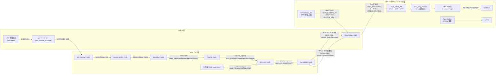

# 系统拓扑总览（Mermaid）

基于当前仓库源码、launch 文件和 STM32 FreeRTOS 入口整理。

说明：
- 以默认部署链路为准：`vision_stack.launch.py` + `rpi_stack.launch.py` + `stm32_keil`
- 以下内容按“实际运行代码”整理，不包含大部分测试程序
- 当前主通信链路中 **没有实际启用的 CAN 总线**
- `CalibrateCenter.srv` 已定义，但当前代码里 **没有服务端实现**

---

## 1. 三个域上实际运行的节点 / 任务

### 1.1 WSL / PC 域

默认由 `ros2 launch robot_bringup vision_stack.launch.py` 启动：

| 名称 | 类型 | 入口文件 | 职责 |
|---|---|---|---|
| `gst_receiver_node` | ROS 2 节点 | `ros2_ws/src/gst_receiver/src/gst_receiver_node.cpp` | 接收树莓派发来的 UDP/H.264 码流，解码后发布 `/stereo/image_raw` |
| `stereo_splitter_node` | ROS 2 节点 | `ros2_ws/src/stereo_splitter/src/stereo_splitter_node.cpp` | 将 640x480 双目拼接图切出左目，发布 `/camera/image_mono` |
| `detection_node` | ROS 2 节点 | `ros2_ws/src/detection_node/src/detection_node.cpp` | YOLOv8 推理，发布 `/detections` |
| `tracker_node` | ROS 2 节点 | `ros2_ws/src/tracker_node/src/tracker_node.cpp` | ByteTrack 跟踪，发布 `/tracked_objects` |
| `behavior_node` | ROS 2 节点 | `ros2_ws/src/behavior_node/src/behavior_node.cpp` | 从跟踪结果中按类别选目标，计算像素误差，发布 `/pixel_error`，提供 `/set_target_class` |
| `leg_motion_node` | ROS 2 节点 | `ros2_ws/src/visual_servo/src/visual_servo_node.cpp` | 订阅 `/pixel_error` 和 `/servo_state`，生成前进/转向控制量并合成 4 路腿舵机目标角，发布 `/servo_cmd` |

补充：
- `robot_bringup/src/vision_front_main.cpp` 是可选的 WSL 进程内组合入口，默认 `BUILD_VISION_FRONT=OFF`
- `detection_viz_node` 是调试节点，不在默认 launch 中

### 1.2 树莓派域

默认运行两类实体：

| 名称 | 类型 | 入口文件 | 职责 |
|---|---|---|---|
| `gst-launch-1.0` 推流进程 | 非 ROS 进程 | `scripts/start_camera_stream.sh` | 从 `/dev/video0` 读取 USB 双目摄像头，H.264 编码后经 UDP 发往 WSL `:5600` |
| `uart_bridge_node` | ROS 2 节点 | `ros2_ws/src/uart_bridge/src/uart_bridge_node.cpp` | 订阅 `/servo_cmd` 并编码成 UART 帧发送到 STM32；接收 STM32 状态帧并发布 `/servo_state`；负责握手、时间戳映射、丢帧统计 |

默认由 `ros2 launch robot_bringup rpi_stack.launch.py` 启动的是 `uart_bridge_node`。

### 1.3 STM32 / FreeRTOS 域

由 `stm32_keil/Core/Src/main.c` 初始化外设后进入 `MX_FREERTOS_Init()`，创建以下任务：

| 名称 | 类型 | 入口文件 | 职责 |
|---|---|---|---|
| `defaultTask` | FreeRTOS 任务 | `stm32_keil/Core/Src/freertos.c` | 空转占位任务 |
| `Task_UART_RX` | FreeRTOS 任务 | `stm32_keil/Core/Src/uart_rx_task.c` | USART1 DMA + IDLE 中断收包，解析 UART 帧，校验 CRC，处理握手和舵机命令 |
| `Task_Traj_Planner` | FreeRTOS 任务 | `stm32_keil/Core/Src/traj_planner.c` | 每 5ms 更新 4 路舵机的梯形轨迹，并调用 PWM 驱动输出 |
| `Task_Status_TX` | FreeRTOS 任务 | `stm32_keil/Core/Src/status_safety_task.c` | 每 50ms 打包并发送 `SERVO_STATE_V2` 状态帧；按需发送 `SYSTEM_STATE` |
| `Task_Safety` | FreeRTOS 任务 | `stm32_keil/Core/Src/status_safety_task.c` | 每 100ms 喂狗，维持 IWDG |

支撑但不是任务的关键执行点：

| 名称 | 类型 | 文件 | 职责 |
|---|---|---|---|
| `USART1_IRQHandler` | 中断 | `stm32_keil/Core/Src/stm32f1xx_it.c` | 处理 ORE / IDLE，中断里唤醒 `Task_UART_RX` |
| `Servo_SetAngle()` | 驱动函数 | `stm32_keil/Core/Src/servo_driver.c` | 将角度转换为 TIM2 CCR，驱动 PA0~PA3 PWM |

---

## 2. 整体拓扑图（Mermaid）



---

## 3. 物理连接

| 两端 | 物理链路 | 代码 / 配置证据 |
|---|---|---|
| USB 双目摄像头 -> 树莓派 | USB / V4L2 | `scripts/start_camera_stream.sh` 使用 `/dev/video0` |
| 树莓派 -> WSL | 以太网 / IP 网络 | WSL2 与树莓派通过 DDS 和 UDP 视频流通信 |
| 树莓派 -> WSL | UDP/H.264 `:5600` | 树莓派 `udpsink host=... port=5600`，WSL `udpsrc port=5600` |
| WSL <-> 树莓派 | ROS 2 DDS over network | `/servo_cmd`、`/servo_state` 跨主机传输 |
| 树莓派 GPIO14/15 <-> STM32 PA10/PA9 | UART | 树莓派 `/dev/ttyAMA0`，STM32 `USART1`，921600 bps |
| STM32 PA0~PA3 -> 舵机 | PWM | TIM2_CH1~4，50Hz |

明确未启用：
- CAN：仓库中没有实际 CAN 收发节点、任务或协议主链；仅 HAL 配置里保留了可选 CAN 宏

---

## 4. ROS 2 topic 和 service 发布/订阅关系

### 4.1 Topics

| Topic | 类型 | 发布者 | 订阅者 |
|---|---|---|---|
| `/stereo/image_raw` | `sensor_msgs/Image` | `gst_receiver_node` | `stereo_splitter_node` |
| `/camera/image_mono` | `sensor_msgs/Image` | `stereo_splitter_node` | `detection_node` |
| `/detections` | `robot_interfaces/SimpleDetection2DArray` | `detection_node` | `tracker_node` |
| `/tracked_objects` | `robot_interfaces/SimpleDetection2DArray` | `tracker_node` | `behavior_node` |
| `/pixel_error` | `geometry_msgs/Vector3` | `behavior_node` | `leg_motion_node` |
| `/servo_cmd` | `sensor_msgs/JointState` | `leg_motion_node` | `uart_bridge_node` |
| `/servo_state` | `sensor_msgs/JointState` | `uart_bridge_node` | `leg_motion_node` |

### 4.2 Services

| Service | 类型 | 服务端 | 调用方 |
|---|---|---|---|
| `/set_target_class` | `robot_interfaces/SetTargetClass` | `behavior_node` | 操作端 / CLI / 上位控制逻辑 |

已定义但当前未实现服务端：

| Service | 类型 | 状态 |
|---|---|---|
| `/calibrate_center` | `robot_interfaces/CalibrateCenter` | 仅接口定义，当前未发现节点实现 |

---

## 5. 串口协议消息流

共享协议定义见：
- `shared/uart_protocol.h`
- `ros2_ws/src/uart_bridge/include/uart_bridge/uart_protocol.h`
- `stm32_keil/Core/Inc/uart_protocol.h`

### 5.1 UART 帧格式

```text
[0xAA][0x55][CMD_ID][LEN][PAYLOAD...][CRC16_LO][CRC16_HI][0x0D]
```

CRC16 覆盖范围：
- `CMD_ID + LEN + PAYLOAD`

### 5.2 树莓派 -> STM32

| CMD_ID | 名称 | 方向 | Payload | 来源 |
|---|---|---|---|---|
| `0x10` | `UART_CMD_INIT_HANDSHAKE` | 树莓派 -> STM32 | `UartHandshakePayload` | `uart_bridge_node` 启动后发送握手 |
| `0x01` | `UART_CMD_SERVO_CONTROL` | 树莓派 -> STM32 | `ServoCmdItem[]` | `/servo_cmd` 转换而来 |

流程：
1. `leg_motion_node` 发布 `/servo_cmd`
2. `uart_bridge_node::OnServoCmdReceived()` 将关节名映射到 `servo_id`
3. `frame_encoder.cpp` 打包为 `SERVO_CONTROL` 帧
4. 树莓派通过 `/dev/ttyAMA0` 写入 UART
5. STM32 `Task_UART_RX` 解包、校验 CRC
6. 调用 `Traj_SetTarget()` 更新舵机目标

### 5.3 STM32 -> 树莓派

| CMD_ID | 名称 | 方向 | Payload | 来源 |
|---|---|---|---|---|
| `0x82` | `UART_CMD_SERVO_STATE_V2` | STM32 -> 树莓派 | `ServoStateItem_v2[]` | `Task_Status_TX` 周期发送 |
| `0x83` | `UART_CMD_SYSTEM_STATE` | STM32 -> 树莓派 | `UartSystemStatePayload` | 握手阶段和状态切换时发送 |

流程：
1. STM32 `Task_Status_TX` 每 50ms 打包 4 路舵机状态
2. 状态帧通过 `HAL_UART_Transmit()` 发到树莓派
3. 树莓派 `ReadLoop()` 按字节送入 `FrameParser`
4. `uart_bridge_node::OnFrameReceived()` 解析为 `/servo_state`
5. `leg_motion_node` 用 `/servo_state` 更新四条腿当前角度，形成闭环

---

## 6. “边界点”标注：ROS 2 ↔ STM32 协议解析在哪些文件

这是最关键的跨域边界。

### 6.1 ROS 2 -> UART 编码边界

| 边界职责 | 文件 |
|---|---|
| ROS JointState 转串口控制项 | `ros2_ws/src/uart_bridge/src/uart_bridge_node.cpp` 中 `OnServoCmdReceived()` |
| 串口控制帧编码 | `ros2_ws/src/uart_bridge/src/frame_encoder.cpp` |
| 协议定义 | `ros2_ws/src/uart_bridge/include/uart_bridge/uart_protocol.h` |

### 6.2 UART 字节流 -> ROS 2 解码边界

| 边界职责 | 文件 |
|---|---|
| 字节流状态机解析 | `ros2_ws/src/uart_bridge/src/frame_parser.cpp` |
| 解析后的帧分发为 `/servo_state` | `ros2_ws/src/uart_bridge/src/uart_bridge_node.cpp` 中 `OnFrameReceived()` |

### 6.3 STM32 侧协议解析边界

| 边界职责 | 文件 |
|---|---|
| DMA + IDLE 接收、组帧、CRC 校验 | `stm32_keil/Core/Src/uart_rx_task.c` |
| USART1 IDLE 中断唤醒接收任务 | `stm32_keil/Core/Src/stm32f1xx_it.c` |
| 收到控制帧后调用轨迹规划 | `stm32_keil/Core/Src/uart_rx_task.c` 中 `Traj_SetTarget()` |

### 6.4 STM32 状态回传边界

| 边界职责 | 文件 |
|---|---|
| `SERVO_STATE_V2` 打包发送 | `stm32_keil/Core/Src/status_safety_task.c` |
| `SYSTEM_STATE` 打包发送 | `stm32_keil/Core/Src/status_safety_task.c` |

---

## 7. 代码运行域划分

### 7.1 只运行在 WSL

- `ros2_ws/src/gst_receiver/`
- `ros2_ws/src/stereo_splitter/`
- `ros2_ws/src/detection_node/`
- `ros2_ws/src/tracker_node/`
- `ros2_ws/src/behavior_node/`
- `ros2_ws/src/visual_servo/`
- 可选：`ros2_ws/src/robot_bringup/src/vision_front_main.cpp`

这些模块依赖：
- OpenCV
- GStreamer 解码
- ONNX Runtime / CUDA
- WSL 侧 ROS 2 环境

### 7.2 只运行在树莓派

- `ros2_ws/src/uart_bridge/`
- `scripts/start_camera_stream.sh`
- `scripts/rpi_start_camera.sh`
- `scripts/rpi_start_ros.sh`

这些模块依赖：
- `/dev/video0`
- `/dev/ttyAMA0`
- 树莓派 ROS 2 Jazzy 运行时

### 7.3 STM32 固件

- `stm32_keil/Core/Src/*.c`
- `stm32_keil/Core/Inc/*.h`
- `stm32_keil/Drivers/`
- `stm32_keil/Middlewares/Third_Party/FreeRTOS/`

核心固件模块：
- `main.c`
- `freertos.c`
- `uart_rx_task.c`
- `traj_planner.c`
- `status_safety_task.c`
- `servo_driver.c`
- `uart_protocol.c`

### 7.4 WSL 与树莓派共享的 ROS 2 包

- `ros2_ws/src/robot_interfaces/`
- `ros2_ws/src/robot_bringup/launch/`

说明：
- `robot_interfaces` 需要同时存在于 WSL 和树莓派的 ROS 工作空间中
- `robot_bringup` 的 launch 在两个域各自被调用，但实际启动内容不同

### 7.5 树莓派与 STM32 共享的协议定义

- 源共享定义：`shared/uart_protocol.h`、`shared/uart_protocol.c`
- 树莓派镜像：`ros2_ws/src/uart_bridge/include/uart_bridge/uart_protocol.h`
- STM32 镜像：`stm32_keil/Core/Inc/uart_protocol.h`

---

## 8. 默认启动链路

### WSL

```bash
ros2 launch robot_bringup vision_stack.launch.py
```

### 树莓派

```bash
./scripts/start_camera_stream.sh
ros2 launch robot_bringup rpi_stack.launch.py
```

### STM32

- 烧录 `stm32_keil` 固件
- 上电后执行：
  - `MX_USART1_UART_Init()`
  - `MX_TIM2_Init()`
  - `MX_FREERTOS_Init()`
  - `osKernelStart()`

---

## 9. 一句话总结

这套系统的真正边界不是 ROS 2 节点本身，而是：

1. WSL 与树莓派之间的 **ROS 2 DDS + UDP 视频流**
2. 树莓派与 STM32 之间的 **UART 二进制协议**
3. STM32 内部的 **UART 接收任务 -> 轨迹规划任务 -> PWM 驱动**

如果后续要排障，优先沿这三条边界逐段看日志和波形。
