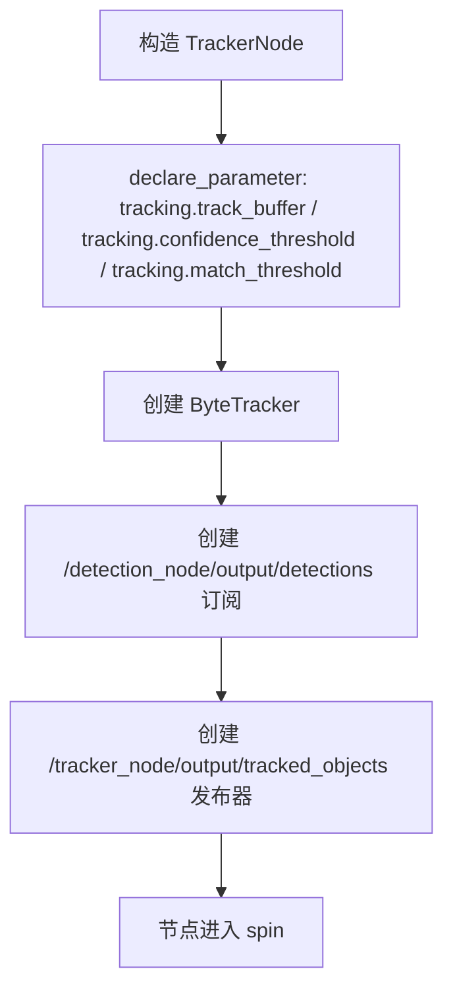
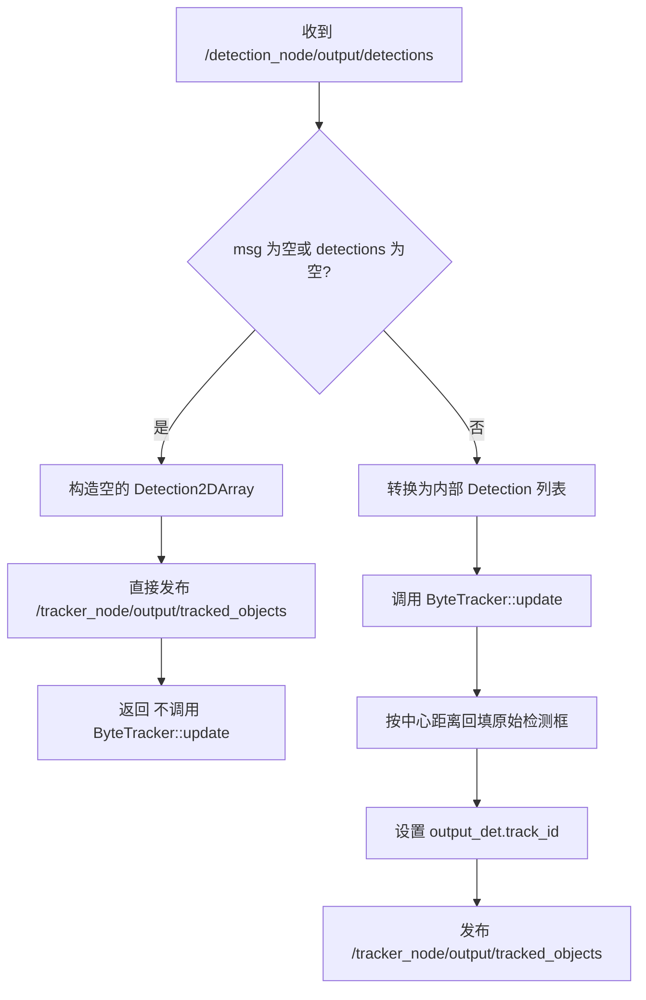
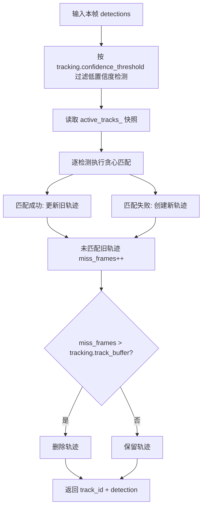

# tracker_node 节点中文代码说明文档

本文基于仓库当前源码撰写，分析对象是 `tracker_node` 节点及其内部使用的简化版 `ByteTracker`。

源码基线：

- `ros2_ws/src/tracker_node/include/tracker_node/tracker_node.hpp`
- `ros2_ws/src/tracker_node/src/tracker_node.cpp`
- `ros2_ws/src/tracker_node/include/tracker_node/byte_tracker.hpp`
- `ros2_ws/src/tracker_node/src/byte_tracker.cpp`
- `ros2_ws/src/tracker_node/launch/tracker.launch.py`
- `ros2_ws/src/tracker_node/config/tracker.yaml`

## 1. 节点概述

### 1.1 用途

`tracker_node` 的职责是接收上游 `detection_node` 发布的检测框数组 `/detection_node/output/detections`，为同一目标在连续帧之间分配稳定的 `track_id`，然后输出带跟踪编号的 `/tracker_node/output/tracked_objects`。

对初级 ROS 2 开发者来说，可以把它理解为：

- `detection_node` 负责回答“这一帧里有什么”
- `tracker_node` 负责回答“这一帧里的这个目标，是不是上一帧那个目标”

### 1.2 所属功能包

| 项目 | 内容 |
| --- | --- |
| 功能包名 | `tracker_node` |
| 节点类名 | `tracker_node::TrackerNode` |
| 可执行文件 | `tracker_node_exe` |
| 主入口文件 | `ros2_ws/src/tracker_node/src/main.cpp` |

### 1.3 在系统中的角色

它位于视觉链路中的“检测之后，行为决策之前”：

```text
stereo_splitter_node
  -> detection_node
  -> tracker_node
  -> behavior_node
```

它在系统中的价值主要有三点：

1. 给每个目标分配稳定 ID，避免下游每帧都把同一个物体当成新目标
2. 允许目标短暂丢失后恢复同一轨迹
3. 给 `behavior_node` 提供更稳定的上游输入

## 2. 依赖项

### 2.1 ROS 2 版本

根据仓库 `README.md` 与 `SETUP_GUIDE.md`，当前工程基线是 **ROS 2 Jazzy**。

### 2.2 依赖的 ROS 2 功能包

| 依赖包 | 类型 | 作用 |
| --- | --- | --- |
| `rclcpp` | ROS 2 C++ 客户端库 | 提供节点、参数、话题收发、日志 |
| `robot_interfaces` | 自定义接口包 | 提供 `Detection2D` 与 `Detection2DArray` |
| `sensor_msgs` | 官方消息包 | 在 `package.xml` / `CMakeLists.txt` 中声明为依赖，但本节点源码中未直接使用图像消息 |

### 2.3 第三方库

| 库 | 用途 |
| --- | --- |
| C++ 标准库 `vector` / `map` / `algorithm` | 存储轨迹、检测和匹配结果 |
| C++ 标准库 `cmath` | 计算 IoU、欧氏距离等几何量 |

### 2.4 自定义消息

#### `robot_interfaces/msg/Detection2D`

| 字段 | 类型 | 在本节点中的用途 |
| --- | --- | --- |
| `center_x` | `float32` | 检测框中心 x |
| `center_y` | `float32` | 检测框中心 y |
| `width` | `float32` | 检测框宽度 |
| `height` | `float32` | 检测框高度 |
| `confidence` | `float32` | 跟踪前的检测置信度 |
| `class_id` | `int32` | 类别 ID |
| `track_id` | `string` | 输出阶段由本节点补充 |

#### `robot_interfaces/msg/Detection2DArray`

| 字段 | 类型 | 在本节点中的用途 |
| --- | --- | --- |
| `header` | `std_msgs/Header` | 原样透传时间戳与坐标系 |
| `detections` | `Detection2D[]` | 输入检测框列表 / 输出带轨迹 ID 的目标列表 |

## 3. 节点接口清单

### 3.1 订阅的话题

| 话题名 | 消息类型 | QoS | 回调函数 | 用途 |
| --- | --- | --- | --- | --- |
| `/detection_node/output/detections` | `robot_interfaces/msg/Detection2DArray` | `rclcpp::SensorDataQoS()`，等价于常见的 `KeepLast(5) + BestEffort + Volatile` | `TrackerNode::detections_callback()` | 接收检测节点输出的原始检测结果，并触发一次轨迹更新 |

### 3.2 发布的话题

| 话题名 | 消息类型 | QoS | 发布频率 | 用途 |
| --- | --- | --- | --- | --- |
| `/tracker_node/output/tracked_objects` | `robot_interfaces/msg/Detection2DArray` | `rclcpp::QoS(5).reliable()`，即 `KeepLast(5) + Reliable + Volatile` | 事件驱动；通常跟随 `/detection_node/output/detections` 的有效输入频率 | 发布带 `track_id` 的检测框结果，供 `behavior_node` 等下游节点使用 |

### 3.3 提供的服务 / 动作

当前节点 **没有** 提供任何 Service，也 **没有** 提供任何 Action。

| 名称 | 类型 | 用途 |
| --- | --- | --- |
| 无 | 无 | 当前未实现 |

### 3.4 客户端调用的服务 / 动作

当前节点 **没有** 调用任何 Service，也 **没有** 使用任何 Action Client。

| 名称 | 类型 | 用途 |
| --- | --- | --- |
| 无 | 无 | 当前未实现 |

### 3.5 TF 坐标系

当前节点 **不监听 TF**，也 **不广播 TF**。

| 类型 | 坐标系 | 说明 |
| --- | --- | --- |
| 监听 | 无 | 不依赖 `tf2` |
| 广播 | 无 | 不发布任何坐标变换 |

## 4. 参数列表

### 4.1 参数总表

> ROS 2 参数可以理解为“节点启动配置”。本节点没有参数热更新回调，因此运行中改值通常不会自动重建 `ByteTracker`，默认应按“重启节点后生效”理解。

| 参数名 | 类型 | 默认值 | 取值范围 | 含义 | 是否动态可调 | 代码现状 |
| --- | --- | --- | --- | --- | --- | --- |
| `tracking.track_buffer` | `int` | `30` | 建议 `>=0` | 轨迹在丢失后最多保留多少帧 | 否 | **部分生效**；已传入 `ByteTracker`，但节点收到空检测帧时不会调用 `update({})` |
| `tracking.confidence_threshold` | `double` | `0.5` | 建议 `0.0 ~ 1.0` | 低于该置信度的检测框不参与跟踪 | 否 | 已生效 |
| `tracking.match_threshold` | `double` | `0.5` | 建议 `0.0 ~ 1.0` | 最大匹配代价阈值；这里的代价定义为 `1 - IoU` | 否 | 已生效 |

### 4.2 参数 YAML 示例

```yaml
tracker_node:
  ros__parameters:
    tracking.confidence_threshold: 0.5
    tracking.match_threshold: 0.5
    tracking.track_buffer: 30
```

### 4.3 参数含义补充说明

#### `tracking.track_buffer`

表示目标在暂时消失后还能“保号”多久。

例如在 30 FPS 下：

- `tracking.track_buffer = 30` 约等于允许丢失 1 秒
- 只要目标在这段时间内重新出现，并且与旧轨迹匹配成功，就还能拿回原来的 `track_id`

#### `tracking.confidence_threshold`

表示“这个检测值不值得拿去跟踪”。

如果检测置信度低于这个值，本节点会直接忽略该检测，不给它创建轨迹，也不参与匹配。

#### `tracking.match_threshold`

这里不是 IoU 阈值本身，而是 **匹配代价阈值**：

```text
cost = 1 - IoU
```

所以：

- `cost` 越小，说明两个框越像同一个目标
- `tracking.match_threshold` 越小，匹配越严格

以默认值 `0.5` 为例：

```text
1 - IoU < 0.5
=> IoU > 0.5
```

也就是说，默认情况下大致要求两个框的 IoU 大于 `0.5` 才会认为是同一目标。

## 5. 核心代码逻辑

### 5.1 类结构和继承关系

`TrackerNode` 负责 ROS 2 接口，`ByteTracker` 负责轨迹匹配与轨迹状态维护。

```mermaid
classDiagram
    class rclcpp::Node

    class TrackerNode {
        -Subscription~Detection2DArray~ detections_sub_
        -Publisher~Detection2DArray~ tracked_objects_pub_
        -unique_ptr~ByteTracker~ tracker_
        +TrackerNode(options)
        -detections_callback(msg)
        -Detection2DToByteTrack(det)
    }

    class Detection {
        +float x
        +float y
        +float w
        +float h
        +float conf
        +int class_id
        +Area()
        +CenterDistance(other)
    }

    class TrackState {
        +int track_id
        +Detection last_detection
        +int age
        +int active_frames
        +int miss_frames
        +IsActive()
        +IsToDelete(max_buffer)
    }

    class ByteTracker {
        -int track_buffer_
        -float confidence_threshold_
        -float match_threshold_
        -int next_id_
        -map~int, TrackState~ active_tracks_
        +update(detections)
        +reset()
        -ComputeIoU(det1, det2)
        -compute_cost(det, track_det)
    }

    rclcpp::Node <|-- TrackerNode
    TrackerNode *-- ByteTracker
    ByteTracker *-- TrackState
    TrackState *-- Detection
```

### 5.2 构造函数初始化流程

`TrackerNode` 构造函数的流程非常直接：

1. 声明并读取三个跟踪参数
2. 创建 `ByteTracker`
3. 创建 `/detection_node/output/detections` 订阅者
4. 创建 `/tracker_node/output/tracked_objects` 发布者
5. 输出初始化日志



构造函数核心骨架如下：

```cpp
int track_buffer = this->declare_parameter<int>("tracking.track_buffer", 30);     // 允许丢失的最大帧数
float confidence_threshold = this->declare_parameter<double>("tracking.confidence_threshold", 0.5);  // 低置信度过滤阈值
float match_threshold = this->declare_parameter<double>("tracking.match_threshold", 0.5);  // 1-IoU 的最大允许代价

tracker_ = std::make_unique<ByteTracker>(track_buffer, confidence_threshold, match_threshold);  // 创建跟踪器

auto qos = rclcpp::SensorDataQoS();
detections_sub_ = this->create_subscription<robot_interfaces::msg::Detection2DArray>(
  "/detection_node/output/detections", qos,
  std::bind(&TrackerNode::detections_callback, this, std::placeholders::_1));   // 接收检测结果

tracked_objects_pub_ =
  this->create_publisher<robot_interfaces::msg::Detection2DArray>(
    "/tracker_node/output/tracked_objects", rclcpp::QoS(5).reliable());                      // 发布带 track_id 的结果
```

### 5.3 主要回调函数处理流程

#### 5.3.1 `detections_callback()`

这是本节点唯一的 ROS 回调函数，也是整个节点的主入口。

**触发条件**

- 收到一条 `/detection_node/output/detections` 消息

**处理结果**

- 若输入为空，则发布空的 `/tracker_node/output/tracked_objects`，并且**不会推进内部轨迹的 miss 计数**
- 若输入非空，则完成“检测消息转换 -> 轨迹更新 -> 回填 `track_id` -> 发布结果”

**处理步骤**

1. 检查消息指针和检测数组是否为空
2. 把 `Detection2D` 转为内部 `Detection`
3. 调用 `tracker_->update()`
4. 对每个跟踪结果，去原始输入里找最接近的检测框
5. 给该检测框填上字符串形式的 `track_id`
6. 发布 `/tracker_node/output/tracked_objects`



**关键代码片段**

```cpp
for (const auto& det : msg->detections) {
  detections.push_back(Detection2DToByteTrack(det));  // ROS 消息 -> 跟踪器内部结构
}

auto tracked = tracker_->update(detections);             // 执行一帧跟踪

for (const auto& [track_id, detection] : tracked) {
  int best_idx = -1;
  float best_dist = 50.0f;                               // 只接受 50 像素内的最近输入框

  for (size_t i = 0; i < msg->detections.size(); ++i) {
    float dx = msg->detections[i].center_x - detection.x;
    float dy = msg->detections[i].center_y - detection.y;
    float dist = std::sqrt(dx * dx + dy * dy);
    if (dist < best_dist) {
      best_dist = dist;
      best_idx = i;
    }
  }

  if (best_idx >= 0) {
    auto output_det = msg->detections[best_idx];         // 保留原检测框字段
    output_det.track_id = std::to_string(track_id);      // 只补充 track_id
    result->detections.push_back(output_det);
  }
}
```

#### 5.3.2 `Detection2DToByteTrack()`

它不是 ROS 回调，但它是消息适配的重要辅助函数。

**触发条件**

- `detections_callback()` 遍历输入检测框时调用

**处理结果**

- 把 ROS 消息 `Detection2D` 转换为 `ByteTracker` 内部使用的 `Detection`

**转换关系**

| 输入字段 | 输出字段 |
| --- | --- |
| `center_x` | `x` |
| `center_y` | `y` |
| `width` | `w` |
| `height` | `h` |
| `confidence` | `conf` |
| `class_id` | `class_id` |

### 5.4 关键算法说明

#### 5.4.1 这不是完整版 ByteTrack

虽然类名叫 `ByteTracker`，但当前实现其实是 **“ByteTrack 风格的简化跟踪器”**，不是论文里的完整实现。

主要差异有：

1. 使用的是 **贪心匹配**，不是匈牙利算法
2. 只对高置信度检测进行匹配
3. 没有卡尔曼滤波
4. 没有两阶段高低分框关联
5. 轨迹状态非常轻量，只保留最后一次检测框

所以文档里更准确的说法应该是：

> “简化版 ByteTrack 风格多目标跟踪器”

#### 5.4.2 `ByteTracker::update()` 总流程

`update()` 每收到一帧检测列表就执行一次。它的核心流程是：

1. 过滤低置信度检测
2. 取出当前活跃轨迹快照
3. 用 `1 - IoU` 做代价，执行贪心匹配
4. 未匹配检测创建新轨迹
5. 未匹配轨迹累计 `miss_frames`
6. 丢失超过 `tracking.track_buffer` 的轨迹被删除



#### 5.4.3 低置信度过滤

在正式匹配前，代码先做一次简单过滤：

```cpp
for (const auto& det : detections) {
  if (det.conf >= confidence_threshold_) {
    high_conf.push_back(det);  // 只有高于阈值的检测才参与后续匹配
  }
}
```

这意味着：

- 低分检测不会创建轨迹
- 低分检测也不会用来延续已有轨迹

#### 5.4.4 匹配代价：`1 - IoU`

当前实现的代价函数非常简单：

```text
cost = 1 - IoU
```

含义如下：

| IoU | cost | 含义 |
| --- | --- | --- |
| `1.0` | `0.0` | 两个框完全重合，最适合匹配 |
| `0.5` | `0.5` | 中等重叠 |
| `0.0` | `1.0` | 完全不重叠，最不适合匹配 |

#### 5.4.5 贪心匹配

代码不是先构建完整代价矩阵再做全局最优分配，而是按“检测顺序”逐个寻找当前最合适的未匹配轨迹：

1. 取一个检测框
2. 遍历所有还没被占用的轨迹
3. 找到代价最小的轨迹
4. 如果代价小于阈值，则匹配成功
5. 否则认为这是一个新目标

这个方法的优点是实现简单、速度快；缺点是目标多的时候可能不是全局最优。

#### 5.4.6 新轨迹创建与旧轨迹删除

如果某个检测没有匹配到旧轨迹，就分配新 `track_id`：

```cpp
int new_id = next_id_++;        // 先取当前 ID，再自增
state.track_id = new_id;
state.active_frames = 1;
state.miss_frames = 0;
active_tracks_[new_id] = state; // 写入活跃轨迹表
```

如果某条旧轨迹本帧没有匹配到检测，则：

1. `miss_frames++`
2. 若 `miss_frames > track_buffer_`，删除该轨迹

### 5.5 当前实现的几个注意点

#### 5.5.1 `class_id` 当前没有参与匹配

虽然 `Detection` 结构体里有 `class_id`，但 `update()` 里并不会检查“类别是否一致”。

也就是说，当前是否延续同一轨迹，主要只看：

- 置信度是否过阈值
- IoU 是否足够大

#### 5.5.2 `age` 当前没有持续更新

`TrackState` 里定义了 `age` 字段，但在当前实现中：

- 新轨迹创建时把 `age = 0`
- 后续并没有在每帧里递增它

所以它目前更像“预留字段”，不是活跃逻辑的一部分。

#### 5.5.3 `CenterDistance()` 当前未被 `ByteTracker` 匹配逻辑使用

`Detection::center_distance()` 在头文件中定义了，但 `update()` 的轨迹匹配并不用它。真正的匹配依据是 IoU。

#### 5.5.4 回填输出时使用的是“中心点最近 + 50 像素阈值”

`ByteTracker::update()` 返回的是内部 `Detection` 列表；`TrackerNode` 在发布前，要重新找到“对应的原始输入检测框”，这样可以保留原消息的字段。

它采用的方法是：

1. 遍历所有输入检测
2. 找中心点距离最近的检测框
3. 只有距离小于 `50` 像素才认为匹配成功

这意味着：

- 如果内部检测位置和输入消息偏差太大，可能找不到对应原始框
- 输出中该轨迹就不会被发布

#### 5.5.5 空消息分支对空指针不够稳妥

代码中有一段：

```cpp
if (!msg || msg->detections.empty()) {
  auto result = std::make_shared<robot_interfaces::msg::Detection2DArray>();
  result->header = msg->header;
  tracked_objects_pub_->publish(*result);
  return;
}
```

在 ROS 正常运行时，回调收到的 `msg` 一般不会是空指针，所以这个问题通常不触发。但从代码健壮性角度看：

- 条件里允许 `!msg`
- 后面又直接使用 `msg->header`

因此它对“真正的空指针输入”并不完全安全。

#### 5.5.6 空检测帧不会推进 `miss_frames`

这点非常关键。

虽然 `ByteTracker::update({})` 本身支持“空检测输入时给旧轨迹累计 `miss_frames`”，但 `TrackerNode::detections_callback()` 在收到空检测数组时会直接返回：

- 发布一个空的 `/tracker_node/output/tracked_objects`
- **不调用** `tracker_->update({})`

这意味着在真实 ROS 链路里：

1. 如果上游持续发布“空检测帧”
2. `tracker_node` 的内部轨迹状态并不会因为这些空帧而老化
3. `track_buffer` 的行为会和你单独测试 `ByteTracker` 时看到的不完全一样

换句话说，`track_buffer` 在“节点级实际运行”与“算法类单独测试”之间，目前存在语义差异。

#### 5.5.7 本帧新建轨迹会立刻记一次 `miss_frames`

`ByteTracker::update()` 的阶段顺序是：

1. 先拿旧轨迹快照 `tracks`
2. 对未匹配检测创建新轨迹，写入 `active_tracks_`
3. 再遍历 `active_tracks_` 给“未匹配轨迹”做 `miss_frames++`

问题在于：

- 本帧新建轨迹不在旧快照 `tracks` 里
- 到阶段 5 遍历 `active_tracks_` 时，它会被当成“未匹配轨迹”
- 于是 `miss_frames` 会在创建当帧就从 `0` 变成 `1`

这会让轨迹的实际保留时长比直觉上更短一帧。

## 6. 生命周期与线程模型

### 6.1 生命周期类型

本节点是普通 `rclcpp::Node`，**不是** `LifecycleNode`。

因此它没有显式的：

- `configure`
- `activate`
- `deactivate`
- `cleanup`

这些生命周期状态转换。

### 6.2 执行器类型

主入口 `src/main.cpp` 调用的是：

```cpp
project_shared::spin_single_node_main<tracker_node::TrackerNode>(argc, argv);
```

而 `spin_single_node_main()` 内部本质上是：

```cpp
rclcpp::spin(node);
```

因此默认独立运行时，可以按 **单线程执行器语义** 理解。

### 6.3 回调组

当前代码 **没有显式创建 callback group**，所有 ROS 回调都在默认回调组中。

### 6.4 定时器

当前节点 **没有定时器**。

### 6.5 后台线程

当前节点 **没有后台线程**，也没有显式工作队列。

和 `detection_node` 不同，`tracker_node` 的所有工作都在 `detections_callback()` 这一个回调里完成。

### 6.6 线程模型总结

| 项目 | 现状 |
| --- | --- |
| 执行器 | 默认 `rclcpp::spin()` |
| ROS 回调 | 只有一个：`detections_callback()` |
| 回调组 | 默认回调组 |
| 定时器 | 无 |
| 后台线程 | 无 |
| 显式工作队列 | 无 |

## 7. 启动方式

### 7.1 `ros2 run` 命令示例

先准备环境：

```bash
source /opt/ros/jazzy/setup.bash
cd /home/peter/dog/dog_dev/ros2_ws
colcon build --packages-select tracker_node
source install/setup.bash
```

直接运行：

```bash
ros2 run tracker_node tracker_node_exe \
  --ros-args \
  --params-file /home/peter/dog/dog_dev/ros2_ws/src/tracker_node/config/tracker.yaml
```

如果想查看更多日志：

```bash
ros2 run tracker_node tracker_node_exe \
  --ros-args \
  --params-file /home/peter/dog/dog_dev/ros2_ws/src/tracker_node/config/tracker.yaml \
  --log-level debug
```

### 7.2 launch 文件示例

单独启动 `tracker_node`：

```bash
ros2 launch tracker_node tracker.launch.py
```

`tracker.launch.py` 的核心内容如下：

```python
Node(
    package='tracker_node',                    # 功能包名
    executable='tracker_node_exe',            # 可执行文件
    name='tracker_node',                      # 节点名
    output='screen',                          # 日志输出到终端
    parameters=[os.path.join(config_dir, 'tracker.yaml')]  # 加载 YAML 参数
)
```

在完整视觉链路中，通常通过：

```bash
ros2 launch robot_bringup vision_stack.launch.py
```

### 7.3 启动前的前置条件

| 前置条件 | 说明 |
| --- | --- |
| 上游节点已启动 | 需要 `detection_node` 正常发布 `/detection_node/output/detections` |
| 工作区已编译 | `tracker_node_exe` 需要已构建并 source |
| 参数文件可访问 | `tracker.yaml` 路径存在且格式正确 |

## 8. 调试与排错

### 8.1 常用诊断命令

#### 查看节点与话题

```bash
ros2 node list
ros2 node info /tracker_node
ros2 topic list
ros2 topic info /detection_node/output/detections
ros2 topic info /tracker_node/output/tracked_objects
```

#### 查看数据是否连通

```bash
ros2 topic hz /detection_node/output/detections
ros2 topic hz /tracker_node/output/tracked_objects
ros2 topic echo /tracker_node/output/tracked_objects --once
```

#### 查看日志

```bash
ros2 run tracker_node tracker_node_exe --ros-args --log-level debug
```

### 8.2 推荐的可视化工具

| 工具 | 建议用途 |
| --- | --- |
| `rqt_graph` | 查看 `/detection_node/output/detections -> tracker_node -> /tracker_node/output/tracked_objects` 是否连通 |
| `ros2 topic echo /tracker_node/output/tracked_objects` | 直接观察 `track_id` 是否稳定 |
| `detection_viz_node_exe` | 将跟踪结果叠加到图像上，查看 ID 是否抖动 |
| `rqt_image_view` | 配合 `detection_viz_node` 看输出画面 |

调试组合示例：

```bash
ros2 run detection_node detection_viz_node_exe
ros2 run rqt_image_view rqt_image_view /camera/image_detected
```

### 8.3 常见问题与排查建议

#### 问题 1：`/tracker_node/output/tracked_objects` 没有输出

**常见原因**

- `/detection_node/output/detections` 没有数据
- 所有检测框置信度都低于 `tracking.confidence_threshold`
- 节点没有正确启动

**排查建议**

1. `ros2 topic echo /detection_node/output/detections --once`
2. 检查 `confidence` 是否普遍太低
3. 临时把 `tracking.confidence_threshold` 调小再观察

#### 问题 2：同一个目标每帧都在换 `track_id`

**常见原因**

- `tracking.match_threshold` 太严格
- 目标移动快，连续帧 IoU 太小
- 上游检测框抖动明显
- 多目标靠得太近，贪心匹配不稳定

**排查建议**

1. 适当放宽 `tracking.match_threshold`
2. 观察上游 `/detection_node/output/detections` 的框是否稳定
3. 通过可视化节点观察 ID 是否频繁跳变

#### 问题 3：目标短暂消失后拿不到原 ID

**常见原因**

- `tracking.track_buffer` 太小
- 遮挡时间过长
- 重新出现时位置变化太大，IoU 不够

**排查建议**

1. 增大 `tracking.track_buffer`
2. 观察目标重新出现时的位置偏移
3. 确认检测框尺寸是否变化过大

#### 问题 4：明明有跟踪结果，但输出数量比输入检测少

**常见原因**

- 某些输入框在 `tracking.confidence_threshold` 阶段被过滤掉了
- 回填原始输入检测时没有找到 50 像素内的候选框

**排查建议**

1. 检查 `tracking.confidence_threshold`
2. 在代码层观察 `best_idx` 是否常为 `-1`

### 8.4 初学者容易忽略的实现细节

| 细节 | 说明 |
| --- | --- |
| 不是完整版 ByteTrack | 当前实现是简化版，重点是 IoU 贪心匹配 |
| `track_id` 是字符串 | 发布时会用 `std::to_string(track_id)` 转成字符串 |
| 按中心点最近回填输出 | 跟踪结果不是直接原样发布，而是先找回原始输入框 |
| 没有类别一致性约束 | 不会强制 `class_id` 相同后再匹配 |
| `SensorDataQoS` 是 BestEffort | 这对视频流友好，但在网络抖动时可能丢帧 |

## 9. 单元测试与集成测试说明

### 9.1 当前已有测试 / 验证文件

| 文件 | 类型 | 说明 |
| --- | --- | --- |
| `ros2_ws/src/tracker_node/test/test_byte_tracker.cpp` | 独立示例程序 | 打印多帧跟踪过程，偏手工验证 |
| `ros2_ws/src/tracker_node/test/test_tracker_node_integration.cpp` | GTest | 覆盖参数构造、基本跟踪、新目标创建、遮挡恢复 |
| `tests/test_byte_tracker.cpp` | 顶层手工单元测试 | 用 `assert` 验证轨迹创建、保号、删除、Reset 等行为 |
| `scripts/verify_tracking.sh` | 系统联调脚本 | 从节点、话题频率到 `/tracker_node/output/tracked_objects` 输出做端到端检查 |

### 9.2 这些测试的特点

当前测试不是完全统一的：

1. 包内有 GTest
2. 也有手工可执行测试程序
3. 顶层 `tests/` 目录还有额外的手工断言测试

值得注意的是：

- `test_tracker_node_integration` 在 `CMakeLists.txt` 中通过 `add_test()` 注册了
- `test_byte_tracker` 虽然会被编译，但当前没有通过 `add_test()` 注册到标准测试入口
- 现有测试大多直接验证 `ByteTracker`，**并没有完整覆盖 `TrackerNode::detections_callback()` 对空检测帧的早返回行为**

### 9.3 适合的验证顺序

对初学者，建议按下面顺序验证：

1. 先跑 `ByteTracker` 的离线/单元测试
2. 再单独启动 `tracker_node`，观察 `/tracker_node/output/tracked_objects`
3. 最后在完整视觉链路中观察 `track_id` 是否稳定

## 10. 变更记录与待办事项

### 10.1 变更记录

| 日期 | 变更 |
| --- | --- |
| 2026-04-29 | 基于当前仓库源码补充 `tracker_node` 中文代码说明文档 |

### 10.2 当前待办事项

| 待办项 | 原因 |
| --- | --- |
| 为空消息分支补上真正安全的空指针处理 | 当前 `!msg` 分支后仍访问 `msg->header` |
| 评估是否引入类别一致性约束 | 目前匹配只看 IoU，不看 `class_id` |
| 评估是否改为匈牙利算法或更完整的匹配策略 | 当前贪心匹配在目标多时可能不是全局最优 |
| 决定是否让 `age` 真正参与状态更新 | 现在字段存在但未持续递增 |
| 明确回填输出的 50 像素阈值是否应参数化 | 当前阈值写死在回调里 |
| 把 `test_byte_tracker` 纳入标准测试入口 | 当前只编译，不自动运行 |

### 10.3 维护建议

以后以下内容只要改动，这份文档都应同步更新：

1. `/detection_node/output/detections` 或 `/tracker_node/output/tracked_objects` 的消息结构变化
2. `ByteTracker` 匹配规则变化
3. 参数名、默认值或实际含义变化
4. 测试组织方式变化
5. 输出 `track_id` 的回填策略变化
