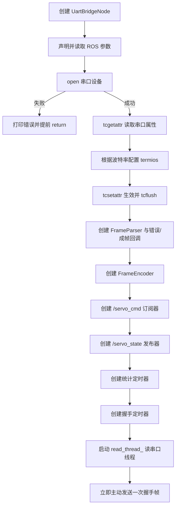
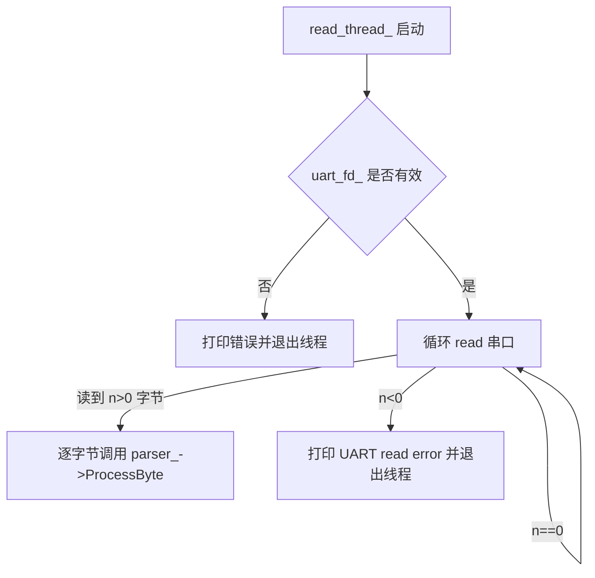
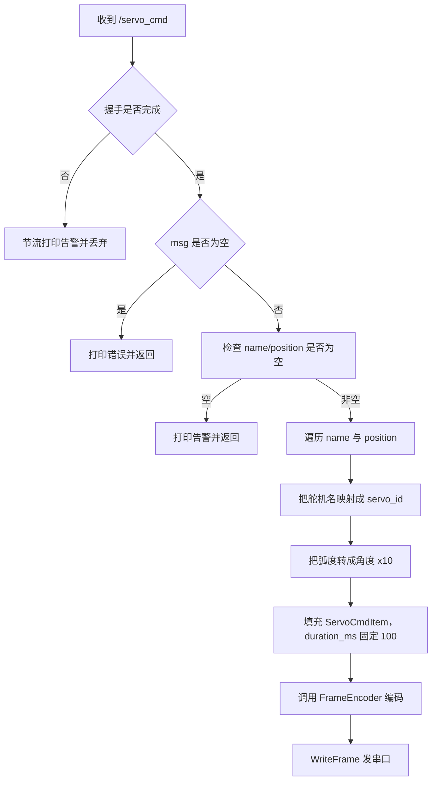
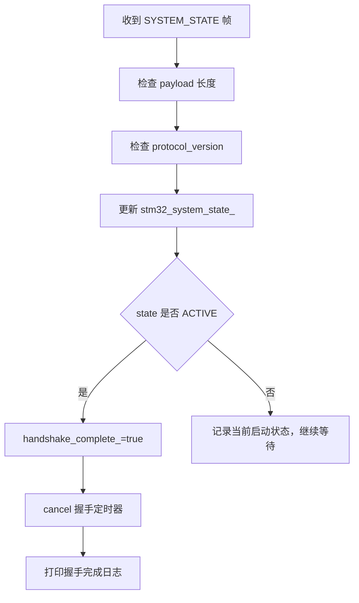
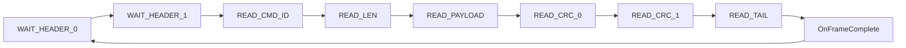

# uart_bridge_node 代码说明文档

## 1. 节点概述

### 1.1 用途

`uart_bridge_node` 的职责是把 ROS 2 世界和 STM32 串口协议世界连接起来：

1. 订阅 ROS 话题 `/servo_cmd`
2. 把 `sensor_msgs/msg/JointState` 转成 UART 二进制控制帧
3. 通过串口发给 STM32
4. 持续从串口读取 STM32 返回的状态帧
5. 解析后发布成 ROS 话题 `/servo_state`

对初级 ROS 2 开发者来说，可以把它理解成一个“协议桥接节点”：

| 角色 | 说明 |
| --- | --- |
| ROS 输入端 | 接收上游控制节点发来的舵机目标角 |
| 串口发送端 | 把 ROS 消息编码成 STM32 能识别的二进制帧 |
| 串口接收端 | 从 STM32 持续读取状态帧和系统状态帧 |
| ROS 输出端 | 把串口反馈还原成标准 `JointState` 消息 |

### 1.2 所属功能包与源码入口

`uart_bridge` 包的实现不是一个大单文件，而是按职责拆成了多个源文件：

| 项目 | 内容 |
| --- | --- |
| 功能包名 | `uart_bridge` |
| 节点入口 | `ros2_ws/src/uart_bridge/src/uart_bridge_main.cpp` |
| 内部类声明 | `ros2_ws/src/uart_bridge/src/uart_bridge_node_internal.hpp` |
| 串口与线程实现 | `ros2_ws/src/uart_bridge/src/uart_bridge_transport.cpp` |
| 协议与 ROS 回调实现 | `ros2_ws/src/uart_bridge/src/uart_bridge_protocol.cpp` |
| 时间同步与丢包统计 | `ros2_ws/src/uart_bridge/src/uart_bridge_time_sync.cpp` |
| 帧编码器 | `ros2_ws/src/uart_bridge/src/frame_encoder.cpp` |
| 帧解析器 | `ros2_ws/src/uart_bridge/src/frame_parser.cpp` |
| 协议定义 | `shared/uart_protocol.h` |
| launch 文件 | `ros2_ws/src/uart_bridge/launch/uart_bridge.launch.py` |
| 参数 YAML | `ros2_ws/src/uart_bridge/config/uart_bridge.yaml` |

### 1.3 在系统中的角色

在当前系统默认链路中，`uart_bridge_node` 运行在 Raspberry Pi 侧，位于控制链的末端：

```text
leg_motion_node
  -> /servo_cmd
  -> uart_bridge_node
  -> UART (/dev/ttyAMA0)
  -> STM32
  -> UART 状态帧
  -> uart_bridge_node
  -> /servo_state
  -> leg_motion_node
```

它的作用不只是“转发字节”，还承担了下面这些附加职责：

| 职责 | 说明 |
| --- | --- |
| 握手保护 | 在 STM32 进入 `ACTIVE` 前丢弃 `/servo_cmd` |
| 协议版本校验 | 检查 STM32 上报的协议版本是否匹配 |
| 时间戳映射 | 把 STM32 的 `timestamp_ms` 映射到 ROS 时间 |
| 丢包检测 | 用 `frame_seq` 统计每路舵机的帧丢失 |
| 时延统计 | 周期输出 UART 接收延迟统计日志 |

## 2. 依赖项

### 2.1 ROS 2 版本与功能包依赖

> 说明：仓库顶层 `README.md` 标明当前项目基于 `ROS 2 Jazzy`；包级依赖来自 `uart_bridge/package.xml` 和 `CMakeLists.txt`。

| 类别 | 名称 | 来源 | 在本节点中的作用 |
| --- | --- | --- | --- |
| ROS 2 发行版 | `ROS 2 Jazzy` | 顶层文档 | 提供 `rclcpp`、launch、参数、QoS、时间类型 |
| ROS 2 C++ 客户端库 | `rclcpp` | `package.xml` | 节点、订阅器、发布器、定时器、日志 |
| 标准消息包 | `sensor_msgs` | `package.xml` | 使用 `sensor_msgs/msg/JointState` 表示指令和状态 |

### 2.2 第三方库与系统库

`uart_bridge` 没有依赖 OpenCV、GStreamer 这类重型三方库，但依赖了不少 Linux/POSIX 系统能力：

| 名称 | 类型 | 在本节点中的作用 |
| --- | --- | --- |
| `termios` | POSIX 串口配置接口 | 设置波特率、数据位、超时参数 |
| `fcntl/open` | POSIX 文件设备接口 | 打开 `/dev/ttyAMA0` 之类的串口设备 |
| `unistd/read/write/close` | POSIX I/O 接口 | 串口读写与关闭 |
| `std::thread` | C++ 标准库 | 后台持续读取串口字节流 |
| `std::atomic` | C++ 标准库 | 线程间共享握手状态和系统状态 |
| `std::mutex` | C++ 标准库 | 保护时间映射和丢包统计数据 |

### 2.3 自定义消息、共享协议与辅助头文件

| 名称 | 类型 | 作用 |
| --- | --- | --- |
| 自定义 ROS 消息 | 无 | 当前节点只用标准消息 `JointState` |
| `shared/uart_protocol.h` | 共享协议头 | 定义 UART 帧格式、命令 ID、payload 结构体、CRC 接口 |
| `shared/servo_names.hpp` | 共享名称映射 | 负责 `servo_id <-> 舵机名` 的映射 |
| `FrameEncoder` | 本包内 helper | 把结构化数据编码成 UART 帧 |
| `FrameParser` | 本包内 helper | 把串口字节流按状态机解析成完整帧 |

## 3. 节点接口清单

### 3.1 非 ROS 外部接口

`uart_bridge_node` 不是纯 ROS 节点，它还有一组很关键的“非 ROS 接口”：

| 名称 | 协议 / 类型 | 方向 | 当前配置 | 用途 |
| --- | --- | --- | --- | --- |
| 串口设备 | Linux 字符设备 | 双向 | 默认 `/dev/ttyAMA0` | 与 STM32 交换控制帧和状态帧 |
| UART 波特率 | 8N1 串口参数 | 双向 | 默认 `921600`，源码支持 `115200` 和 `921600` | 控制串口传输速率 |
| 控制帧 | `UART_CMD_SERVO_CONTROL` | Pi -> STM32 | payload = `ServoCmdItem[]` | 下发舵机目标角 |
| 握手帧 | `UART_CMD_INIT_HANDSHAKE` | Pi -> STM32 | payload = `UartHandshakePayload` | 请求 STM32 进入 `ACTIVE` |
| 系统状态帧 | `UART_CMD_SYSTEM_STATE` | STM32 -> Pi | payload = `UartSystemStatePayload` | 通知当前启动状态 |
| 状态反馈帧 | `UART_CMD_SERVO_STATE` / `UART_CMD_SERVO_STATE_V2` | STM32 -> Pi | payload = 舵机状态数组 | 回传舵机角度与可选时间戳 |

### 3.2 订阅的话题

| 名称 | 消息类型 | QoS | 回调函数 | 用途 |
| --- | --- | --- | --- | --- |
| `/servo_cmd` | `sensor_msgs/msg/JointState` | `SensorDataQoS`，即 `KeepLast(5) + BestEffort + Volatile` | `UartBridgeNode::OnServoCmdReceived` | 接收四足控制节点下发的目标关节角，编码成串口控制帧 |

### 3.3 发布的话题

| 名称 | 消息类型 | QoS | 发布频率 | 用途 |
| --- | --- | --- | --- | --- |
| `/servo_state` | `sensor_msgs/msg/JointState` | `Reliable + depth=10` | 事件驱动；通常约等于 STM32 状态上报频率，典型约 `20 Hz` | 发布 STM32 当前舵机反馈，供 `leg_motion_node` 读取 |

补充说明：

| 字段 | 当前行为 | 说明 |
| --- | --- | --- |
| `header.stamp` | `SERVO_STATE_V2` 时优先使用映射后的 STM32 时间；`v1` 时直接用当前 ROS 时间 | 用于闭环时间语义 |
| `header.frame_id` | 空字符串 `""` | 当前未绑定具体坐标系 |
| `name` | `front_left/front_right/rear_left/rear_right` 中的有效子集 | 由 `servo_id` 映射而来 |
| `position` | 弧度制 | 串口角度单位是 `0.1°`，发布前会转成弧度 |

### 3.4 提供的服务 / 动作

| 名称 | 类型 | 用途 |
| --- | --- | --- |
| 无 | - | 当前节点不提供 ROS service 或 action |

### 3.5 客户端调用的服务 / 动作

| 名称 | 类型 | 用途 |
| --- | --- | --- |
| 无 | - | 当前节点不主动调用其他 service 或 action |

### 3.6 TF 坐标系

| 类型 | 坐标系 | 用途 |
| --- | --- | --- |
| 监听 | 无 | 当前节点不监听 TF |
| 广播 | 无 | 当前节点不广播 TF |

## 4. 参数列表

### 4.1 参数表

当前节点既有 launch/YAML 传入参数，也有源码默认值：

| 参数名 | 类型 | 默认值 | 取值范围 | 含义 | 是否动态可调 |
| --- | --- | --- | --- | --- | --- |
| `uart_device` | `string` | `"/dev/ttyAMA0"` | 任意有效串口设备路径 | 要打开的 UART 设备文件 | 否 |
| `uart_baudrate` | `int` | `921600` | 当前源码只接受 `115200` 或 `921600` | 串口波特率 | 否 |
| `stats_report_interval_sec` | `double` | `10.0` | 代码期望为正数，但当前没有显式校验 | 统计日志输出周期（秒） | 否 |

### 4.2 YAML 与源码默认值的关系

当前 `uart_bridge.yaml` 只写了两个参数：

```yaml
uart_bridge_node:
  ros__parameters:
    uart_device: "/dev/ttyAMA0"   # 串口设备路径
    uart_baudrate: 921600         # 串口波特率
```

这意味着：

| 参数 | 来源 |
| --- | --- |
| `uart_device` | YAML 覆盖 |
| `uart_baudrate` | YAML 覆盖 |
| `stats_report_interval_sec` | 当前仍使用源码默认值 `10.0` |

## 5. 核心代码逻辑

### 5.1 类结构和职责分工

`uart_bridge` 的实现不是单一类，而是几个小组件配合工作：

| 类 / 模块 | 位置 | 职责 |
| --- | --- | --- |
| `UartBridgeNode` | `uart_bridge_node_internal.hpp` + `transport/protocol.cpp` | ROS 节点主体，负责串口、回调、发布订阅、握手和统计 |
| `TimestampMapper` | `uart_bridge_time_sync.cpp` | 把 STM32 的毫秒时间戳映射到 ROS 时间 |
| `LatencyMonitor` | `uart_bridge_time_sync.cpp` | 记录接收时延的最小/最大/平均值 |
| `FrameSequenceChecker` | `uart_bridge_time_sync.cpp` | 用每路舵机的 `frame_seq` 检测丢帧 |
| `FrameEncoder` | `frame_encoder.cpp` | 负责把结构体打包成完整 UART 帧 |
| `FrameParser` | `frame_parser.cpp` | 负责把字节流按状态机解析成完整帧 |

从继承和组合关系上看，可以简化成：

```text
rclcpp::Node
  └── UartBridgeNode
       ├── FrameParser
       ├── FrameEncoder
       ├── TimestampMapper
       ├── LatencyMonitor
       └── FrameSequenceChecker
```

### 5.2 构造函数初始化流程

`UartBridgeNode` 的构造函数完成了几乎所有运行准备工作。

初始化流程如下：



关键代码片段如下：

```cpp
declare_parameter<std::string>("uart_device", "/dev/ttyAMA0");  // 串口设备路径
declare_parameter<int>("uart_baudrate", 921600);                // 支持的波特率
declare_parameter<double>("stats_report_interval_sec", 10.0);   // 统计输出周期

uart_fd_ = open(device.c_str(), O_RDWR | O_NOCTTY);             // 打开串口设备
if (uart_fd_ < 0) {
  RCLCPP_ERROR(this->get_logger(), "Failed to open %s: %s",
               device.c_str(), strerror(errno));
  return;                                                       // 打不开就提前返回
}

servo_cmd_sub_ = this->create_subscription<sensor_msgs::msg::JointState>(
    "/servo_cmd",
    rclcpp::SensorDataQoS(),                                    // 上游控制命令偏低延迟
    [this](const sensor_msgs::msg::JointState::SharedPtr msg) {
      OnServoCmdReceived(msg);                                  // 收到命令后编码下发
    });

rclcpp::QoS qos(10);
qos.reliable();                                                 // 状态反馈更强调可靠性
servo_state_pub_ = this->create_publisher<sensor_msgs::msg::JointState>(
    "/servo_state", qos);
```

### 5.3 读线程 `ReadLoop()` 的处理流程

这个节点最关键的非 ROS 执行路径，就是后台读线程。

| 项目 | 内容 |
| --- | --- |
| 触发条件 | 构造函数启动 `read_thread_` |
| 输入 | 来自 UART 设备的原始字节流 |
| 输出 | 把每个字节喂给 `FrameParser` |
| 处理结果 | 成帧后触发 `OnFrameReceived()`；出错时记录日志 |

处理流程如下：



关键代码片段如下：

```cpp
while (rclcpp::ok()) {
  int n = read(uart_fd_, buf, sizeof(buf));      // 从串口设备读取一批字节
  if (n > 0) {
    for (int i = 0; i < n; ++i) {
      parser_->ProcessByte(buf[i]);              // 逐字节推进协议状态机
    }
  } else if (n < 0) {
    RCLCPP_ERROR(this->get_logger(),             // 读取失败就退出线程
                 "UART read error: %s",
                 strerror(errno));
    break;
  }
}
```

### 5.4 回调函数：握手定时器

握手定时器是构造函数里创建的一个 `500 ms` 周期定时器。

| 项目 | 内容 |
| --- | --- |
| 触发条件 | 定时器每 `500 ms` 到期一次 |
| 输入 | 当前 `handshake_complete_` 原子标志 |
| 输出 | 可能发送一帧 `INIT_HANDSHAKE` |
| 处理结果 | 在 STM32 进入 `ACTIVE` 前持续重发握手帧；完成后定时器被取消 |

对应逻辑：

```cpp
handshake_timer_ = this->create_wall_timer(
    std::chrono::milliseconds(500),
    [this]() {
      if (!handshake_complete_.load()) {  // 只有没完成握手时才发
        SendInitHandshake();
      }
    });
```

`SendInitHandshake()` 内部的处理结果也很明确：

| 步骤 | 作用 |
| --- | --- |
| `encoder_->EncodeInitHandshake()` | 构造 `CMD_ID=0x10` 握手帧 |
| `WriteFrame(frame)` | 发到 UART |
| `handshake_tx_count_++` | 统计发过多少次握手 |
| 打日志 | 第一次 `INFO`，后续重试 `DEBUG` |

### 5.5 回调函数：`OnServoCmdReceived()`

这是唯一一个 ROS 订阅回调，负责把 `/servo_cmd` 变成串口控制帧。

| 项目 | 内容 |
| --- | --- |
| 触发条件 | 收到 `/servo_cmd` 的 `sensor_msgs/msg/JointState` |
| 输入 | `name[] + position[]`，角度单位是弧度 |
| 输出 | UART `SERVO_CONTROL` 帧 |
| 处理结果 | 握手未完成时丢弃；握手完成后发送控制帧 |

处理流程如下：



关键代码片段如下：

```cpp
if (!handshake_complete_.load()) {
  RCLCPP_WARN_THROTTLE(this->get_logger(), *this->get_clock(), 2000,
                       "Dropping /servo_cmd until STM32 handshake completes");
  return;                                                     // 握手没完成，控制命令不下发
}

uint8_t servo_id = NameToServoId(msg->name[i]);               // front_left -> 0 等
float angle_deg = msg->position[i] * 180.0f / M_PI;          // ROS 弧度 -> 角度
int16_t angle_x10 = static_cast<int16_t>(angle_deg * 10.0f); // 角度 -> 0.1° 单位

ServoCmdItem item;
item.servo_id = servo_id;
item.angle_x10 = angle_x10;
item.duration_ms = 100;                                       // 当前实现写死 100 ms
```

需要特别注意的当前实现细节：

| 细节 | 当前行为 |
| --- | --- |
| 舵机名不认识 | 跳过该项并打印警告 |
| 角度超出 `[-180, 180]` | 只警告，不会强制截断 |
| `name.size() != position.size()` | 只警告，按两者最小长度继续处理 |
| 握手未完成 | 直接丢弃命令，不缓存重发 |

### 5.6 回调函数：`OnFrameReceived()`

这是 `FrameParser` 成帧成功后触发的协议层回调。它不是 ROS 订阅回调，而是 **读线程里的协议回调**。

| 项目 | 内容 |
| --- | --- |
| 触发条件 | `FrameParser` 成功解析出一帧完整 UART 数据 |
| 输入 | `cmd_id + payload + payload_len` |
| 输出 | 可能更新握手状态，也可能发布 `/servo_state` |
| 处理结果 | 根据命令 ID 分流到 `SYSTEM_STATE`、`SERVO_STATE_V2` 或 `SERVO_STATE` 处理逻辑 |

分支处理如下：

| `cmd_id` | 处理逻辑 | 结果 |
| --- | --- | --- |
| `UART_CMD_SYSTEM_STATE (0x83)` | 调用 `OnSystemStateReceived()` | 更新 STM32 启动状态与握手状态 |
| `UART_CMD_SERVO_STATE_V2 (0x82)` | 解析带时间戳和序列号的状态数组 | 发布 `/servo_state`，并统计时延与丢包 |
| `UART_CMD_SERVO_STATE (0x81)` | 解析旧版无时间戳状态数组 | 发布 `/servo_state` |
| 其他命令 | 当前忽略 | 无进一步动作 |

对于 `SERVO_STATE_V2`，处理流程是：

1. 检查 payload 长度是否是 `sizeof(ServoStateItem_v2)` 的整数倍
2. 读取第一项的 `timestamp_ms`
3. 用 `TimestampMapper` 把 STM32 时间映射到 ROS 时间
4. 记录接收延迟
5. 遍历每个舵机状态项
6. 检查 `servo_id`
7. 用 `frame_seq` 检查该路舵机是否丢帧
8. 把角度从 `0.1°` 转成弧度
9. 填充 `JointState.name/position`
10. 发布 `/servo_state`
11. 记录一条新的时间映射样本

关键代码片段如下：

```cpp
rclcpp::Time t_stm32_send =
    timestamp_mapper_.MapTimestamp(first_item->timestamp_ms, t_receive);
state_msg->header.stamp = t_stm32_send;                  // 用映射后的时间做消息时间戳

latency_monitor_.RecordReceiveLatency(t_stm32_send, t_receive);  // 统计 UART 接收时延

bool seq_ok = sequence_checker_.CheckSequence(
    item->servo_id, item->frame_seq, dropped);           // 检测该路舵机是否丢帧

float angle = item->current_angle_x10 / 10.0f;          // 0.1° -> °
state_msg->position.push_back(angle * M_PI / 180.0);    // ° -> 弧度
```

### 5.7 回调函数：`OnSystemStateReceived()`、解析错误回调与统计定时器

这一组回调不直接处理舵机角度，但决定了节点是否真正进入“可控”状态。

**`OnSystemStateReceived()`**

| 项目 | 内容 |
| --- | --- |
| 触发条件 | `OnFrameReceived()` 收到 `UART_CMD_SYSTEM_STATE` |
| 输入 | `UartSystemStatePayload` |
| 输出 | 更新 `stm32_system_state_`、`handshake_complete_` |
| 处理结果 | 当 STM32 进入 `ACTIVE` 时，取消握手定时器并放行 `/servo_cmd` |

关键流程：



**解析错误回调**

`FrameParser` 在 CRC 错误、非法帧尾、payload 过长时，会调用错误回调：

| 项目 | 内容 |
| --- | --- |
| 触发条件 | UART 帧解析失败 |
| 输入 | 错误描述字符串 |
| 输出 | 日志 + `frame_error_count_++` |
| 处理结果 | 只统计和打印，不做自动恢复策略 |

**统计定时器**

| 项目 | 内容 |
| --- | --- |
| 触发条件 | 默认每 `10 s` 触发一次 |
| 输入 | `LatencyMonitor`、`FrameSequenceChecker`、内部计数器 |
| 输出 | `RCLCPP_INFO` 统计日志 |
| 处理结果 | 输出收到帧数、解析错误数、总丢包数、UART 接收延迟统计 |

### 5.8 关键算法与状态机说明

`uart_bridge_node` 的“难点”不在 ROS API，而在下面四个机制。

**1. UART 帧格式与编解码**

协议帧格式来自 `shared/uart_protocol.h`：

```text
[0xAA][0x55][CMD_ID][LEN][PAYLOAD...][CRC16_LO][CRC16_HI][0x0D]
```

对应含义如下：

| 字段 | 含义 |
| --- | --- |
| `0xAA 0x55` | 帧头 |
| `CMD_ID` | 命令类型，例如握手、控制、状态、系统状态 |
| `LEN` | payload 长度 |
| `PAYLOAD` | 结构体数组或状态结构体 |
| `CRC16_LO/HI` | 对 `CMD_ID + LEN + PAYLOAD` 的 CRC16 校验 |
| `0x0D` | 帧尾 |

**2. `FrameParser` 的状态机**

`FrameParser` 采用逐字节状态机解析串口流：



这个设计的好处是：

| 优点 | 说明 |
| --- | --- |
| 适合串口流 | 不要求一次就读到完整帧 |
| 易于恢复 | CRC 或帧尾错误时可立即 `Reset()` |
| 内存简单 | 只维护一个固定大小 payload 缓冲区 |

**3. 握手状态机**

从系统行为角度看，握手链路可以理解为：

```mermaid
flowchart TD
  A[STM32 上电] --> B[BOOT_CENTERING]
  B --> C[WAITING_CONNECTION]
  C --> D[uart_bridge 每 500 ms 发送 INIT_HANDSHAKE]
  D --> E[STM32 回 SYSTEM_STATE]
  E -->|ACTIVE| F[handshake_complete_=true]
  F --> G[/servo_cmd 开始允许下发]
  E -->|非 ACTIVE| D
```

这套逻辑的意义是：在 STM32 还没有准备好之前，不让舵机命令提前进入执行链。

**4. 时间戳映射与丢包检测**

`SERVO_STATE_V2` 比 `v1` 多了两个字段：

| 字段 | 作用 |
| --- | --- |
| `timestamp_ms` | STM32 发送时刻的毫秒时间戳 |
| `frame_seq` | 每路舵机独立递增的帧序列号 |

于是节点可以做两件额外的事：

| 机制 | 当前实现 |
| --- | --- |
| 时间戳映射 | `TimestampMapper` 保存最近 20 组 `STM32 时间 -> ROS 时间` 对应关系，并在区间内做线性插值 |
| 丢包检测 | `FrameSequenceChecker` 为 4 路舵机分别记录上一个 `frame_seq`，发现跳号就累计丢包 |

需要注意的当前限制：

| 限制 | 说明 |
| --- | --- |
| 映射样本为空 | 直接退回 `t_receive` |
| 超出映射区间 | 当前直接返回最新映射时间，不做更复杂的外推 |
| 统计不会自动清零 | `ReportStatistics()` 只读数据，不会在每次打印后重置 |

## 6. 生命周期与线程模型

### 6.1 生命周期

| 阶段 | 发生位置 | 说明 |
| --- | --- | --- |
| 创建节点 | 构造函数 | 读参数、打开并配置串口、创建 parser/encoder、注册 ROS 接口、启动读线程、发送首次握手 |
| 运行中 | 订阅回调 + 定时器 + 读线程 | 同时处理 `/servo_cmd`、握手重发、统计输出和串口状态帧 |
| 销毁节点 | 析构函数 | `join` 读线程并关闭串口文件描述符 |

析构逻辑如下：

```cpp
if (read_thread_.joinable()) {
  read_thread_.join();          // 等待读线程退出
}
if (uart_fd_ >= 0) {
  close(uart_fd_);              // 关闭串口设备
}
```

### 6.2 执行器类型

| 运行方式 | 入口 | 执行器模型 | 说明 |
| --- | --- | --- | --- |
| 单独运行 `uart_bridge_node` | `uart_bridge_main.cpp` -> `spin_single_node_main()` | 等价于单节点 `rclcpp::spin()` | 默认运行方式 |
| 通过 `rpi_stack.launch.py` 运行 | `robot_bringup` 包 launch | 本质仍是单节点默认 `spin()` | Raspberry Pi 侧标准部署方式 |

对初学者来说，**执行器（executor）** 可以理解为“负责调度 ROS 回调和定时器的线程”。但这里还要记住：`uart_bridge_node` 额外还有一个自己创建的串口读线程。

### 6.3 回调组与定时器

| 项目 | 当前实现 |
| --- | --- |
| 回调组（Callback Group） | 未显式创建 |
| ROS 订阅回调 | `OnServoCmdReceived()` |
| 定时器 1 | `handshake_timer_`，500 ms |
| 定时器 2 | `stats_timer_`，默认 10 s |
| 后台线程 | `read_thread_` |

### 6.4 实际线程模型

当前节点至少有两类执行上下文：

| 执行上下文 | 执行内容 |
| --- | --- |
| ROS executor 线程 | 运行 `/servo_cmd` 订阅回调、握手定时器回调、统计定时器回调 |
| `read_thread_` 后台线程 | 调用 `read()` 读取串口字节，并在成帧后执行 `OnFrameReceived()` |

这意味着：

1. `/servo_state` 的发布不一定发生在 ROS executor 线程里，也可能发生在读线程里。
2. `handshake_complete_` 和 `stm32_system_state_` 用 `atomic` 保存，是因为它们会被不同线程同时访问。
3. 时间映射、延迟统计、丢包统计各自用 `mutex` 保护内部数据。

## 7. 启动方式

### 7.1 `ros2 run` 命令示例

在 Raspberry Pi 侧单独运行节点时，常用命令如下：

```bash
source /opt/ros/jazzy/setup.bash
cd /home/ubuntu/desktop_tracking_robot
source ros2_ws/install/setup.bash
ros2 run uart_bridge uart_bridge_node
```

如果想临时覆盖参数：

```bash
ros2 run uart_bridge uart_bridge_node --ros-args \
  -p uart_device:=/dev/ttyAMA0 \
  -p uart_baudrate:=921600 \
  -p stats_report_interval_sec:=5.0
```

启动前提：

| 条件 | 说明 |
| --- | --- |
| 串口设备存在 | 默认需要 `/dev/ttyAMA0` 可访问 |
| STM32 已上电 | 否则只会不断重发握手，收不到状态帧 |
| 工作区已构建 | `ros2_ws/install/setup.bash` 必须存在 |

### 7.2 launch 文件示例

当前仓库的 `uart_bridge.launch.py` 会自动加载 YAML：

```python
config_file = os.path.join(config_dir, 'uart_bridge.yaml')  # 找到参数文件

uart_bridge_node = Node(
    package='uart_bridge',             # 功能包名
    executable='uart_bridge_node',     # 可执行文件名
    name='uart_bridge_node',           # ROS 节点名
    parameters=[config_file],          # 加载 YAML 参数
    output='screen'                    # 日志输出到终端
)
```

在系统级启动里，Raspberry Pi 侧通常使用：

```bash
ros2 launch robot_bringup rpi_stack.launch.py
```

### 7.3 参数 YAML 配置示例

当前仓库自带的配置文件是：

```yaml
uart_bridge_node:
  ros__parameters:
    uart_device: "/dev/ttyAMA0"   # 默认串口设备
    uart_baudrate: 921600         # 默认高速波特率
```

如果要把统计周期也一并写进 YAML，可以扩展成：

```yaml
uart_bridge_node:
  ros__parameters:
    uart_device: "/dev/ttyAMA0"
    uart_baudrate: 921600
    stats_report_interval_sec: 10.0
```

## 8. 调试与排错

### 8.1 常见问题

| 现象 | 可能原因 | 排查方法 | 处理建议 |
| --- | --- | --- | --- |
| 节点一启动就报 `Failed to open /dev/ttyAMA0` | 设备不存在、权限不足或运行环境不是 Pi | `ls -l /dev/ttyAMA0` | 先确认实际串口设备路径和权限 |
| 启动后不断打印握手相关日志，但 `/servo_state` 没有数据 | STM32 未上电、接线错误、波特率不匹配 | 看终端日志，确认是否收到 `SYSTEM_STATE` | 重点检查 TX/RX/GND 连线和串口波特率 |
| `/servo_cmd` 有数据，但 STM32 没动作 | 握手还没完成，节点在主动丢弃命令 | `ros2 topic echo /servo_cmd` + 看 `Dropping /servo_cmd until STM32 handshake completes` | 先解决握手问题，再看控制帧 |
| 出现 `Unsupported baudrate` | 参数不是 `115200` 或 `921600` | 检查启动参数与 YAML | 当前实现只支持这两档 |
| 出现 `Parse error: CRC mismatch` | 串口噪声、波特率配置错误、协议帧不一致 | 观察是否持续出现 Parse error | 优先确认两端协议版本和串口配置一致 |
| 出现 `STM32 protocol version mismatch` | Pi 与 STM32 使用了不同版本的 `uart_protocol.h` | 看日志里的版本号 | 保证两端共享同一份协议头 |
| 出现 `Frame loss detected on servo X` | 状态帧在串口链路中丢失或乱序 | 观察统计日志和单路丢包告警 | 优先检查线缆、供电和串口稳定性 |
| `/servo_state` 时间戳看起来异常 | 时间映射样本不足或时间戳区间不连续 | `ros2 topic echo /servo_state --once` | 联合查看 `time-sync.md` 和 STM32 上报行为 |

### 8.2 日志与命令行排查方法

| 目的 | 命令 |
| --- | --- |
| 查看节点是否启动 | `ros2 node list` |
| 查看节点接口 | `ros2 node info /uart_bridge_node` |
| 查看控制命令是否进入桥接节点 | `ros2 topic echo /servo_cmd` |
| 查看状态反馈是否发布 | `ros2 topic echo /servo_state` |
| 查看状态反馈频率 | `ros2 topic hz /servo_state` |
| 查看启动和错误日志 | `ros2 launch uart_bridge uart_bridge.launch.py` |
| 查看串口设备是否存在 | `ls -l /dev/ttyAMA0` |

### 8.3 可视化工具建议

| 工具 | 用途 | 建议 |
| --- | --- | --- |
| `rqt_graph` | 看 `/servo_cmd -> uart_bridge_node -> /servo_state` 链路 | 最先确认拓扑是否对上 |
| `rqt_console` | 集中看告警与错误日志 | 尤其适合观察握手、解析错误、丢包日志 |
| `rqt_plot` | 看关节反馈曲线 | 可直接画 `/servo_state` 中各关节位置变化 |
| `rviz2` | 本节点本身不依赖 RViz | 一般不是排查 `uart_bridge` 的首选工具 |

## 9. 单元测试与集成测试说明

### 9.1 当前测试现状

| 类型 | 当前状态 | 说明 |
| --- | --- | --- |
| 包级 lint | 有 | `CMakeLists.txt` 中启用了 `ament_lint_auto` |
| 帧编解码测试源码 | 有 | `tests/test_uart_frame_codec.cpp` 覆盖握手帧、控制帧、状态帧、系统状态帧和 CRC 损坏场景 |
| 额外解析测试源码 | 有 | `tests/test_uart_frame_parser.cpp` 提供了简化版解析器测试思路 |
| 脚本级检查 | 有，但偏历史化 | `tests/test_uart_bridge_read.sh` / `send.sh` / `publish.sh` 存在，但仍引用旧工作区路径和旧文件名 `uart_bridge_node.cpp` |
| `colcon test` 自动接入 | 无 | 当前 `uart_bridge/CMakeLists.txt` 没有注册 `ament_add_gtest()` 或 `add_test()` |
| 真机端到端自动化测试 | 无 | 仍主要依赖硬件联调与日志观察 |

### 9.2 现有可参考测试方式

如果只想验证节点行为，当前更可行的是下面三类方式：

```bash
# 1. 启动节点，看是否能正常打开串口或至少优雅报错
ros2 launch uart_bridge uart_bridge.launch.py

# 2. 观察控制话题与状态话题
ros2 topic echo /servo_cmd
ros2 topic echo /servo_state

# 3. 查看状态反馈频率
ros2 topic hz /servo_state
```

### 9.3 后续建议补充的测试

| 建议项 | 价值 |
| --- | --- |
| 用 `ament_add_gtest()` 接入 `FrameEncoder` / `FrameParser` 单元测试 | 让协议层测试进入正式构建流程 |
| 为 `OnServoCmdReceived()` 增加消息到帧的断言测试 | 能验证角度换算、舵机名映射和 `duration_ms` 填充 |
| 用伪串口（pty）做桥接集成测试 | 能在无真硬件时验证“订阅 -> 编码 -> 解析 -> 发布”整链路 |
| 增加握手失败与协议版本不匹配测试 | 能覆盖最常见真机联调故障 |

## 10. 变更记录与待办事项

### 10.1 本文档对应代码基线

| 项目 | 内容 |
| --- | --- |
| 文档编写日期 | `2026-04-29` |
| 代码基线 | 当前工作区中的 `uart_bridge` 包源码 |
| 主要参考文件 | `uart_bridge_node_internal.hpp`、`uart_bridge_transport.cpp`、`uart_bridge_protocol.cpp`、`uart_bridge_time_sync.cpp`、`frame_encoder.cpp`、`frame_parser.cpp`、`shared/uart_protocol.h` |

### 10.2 当前待办事项

| 优先级 | 待办项 | 原因 |
| --- | --- | --- |
| 高 | 为 `uart_baudrate`、`stats_report_interval_sec` 增加更严格的参数校验 | 现在只有波特率有简单 `switch` 检查，统计周期未校验 |
| 高 | 为握手失败增加更明确的恢复和诊断策略 | 当前主要依靠反复重发和日志提示 |
| 中 | 把 `duration_ms=100` 改成可配置参数 | 现在舵机控制时长写死在代码里 |
| 中 | 明确 `servo_state` 的发布顺序与完整性约束 | 当前顺序取决于收到的 payload 项顺序 |
| 中 | 把测试源码正式接入 `colcon test` | 现在存在测试文件，但没接入构建 |
| 中 | 清理 `LatencyMonitor` 中当前未真正使用的样本缓存结构 | 目前主要使用的是聚合统计 |
| 低 | 补充包描述和许可证信息 | `package.xml` 仍是 `TODO` |

### 10.3 适合初学者继续阅读的源码入口

| 阅读顺序 | 文件 | 建议关注点 |
| --- | --- | --- |
| 1 | `ros2_ws/src/uart_bridge/src/uart_bridge_node_internal.hpp` | 先看类成员、线程、定时器和 helper 组件有哪些 |
| 2 | `ros2_ws/src/uart_bridge/src/uart_bridge_transport.cpp` | 理解串口打开、参数读取、读线程和写串口逻辑 |
| 3 | `ros2_ws/src/uart_bridge/src/uart_bridge_protocol.cpp` | 理解握手、状态帧处理、`/servo_cmd` 编码发送 |
| 4 | `ros2_ws/src/uart_bridge/src/uart_bridge_time_sync.cpp` | 理解时间戳映射、延迟统计、丢包检测 |
| 5 | `ros2_ws/src/uart_bridge/src/frame_parser.cpp` | 理解逐字节 UART 状态机 |
| 6 | `shared/uart_protocol.h` | 最后统一看协议数据结构和命令 ID 语义 |
