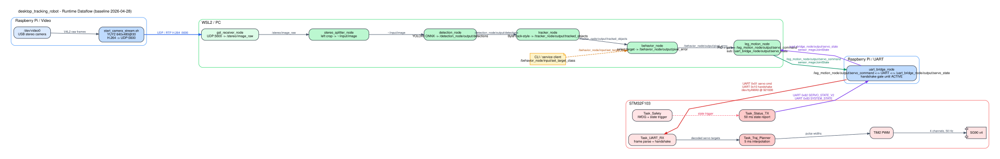

# 从视觉到运动的数据流

## 0. 运行时链路图

图源文件：`docs/assets/project_dataflow_diagram.dot`  
覆盖默认主链：`vision_stack.launch.py + rpi_stack.launch.py`，不含 `detection_viz_node` 与 `vision_front`。

## 1. 输入阶段

### Raspberry Pi 摄像头推流

- 文件：`scripts/start_camera_stream.sh`
- 输入：`/dev/video0`
- 输出：`UDP/H.264` 到 `5600`

### WSL2 接收与解码

- 节点：`gst_receiver_node`
- 输出 topic：`/stereo/image_raw`
- 特点：优先尝试 `nvh264dec`，失败后回退到 `avdec_h264`

## 2. 图像预处理

### 双目裁切

- 节点：`stereo_splitter_node`
- 输入：`/stereo/image_raw`
- 输出：`~/input/image`
- 逻辑：从 `640x480` 图里直接拷出左半边 `320x480`

## 3. 目标检测

### YOLOv8 推理

- 节点：`detection_node`
- 输入：`~/input/image`
- 输出：`/detection_node/output/detections`
- 实现文件：
  - `src/detection_node.cpp`
  - `src/yolo_infer.cpp`

流程：

1. 回调线程把图像放入短队列
2. 推理线程取图
3. `letterbox -> ONNX Runtime -> NMS`
4. 打包成 `Detection2DArray`

## 4. 目标跟踪

### 轨迹维护

- 节点：`tracker_node`
- 输入：`/detection_node/output/detections`
- 输出：`/tracker_node/output/tracked_objects`
- 作用：给检测框补上稳定的 `track_id`

## 5. 目标选择

### 行为层

- 节点：`behavior_node`
- 输入：`/tracker_node/output/tracked_objects`
- 输出：`/behavior_node/output/pixel_error`

当前策略：

- 只关注当前 `target_class_id`
- 在同类目标中选面积最大的框
- 输出像素误差：
  - `x = target_center_x - center_x`
  - `y = target_center_y - center_y`

## 6. 视觉伺服

### 四足角命令生成

- 节点：`leg_motion_node`
- 输入：`/behavior_node/output/pixel_error`、`/uart_bridge_node/output/servo_state`
- 输出：`/leg_motion_node/output/servo_command`

内部逻辑：

- `turn PID` 控制转向偏置
- `forward PID` 控制步幅
- 结合步态相位生成四条腿的目标角
- 输出 `sensor_msgs/JointState`

## 7. 串口桥与执行

### Raspberry Pi 桥接

- 节点：`uart_bridge_node`
- 输入：`/leg_motion_node/output/servo_command`
- 输出：UART 帧到 STM32
- 反馈：把 STM32 的 `SERVO_STATE_V2` 还原为 `/uart_bridge_node/output/servo_state`

### STM32 执行

- `Task_UART_RX`: 收到 `ServoCmdItem`
- `Task_Traj_Planner`: 5 ms 插值
- `servo_driver.c`: 写 TIM2 CCR

## 8. 闭环返回

STM32 每 `50 ms` 回报一次 `SERVO_STATE_V2`：

- 当前角度
- `timestamp_ms`
- `frame_seq`

Pi 侧收到后：

1. 映射成 ROS 时间
2. 检查是否丢包
3. 发布 `/uart_bridge_node/output/servo_state`

这样 `leg_motion_node` 能拿到实际反馈，完成视觉到执行的闭环。
