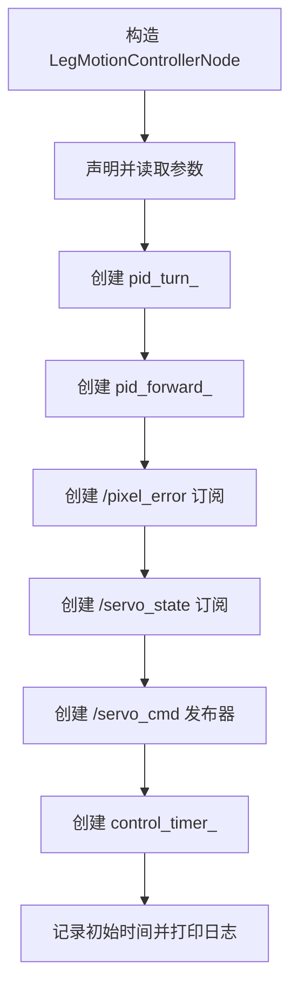
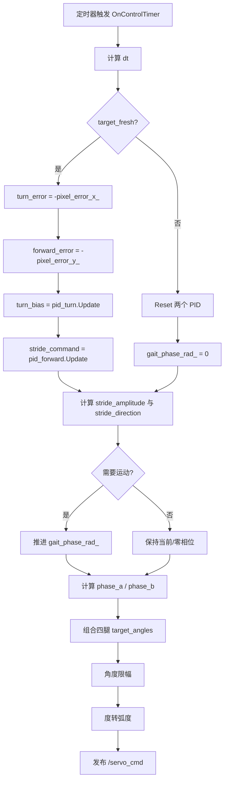

# leg_motion_node 节点代码说明文档

## 1. 节点概述

### 1.1 节点用途

`leg_motion_node` 的职责是把上游 `behavior_node` 输出的像素误差 `/pixel_error` 转换成四足机器人四路腿部舵机的目标角命令 `/servo_cmd`。

如果把整条链路拆开理解：

- `behavior_node` 负责告诉它“目标在画面里偏左/偏右/偏上/偏下多少像素”
- `leg_motion_node` 负责把这个视觉误差变成“往前迈多大步、左右偏多少角”
- `uart_bridge_node` 再负责把这些舵机角命令发给 STM32

它是视觉链路进入运动控制链路的核心控制节点。

### 1.2 所属功能包与入口

| 项目 | 内容 |
| --- | --- |
| 功能包 | `visual_servo` |
| 可执行文件 | `visual_servo_node_exe` |
| 运行时节点名 | `leg_motion_node` |
| 主源码 | `ros2_ws/src/visual_servo/src/leg_motion_controller_node.cpp` |
| 头文件 | `ros2_ws/src/visual_servo/include/visual_servo/leg_motion_controller_node.hpp` |
| PID 控制器 | `ros2_ws/src/visual_servo/src/pid_controller.cpp` |
| 进程入口 | `ros2_ws/src/visual_servo/src/main.cpp` |
| launch 文件 | `ros2_ws/src/visual_servo/launch/visual_servo.launch.py` |
| 默认参数文件 | `config/visual_servo.yaml` |

### 1.3 在系统中的角色

系统主链路如下：

```text
gst_receiver -> stereo_splitter -> detection_node -> tracker_node -> behavior_node -> leg_motion_node -> uart_bridge -> STM32
```

`leg_motion_node` 位于视觉和执行器之间，承担以下职责：

- 订阅 `/pixel_error`，把目标偏差转成控制量
- 订阅 `/servo_state`，接收执行侧回传的舵机状态
- 以固定频率运行控制器和步态发生器
- 发布 `/servo_cmd` 给下游 `uart_bridge_node`

它不是完整运动规划器，也不是底层电机驱动器，而是一个“视觉伺服 + 简化步态控制”的中间层。

## 2. 依赖项

### 2.1 ROS 2 版本与构建依赖

根据仓库顶层 `README.md`，当前项目默认运行环境为 **ROS 2 Jazzy**。

| 类别 | 名称 | 说明 |
| --- | --- | --- |
| 构建工具 | `ament_cmake` | ROS 2 CMake 构建系统 |
| 核心 ROS 2 库 | `rclcpp` | C++ 节点、话题、定时器 API |
| 标准消息 | `geometry_msgs` | 订阅 `/pixel_error` 时使用 `Vector3` |
| 标准消息 | `sensor_msgs` | 发布 `/servo_cmd`、订阅 `/servo_state` 时使用 `JointState` |

### 2.2 第三方库与仓库内共享工具

| 类型 | 名称 | 说明 |
| --- | --- | --- |
| C++ 标准库 | `<array>`、`<algorithm>`、`<cmath>` | 保存四腿状态、限幅、三角函数步态计算 |
| 仓库共享头文件 | `shared/servo_names.hpp` | 统一四个舵机的名字与索引映射 |
| 仓库共享头文件 | `shared/ros2_single_node_main.hpp` | 提供统一 `main()` 启动入口 |
| 本包内部类 | `visual_servo::PIDController` | 将像素误差转成转向偏置和前进步幅 |

说明：

- 这个节点 **没有** 用到 OpenCV、Eigen、MoveIt、控制器管理器等更重型库。
- 当前实现属于“轻量自定义控制逻辑”，没有引入 ROS 2 Control。

### 2.3 关键内部模块

| 模块 | 文件 | 作用 |
| --- | --- | --- |
| 节点主类 | `leg_motion_controller_node.cpp/.hpp` | 负责 ROS 接口、状态缓存、定时控制循环 |
| PID 控制器 | `pid_controller.cpp/.hpp` | 单轴 PID，带死区、积分防饱和、输出限幅 |
| 舵机命名映射 | `shared/servo_names.hpp` | 定义 `front_left/front_right/rear_left/rear_right` 顺序 |

### 2.4 外部数据来源

| 来源 | 类型 | 用途 |
| --- | --- | --- |
| `/pixel_error` | `geometry_msgs/msg/Vector3` | 视觉误差输入 |
| `/servo_state` | `sensor_msgs/msg/JointState` | 舵机反馈输入 |
| `config/visual_servo.yaml` | 参数配置文件 | 控制频率、角度限制、PID 参数 |

## 3. 节点接口清单

### 3.1 订阅的话题

ROS 2 中，“订阅”表示节点被动接收其他节点的数据。

| 话题名称 | 消息类型 | QoS | 回调函数 | 用途 |
| --- | --- | --- | --- | --- |
| `/pixel_error` | `geometry_msgs/msg/Vector3` | `rclcpp::QoS(5)`，默认 `Reliable + Volatile + KeepLast(5)` | `OnPixelError()` | 接收视觉误差，更新当前目标偏差和最新时间戳 |
| `/servo_state` | `sensor_msgs/msg/JointState` | `rclcpp::QoS(10)`，默认 `Reliable + Volatile + KeepLast(10)` | `OnServoState()` | 接收舵机反馈，缓存四条腿当前角度 |

### 3.2 发布的话题

| 话题名称 | 消息类型 | QoS | 发布频率 | 用途 |
| --- | --- | --- | --- | --- |
| `/servo_cmd` | `sensor_msgs/msg/JointState` | `rclcpp::QoS(5)`，默认 `Reliable + Volatile + KeepLast(5)` | 由定时器驱动，默认约 `30 Hz` | 发布四条腿的目标角命令，供 `uart_bridge_node` 编码发送给 STM32 |

重要说明：

- 这个节点是“定时发布”型节点，不依赖每次收到消息才发布。
- 即使目标暂时丢失，它也会继续按定时器频率发布一组“中立姿态”角度。

### 3.3 提供的服务 / 动作

| 名称 | 类型 | 用途 |
| --- | --- | --- |
| 无 | 无 | 当前实现没有服务端，也没有 Action 服务端 |

### 3.4 客户端调用的服务 / 动作

| 名称 | 类型 | 用途 |
| --- | --- | --- |
| 无 | 无 | 当前实现不主动调用其他服务或 Action |

### 3.5 TF 坐标系（监听 / 广播）

| 类型 | 内容 |
| --- | --- |
| 监听 TF | 无 |
| 广播 TF | 无 |

说明：

- 该节点只处理像素误差和关节角命令，不参与坐标变换树。
- 所以它不需要 TF。

### 3.6 关键消息字段速查

#### 3.6.1 `/pixel_error`

| 字段名 | 类型 | 含义 |
| --- | --- | --- |
| `x` | `float64` | 水平方向像素偏差；目标在画面右边时通常为正 |
| `y` | `float64` | 垂直方向像素偏差；目标在画面下方时通常为正 |
| `z` | `float64` | 当前上游固定填 `0.0`，本节点未使用 |

#### 3.6.2 `/servo_cmd` 与 `/servo_state`

两者都是 `sensor_msgs/msg/JointState`，但语义不同：

| 字段名 | 类型 | 在 `/servo_cmd` 中的含义 | 在 `/servo_state` 中的含义 |
| --- | --- | --- | --- |
| `header.stamp` | `builtin_interfaces/Time` | 命令生成时间 | 状态采样或转发时间 |
| `name` | `string[]` | 舵机名称数组 | 舵机名称数组 |
| `position` | `float64[]` | 目标角，单位是**弧度** | 当前反馈角，单位通常也是**弧度** |

当前四个舵机名称顺序来自 `shared/servo_names.hpp`：

| 索引 | 名称 |
| --- | --- |
| `0` | `front_left` |
| `1` | `front_right` |
| `2` | `rear_left` |
| `3` | `rear_right` |

## 4. 参数列表

参数会在节点构造函数中声明，并在启动时读取一次。

> 重要：当前节点没有实现参数回调，所以运行时 `ros2 param set` 修改并不会自动更新控制器内部成员变量，实际效果等同于“需要重启节点才生效”。

### 4.1 基础控制参数

| 参数名 | 类型 | 默认值 | 取值范围 | 含义 | 是否动态可调 |
| --- | --- | --- | --- | --- | --- |
| `control_rate_hz` | `float` | `30.0` | 建议 `> 0`；源码未校验 | 控制定时器频率 | 否 |
| `deadband_px` | `float` | `5.0` | 建议 `>= 0` | 像素死区；误差绝对值小于该值时视为 0 | 否 |
| `min_angle` | `float` | `10.0` | 建议小于 `max_angle` | 舵机最小角限制，单位度 | 否 |
| `max_angle` | `float` | `170.0` | 建议大于 `min_angle` | 舵机最大角限制，单位度 | 否 |
| `neutral_angle_deg` | `float` | `90.0` | 通常在机械中位附近 | 中立姿态角，单位度 | 否 |
| `stride_amplitude_max_deg` | `float` | `20.0` | 建议 `>= 0` | 前进/后退步幅的最大摆动幅度，单位度 | 否 |
| `turn_bias_max_deg` | `float` | `12.0` | 建议 `>= 0` | 左右转向附加偏置的最大幅度，单位度 | 否 |
| `gait_frequency_hz` | `float` | `2.0` | 建议 `> 0` | 步态相位推进频率 | 否 |
| `target_timeout_sec` | `float` | `0.5` | 建议 `>= 0` | 超过该时间未收到新误差时，认为目标丢失 | 否 |

### 4.2 转向 PID 参数

| 参数名 | 类型 | 默认值 | 取值范围 | 含义 | 是否动态可调 |
| --- | --- | --- | --- | --- | --- |
| `turn.kp` | `float` | `0.05` | 一般 `>= 0` | 转向比例增益 | 否 |
| `turn.ki` | `float` | `0.001` | 一般 `>= 0` | 转向积分增益 | 否 |
| `turn.kd` | `float` | `0.02` | 一般 `>= 0` | 转向微分增益 | 否 |

### 4.3 前进 PID 参数

| 参数名 | 类型 | 默认值 | 取值范围 | 含义 | 是否动态可调 |
| --- | --- | --- | --- | --- | --- |
| `forward.kp` | `float` | `0.04` | 一般 `>= 0` | 前进比例增益 | 否 |
| `forward.ki` | `float` | `0.001` | 一般 `>= 0` | 前进积分增益 | 否 |
| `forward.kd` | `float` | `0.02` | 一般 `>= 0` | 前进微分增益 | 否 |

### 4.4 YAML 配置示例

```yaml
leg_motion_node:
  ros__parameters:
    control_rate_hz: 30.0
    deadband_px: 5.0
    min_angle: 10.0
    max_angle: 170.0
    neutral_angle_deg: 90.0
    stride_amplitude_max_deg: 20.0
    turn_bias_max_deg: 12.0
    gait_frequency_hz: 2.0
    target_timeout_sec: 0.5
    turn:
      kp: 0.05
      ki: 0.001
      kd: 0.02
    forward:
      kp: 0.04
      ki: 0.001
      kd: 0.02
```

## 5. 核心代码逻辑

### 5.1 类结构和继承关系

`LegMotionControllerNode` 直接继承 `rclcpp::Node`，属于普通 ROS 2 节点。

```cpp
class LegMotionControllerNode : public rclcpp::Node {
 public:
  LegMotionControllerNode(const rclcpp::NodeOptions& options = rclcpp::NodeOptions());

 private:
  rclcpp::Subscription<geometry_msgs::msg::Vector3>::SharedPtr pixel_error_sub_;
  rclcpp::Subscription<sensor_msgs::msg::JointState>::SharedPtr servo_state_sub_;
  rclcpp::Publisher<sensor_msgs::msg::JointState>::SharedPtr servo_cmd_pub_;
  rclcpp::TimerBase::SharedPtr control_timer_;

  float pixel_error_x_ = 0.0f;      // 最新水平误差
  float pixel_error_y_ = 0.0f;      // 最新垂直误差
  bool have_pixel_error_ = false;   // 是否收到过误差输入
  float gait_phase_rad_ = 0.0f;     // 步态相位
};
```

它的内部结构可以分成 4 组：

| 成员类别 | 代表成员 | 作用 |
| --- | --- | --- |
| ROS 通信对象 | `pixel_error_sub_`、`servo_state_sub_`、`servo_cmd_pub_`、`control_timer_` | 接收输入、周期发布输出 |
| 输入缓存 | `pixel_error_x_`、`pixel_error_y_`、`have_pixel_error_`、`last_pixel_error_time_` | 保存最新视觉误差与新鲜度 |
| 控制器状态 | `pid_forward_`、`pid_turn_`、`last_control_time_`、`gait_phase_rad_` | PID 状态和步态相位 |
| 反馈与约束 | `current_leg_angles_deg_`、`min_angle_`、`max_angle_`、`neutral_angle_deg_` | 保存舵机反馈并限制目标角范围 |

### 5.2 PID 控制器类说明

这个节点内部用了两个 `PIDController`：

- `pid_turn_`：把水平误差转换成左右转向偏置
- `pid_forward_`：把垂直误差转换成前进/后退步幅命令

`PIDController` 的特性如下：

| 机制 | 作用 |
| --- | --- |
| 死区 `deadband_` | 误差很小时强制归零，减少抖动 |
| 积分项 `integral_` | 累积长期误差 |
| 积分限幅 | 防止积分过大导致 windup |
| 微分项 | 响应误差变化速度 |
| 输出限幅 | 保证输出不超过允许角度范围 |

关键实现片段：

```cpp
if (std::abs(error) < deadband_) {
  error = 0.0f;                         // 小误差直接视为 0
}

integral_ += ki_ * error * dt;          // 积分累计
integral_ = std::clamp(integral_,       // 防止积分无限变大
                       output_min_ / 2.0f,
                       output_max_ / 2.0f);

output = std::clamp(output,             // 最终输出限幅
                    output_min_,
                    output_max_);
```

### 5.3 构造函数初始化流程

构造函数完成了节点的大部分初始化：

1. 设置节点名为 `leg_motion_node`
2. 声明所有控制参数和 PID 参数
3. 读取参数到成员变量
4. 构造两个 PID 控制器
5. 创建 `/pixel_error` 订阅
6. 创建 `/servo_state` 订阅
7. 创建 `/servo_cmd` 发布器
8. 创建周期定时器 `control_timer_`
9. 初始化时间戳与日志输出

关键代码片段：

```cpp
this->declare_parameter<float>("control_rate_hz", 30.0f); // 控制频率
this->declare_parameter<float>("deadband_px", 5.0f);      // 像素死区

control_rate_hz_ = this->get_parameter("control_rate_hz").as_double(); // 读取参数
deadband_px_ = this->get_parameter("deadband_px").as_double();         // 后续 PID 会使用

pid_turn_ = std::make_unique<PIDController>(
  turn_kp, turn_ki, turn_kd, deadband_px_,
  -turn_bias_max_deg_, turn_bias_max_deg_); // 转向 PID 输出限制在左右偏置范围内

pid_forward_ = std::make_unique<PIDController>(
  forward_kp, forward_ki, forward_kd, deadband_px_,
  -stride_amplitude_max_deg_, stride_amplitude_max_deg_); // 前进 PID 输出限制在步幅范围内
```

初始化流程图：



### 5.4 主要回调函数处理流程

| 回调函数 | 触发条件 | 主要输入 | 处理结果 |
| --- | --- | --- | --- |
| `OnPixelError()` | 收到 `/pixel_error` | `geometry_msgs/msg/Vector3` | 更新最新误差、标记已有目标、刷新时间戳 |
| `OnServoState()` | 收到 `/servo_state` | `sensor_msgs/msg/JointState` | 根据舵机名称更新四腿反馈角缓存 |
| `OnControlTimer()` | 定时器触发，默认约 30 Hz | 当前缓存的误差、PID 状态、步态相位 | 计算新一帧目标角并发布 `/servo_cmd` |

#### 5.4.1 `OnPixelError()`

触发条件：

- 上游 `behavior_node` 发布一条新的 `/pixel_error`

处理步骤：

1. 读取 `msg->x` 到 `pixel_error_x_`
2. 读取 `msg->y` 到 `pixel_error_y_`
3. 将 `have_pixel_error_` 置为 `true`
4. 用当前时间更新 `last_pixel_error_time_`

关键代码：

```cpp
pixel_error_x_ = msg->x;        // 更新水平误差
pixel_error_y_ = msg->y;        // 更新垂直误差
have_pixel_error_ = true;       // 标记已有视觉目标输入
last_pixel_error_time_ = this->now(); // 记录这条误差的新鲜时间
```

处理结果：

- 不直接发布舵机命令
- 只是为下一次定时器控制循环提供最新输入

#### 5.4.2 `OnServoState()`

触发条件：

- 下游 `uart_bridge_node` 或 `mock_uart_bridge_node` 发布一条 `/servo_state`

处理步骤：

1. 遍历 `msg->name`
2. 用 `servo_name_to_id()` 把舵机名字转成固定索引
3. 若索引合法且 `position` 数组有对应元素，则把弧度转成角度
4. 更新 `current_leg_angles_deg_`

关键代码：

```cpp
const int idx = project_shared::servo_name_to_id(msg->name[i]); // 把名字映射到 0~3
if (idx >= 0 && i < msg->position.size()) {
  current_leg_angles_deg_[static_cast<size_t>(idx)] =
    msg->position[i] * 180.0f / static_cast<float>(M_PI); // 弧度转角度
}
```

处理结果：

- 更新反馈缓存
- 当前版本不会把这些反馈角真正用进控制律，只是先存下来

这点要特别注意：**它已经接入反馈通道，但还不是严格意义上的闭环关节控制器**。

#### 5.4.3 `OnControlTimer()`

触发条件：

- `control_timer_` 到期，默认约每 `33 ms` 触发一次

处理步骤可以拆成 8 步：

1. 读取当前时间 `now`
2. 计算本次控制周期 `dt`
3. 判断目标是否新鲜：
   - 收到过误差
   - 且 `(now - last_pixel_error_time_) <= target_timeout_sec_`
4. 若目标新鲜：
   - 根据误差方向构造 `turn_error` 和 `forward_error`
   - 调用两个 PID 计算 `turn_bias` 与 `stride_command`
5. 若目标不新鲜：
   - 重置两个 PID
   - 重置步态相位 `gait_phase_rad_`
6. 根据 `stride_command` 计算步幅幅值、方向和正弦步态相位
7. 组合出四条腿的目标角，并做角度限幅
8. 把角度从“度”转成“弧度”，打包成 `JointState` 发布 `/servo_cmd`

完整流程图：



关键代码片段：

```cpp
const bool target_fresh =
  have_pixel_error_ && ((now - last_pixel_error_time_).seconds() <= target_timeout_sec_);

if (target_fresh) {
  const float turn_error = -pixel_error_x_;    // 目标在右边时，需要向右转
  const float forward_error = -pixel_error_y_; // 目标偏上时，视为需要向前逼近

  turn_bias = pid_turn_->Update(turn_error, dt);
  stride_command = pid_forward_->Update(forward_error, dt);
} else {
  pid_turn_->Reset();      // 目标丢失后清空控制器状态
  pid_forward_->Reset();
  gait_phase_rad_ = 0.0f;  // 步态相位归零
}
```

再往后，四腿角度通过一组简单的交替步态生成：

```cpp
const float phase_a = stride_direction * stride_amplitude * std::sin(gait_phase_rad_);
const float phase_b = -phase_a; // 另一组腿反相运动

std::array<float, kLegCount> target_angles = {
  neutral_angle_deg_ + phase_a + turn_bias,  // front_left
  neutral_angle_deg_ + phase_b - turn_bias,  // front_right
  neutral_angle_deg_ + phase_b + turn_bias,  // rear_left
  neutral_angle_deg_ + phase_a - turn_bias   // rear_right
};
```

处理结果：

- 如果目标仍然新鲜，就输出“带步态和转向偏置”的舵机命令
- 如果目标已超时丢失，就输出“中立姿态”的舵机命令

这个设计的含义是：**目标丢失时机器人不会继续乱迈步，而是回到中位姿态并持续发布稳定命令。**

### 5.5 关键算法说明

#### 5.5.1 误差到控制量的映射

节点把二维像素误差拆成两个独立控制通道：

| 误差源 | 控制通道 | 作用 |
| --- | --- | --- |
| `pixel_error_x_` | `pid_turn_` | 决定左右转向偏置 |
| `pixel_error_y_` | `pid_forward_` | 决定前后步幅强度 |

特别注意符号约定：

| 现象 | 代码处理 |
| --- | --- |
| `error_x > 0`，目标在右侧 | `turn_error = -pixel_error_x_` |
| `error_y < 0`，目标在上方 | `forward_error = -pixel_error_y_` |

这说明当前控制逻辑采用的是“根据固定相机下的视觉偏差反向修正”的思路。

#### 5.5.2 简化步态发生器

当前步态算法不是复杂的全身运动学，而是非常实用的“正弦相位 + 左右偏置”模型：

1. 用 `stride_command` 决定步幅大小与前后方向
2. 用 `gait_frequency_hz_` 推进相位
3. 用 `sin(gait_phase_rad_)` 生成一组腿的摆动
4. 另一组腿使用反相 `-phase_a`
5. 再叠加 `turn_bias`

这样能得到一个简单但连续的四腿节律输出。

#### 5.5.3 角度限制与单位转换

内部控制计算大多使用“度”，但 ROS 输出给 `/servo_cmd` 时使用“弧度”：

```cpp
for (float angle_deg : target_angles) {
  cmd.position.push_back(angle_deg * static_cast<float>(M_PI) / 180.0f); // 度转弧度
}
```

这对初学者很关键：

- `neutral_angle_deg_`、`min_angle_`、`max_angle_` 都是**度**
- `/servo_cmd.position[]` 却是**弧度**

### 5.6 当前实现的几个重要细节

| 细节 | 说明 |
| --- | --- |
| 控制定时器周期是整数毫秒 | `int period_ms = static_cast<int>(1000.0f / control_rate_hz_)`，默认 `30 Hz` 会被量化为 `33 ms`，实际约 `30.3 Hz` |
| `current_leg_angles_deg_` 目前未参与控制 | 它只是缓存反馈，暂时没有做真正的反馈补偿 |
| `PIDController` 有 `SetGains()` 等方法 | 但当前节点没有参数更新回调，所以运行时不会自动调用这些方法 |
| 目标丢失后仍会发布 `/servo_cmd` | 内容是中立姿态，而不是停止发布 |

## 6. 生命周期与线程模型

### 6.1 生命周期

本节点是普通 `rclcpp::Node`，不是 `LifecycleNode`。

其运行过程如下：

1. `main()` 调用 `rclcpp::init()`
2. 创建 `LegMotionControllerNode`
3. `rclcpp::spin(node)` 进入事件循环
4. 退出时 `rclcpp::shutdown()`

入口代码如下：

```cpp
int main(int argc, char* argv[]) {
  return project_shared::spin_single_node_main<visual_servo::LegMotionControllerNode>(
      argc, argv); // init -> 构造节点 -> spin -> shutdown
}
```

### 6.2 执行器类型

由于入口最终调用的是 `rclcpp::spin(node)`，因此默认是：

- **单线程执行器**
- 订阅回调和定时器回调按单线程串行执行

这意味着：

- 不需要额外写锁来保护 `pixel_error_x_` 等共享状态
- 但如果定时器回调做得太重，会拖慢话题回调处理

### 6.3 回调组、定时器与线程

| 项目 | 当前实现 |
| --- | --- |
| 回调组 | 未显式创建，落在默认回调组 |
| 定时器 | `control_timer_`，默认约 30 Hz |
| 订阅回调 | `OnPixelError()`、`OnServoState()` |
| 后台线程 | 无 |
| 显式任务队列 | 无 |

## 7. 启动方式

### 7.1 使用 `ros2 run` 直接启动

```bash
source /opt/ros/jazzy/setup.bash
cd /home/peter/dog/dog_dev
source ros2_ws/install/setup.bash
ros2 run visual_servo visual_servo_node_exe
```

说明：

- 这种方式默认使用源码里的参数默认值
- 如果要加载 YAML，建议带 `--ros-args --params-file`

示例：

```bash
ros2 run visual_servo visual_servo_node_exe \
  --ros-args --params-file /home/peter/dog/dog_dev/config/visual_servo.yaml
```

### 7.2 使用本包 launch 文件启动

```bash
source /opt/ros/jazzy/setup.bash
cd /home/peter/dog/dog_dev
source ros2_ws/install/setup.bash
ros2 launch visual_servo visual_servo.launch.py
```

### 7.3 在整条主链中启动

```bash
source /opt/ros/jazzy/setup.bash
cd /home/peter/dog/dog_dev
source ros2_ws/install/setup.bash
ros2 launch robot_bringup vision_stack.launch.py
```

### 7.4 无硬件时的闭环联调

如果没有 Raspberry Pi 和 STM32，可以使用仓库提供的模拟桥：

```bash
source /opt/ros/jazzy/setup.bash
cd /home/peter/dog/dog_dev
source ros2_ws/install/setup.bash
ros2 launch robot_bringup test_73_complete.launch.py
```

这个入口会拉起 `mock_uart_bridge_node`，模拟 `/servo_state` 反馈。

### 7.5 launch 文件示例

```python
visual_servo_node = Node(
    package='visual_servo',              # 功能包名
    executable='visual_servo_node_exe',  # 可执行文件
    name='leg_motion_node',              # 运行时节点名
    output='screen',                     # 日志输出到终端
    parameters=[config_file]             # 加载 visual_servo.yaml
)
```

### 7.6 参数 YAML 配置示例

```yaml
leg_motion_node:
  ros__parameters:
    control_rate_hz: 30.0
    deadband_px: 5.0
    min_angle: 10.0
    max_angle: 170.0
    neutral_angle_deg: 90.0
    stride_amplitude_max_deg: 20.0
    turn_bias_max_deg: 12.0
    gait_frequency_hz: 2.0
    target_timeout_sec: 0.5
    turn:
      kp: 0.05
      ki: 0.001
      kd: 0.02
    forward:
      kp: 0.04
      ki: 0.001
      kd: 0.02
```

## 8. 调试与排错

### 8.1 最常用的观察命令

```bash
ros2 node list
ros2 topic list
ros2 topic echo /pixel_error
ros2 topic echo /servo_cmd
ros2 topic echo /servo_state
ros2 topic hz /servo_cmd
ros2 topic hz /servo_state
```

### 8.2 日志查看方法

当前节点主要输出初始化日志和调试日志。

常见日志含义：

| 日志内容 | 说明 |
| --- | --- |
| `LegMotionController initialized: ...` | 节点已启动，参数和 PID 增益已经装载完成 |
| `Leg motion: target=locked ...` | 定时器控制循环认为目标仍然有效 |
| `Leg motion: target=lost ...` | 超过 `target_timeout_sec_`，当前目标已经超时 |

如果要看 `RCLCPP_DEBUG` 调试信息，可以这样启动：

```bash
ros2 run visual_servo visual_servo_node_exe --ros-args --log-level debug
```

### 8.3 推荐的可视化工具

| 工具 | 推荐用途 |
| --- | --- |
| `rqt_graph` | 查看 `/pixel_error -> leg_motion_node -> /servo_cmd` 以及 `/servo_state -> leg_motion_node` 的连通关系 |
| `rqt_plot` | 观察 `/pixel_error/x`、`/pixel_error/y`，也可以画 `/servo_cmd/position[0]` 一类的数值变化 |
| `rqt_image_view` | 配合相机画面理解误差方向与机器人动作之间的关系 |
| `rviz2` | 本节点本身没有 Marker 输出，通常不是首选调试工具 |

### 8.4 常见问题与排错建议

| 现象 | 可能原因 | 排查方法 | 处理建议 |
| --- | --- | --- | --- |
| `/servo_cmd` 没有输出 | 节点未启动或环境未正确 `source` | `ros2 node list`、`ros2 topic hz /servo_cmd` | 先确认 `leg_motion_node` 已存在 |
| `/servo_cmd` 有输出，但机器人不动 | `uart_bridge_node` 未握手成功，未转发命令 | 查看 Pi 侧日志 | 先排查 UART 握手和硬件链路 |
| 机器人左右转方向反了 | 对 `pixel_error_x` 的正负理解与机械方向不一致 | `ros2 topic echo /pixel_error` 对照实际动作 | 调整控制符号或舵机安装方向 |
| 目标一丢就“站住” | 这是当前设计行为 | 检查日志是否频繁出现 `target=lost` | 适当调大 `target_timeout_sec` 或提高上游稳定性 |
| 动作抖动 | `deadband_px` 太小、PID 太敏感 | 看 `/pixel_error` 曲线是否在 0 附近高频摆动 | 增大死区或调小 `kp/kd` |
| 步子太小或太大 | `stride_amplitude_max_deg` 或 `forward.*` 不合适 | 看 `/servo_cmd` 幅值变化 | 调整步幅上限和前进 PID |
| 收到 `/servo_state` 但控制没明显变化 | 当前实现没有把反馈角闭环用进控制律 | 阅读 `OnServoState()` 与 `OnControlTimer()` | 如需真闭环，需要继续扩展算法 |

### 8.5 一个容易忽略的实现细节

当前节点会把 `/servo_state` 里的角度转成度并存入 `current_leg_angles_deg_`，但后续控制计算没有使用这个数组。

也就是说，当前逻辑更像：

- “视觉误差驱动的前馈步态控制”

而不是：

- “真正利用关节反馈做误差修正的闭环关节控制”

## 9. 单元测试与集成测试说明

### 9.1 当前测试现状

当前仓库里有：

- 一个针对 `PIDController` 的离线 C++ 单元测试
- 一个覆盖 `behavior_node + leg_motion_node` 的 shell 级集成测试脚本

### 9.2 已有测试文件

| 文件 | 类型 | 覆盖范围 |
| --- | --- | --- |
| `tests/test_pid_controller.cpp` | 单元测试 | 验证 PID 控制器的比例、积分、微分、死区、限幅、重置、防积分饱和等行为 |
| `tests/test_stage6_integration.sh` | 集成测试脚本 | 检查 `leg_motion_node` 能否启动，并与 `behavior_node` 形成基本链路 |
| `scripts/verify_tracking.sh` | 端到端验证脚本 | 检查 `/pixel_error` 和 `/servo_cmd` 频率、链路连通性 |

### 9.3 本次文档整理时的本地验证

我在当前工作区里离线编译并运行了 `tests/test_pid_controller.cpp`，结果通过，覆盖了以下测试点：

| 测试点 | 结果 |
| --- | --- |
| 比例项输出 | 通过 |
| 死区抑制 | 通过 |
| 积分累积 | 通过 |
| 输出限幅 | 通过 |
| `Reset()` 清状态 | 通过 |
| 微分项 | 通过 |
| 零误差输出 | 通过 |
| 积分防饱和 | 通过 |
| `dt <= 0` 时跳过 I/D | 通过 |

另外，我也尝试过直接启动 `visual_servo_node_exe`：

- 第一次因为默认日志目录 `~/.ros/log` 在当前沙箱下只读而失败
- 将 `ROS_LOG_DIR` 指到 `/tmp` 后，节点可以打印初始化日志
- 启动过程中还会出现 DDS/网络接口的沙箱权限告警，这属于当前执行环境限制，不代表节点本身逻辑错误

### 9.4 仍建议补充的测试

| 建议测试项 | 价值 |
| --- | --- |
| `OnControlTimer()` 数值单元测试 | 验证不同误差输入下四腿角命令是否符合预期 |
| 目标超时测试 | 验证超时后是否稳定回到中立姿态 |
| `/servo_state` 解析测试 | 验证不同舵机名字顺序下映射是否正确 |
| 参数加载测试 | 验证 YAML 中 PID 与角度限制参数是否正确生效 |

## 10. 变更记录与待办事项

### 10.1 当前实现基线

本文档基于当前工作区可见代码整理，基线时间可按当前工作区日期理解为 `2026-04-29`。

### 10.2 已实现的能力

| 项目 | 状态 |
| --- | --- |
| 订阅 `/pixel_error` | 已实现 |
| 订阅 `/servo_state` | 已实现 |
| 定时发布 `/servo_cmd` | 已实现 |
| 双 PID 通道（转向 + 前进） | 已实现 |
| 简化正弦步态发生器 | 已实现 |
| 角度限幅与单位转换 | 已实现 |
| 目标超时后回到中立姿态 | 已实现 |

### 10.3 仍待完善的事项

| 待办项 | 现状说明 |
| --- | --- |
| 真正利用 `current_leg_angles_deg_` 做反馈控制 | 当前只缓存反馈，未参与控制律 |
| 参数动态更新 | `PIDController` 提供了 setter，但节点没实现参数回调 |
| 更完整的步态模型 | 当前是简化正弦步态，不含更复杂的运动学约束 |
| 目标丢失策略多样化 | 当前策略只有“恢复到中立姿态” |
| 自动化节点级测试 | 目前缺少直接验证 `OnControlTimer()` 输出数值的自动化测试 |

### 10.4 对后续维护者的建议

如果你准备继续扩展这个节点，优先级比较高的方向有三个：

1. 把 `/servo_state` 真正接入控制闭环，而不仅仅是缓存
2. 给参数增加动态更新回调，让 PID 调参不必重启节点
3. 为 `OnControlTimer()` 增加可重复的数值测试，避免以后改控制律时悄悄跑偏
