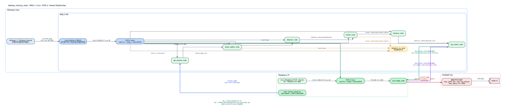

# WSL2、Linux、ROS 2、节点之间到底是什么关系

这张图是给“概念理顺”用的，不是只看 topic 流。



图源文件：`docs/assets/wsl_rpi_ros2_relationship.dot`

## 1. 一句话先讲透

`ROS 2 不是 Linux，也不是操作系统的一部分。`

它更像一套“运行在 Linux 上的通信框架 + 节点开发框架”：

- Linux 提供进程、网络、串口、文件系统
- ROS 2 提供节点、topic、service、参数、launch
- 节点本质上仍然是 Linux 进程

所以你可以把层次理解成：

```text
硬件 / 虚拟机
  -> Linux
    -> ROS 2
      -> 具体节点进程
        -> topic / service 通信
```

## 2. 放到你这个项目里

### Windows / WSL2 侧

你的电脑不是直接在 Windows 上跑这些 ROS 2 节点，而是：

1. Windows 里打开 WSL 终端
2. 进入 WSL2 里的 Ubuntu/Linux
3. 在这个 Linux 环境里运行 ROS 2
4. ROS 2 再启动这些节点：
   - `gst_receiver_node`
   - `stereo_splitter_node`
   - `detection_node`
   - `tracker_node`
   - `behavior_node`
   - `leg_motion_node`
   - `detection_viz_node`（可选调试）

所以“WSL 中的 ROS 2”准确说法其实是：

`运行在 WSL2 的 Linux 里的 ROS 2`

### Raspberry Pi 侧

树莓派本身也是一台独立 Linux 机器。

它上面也有自己的 ROS 2 环境，也会启动自己的节点：

- `uart_bridge_node`

另外它还有一个**不属于 ROS 2** 的脚本：

- `start_camera_stream.sh`

这个脚本负责把摄像头视频用 `UDP/H.264` 推到 WSL 里的 `gst_receiver_node`。

## 3. WSL 和树莓派上的 ROS 2 为什么能互相看到

不是因为“它们属于同一个 Linux”，而是因为：

- 两边各自都有 ROS 2
- 两边都用 `CycloneDDS`
- 两边都设置成同一个 `ROS_DOMAIN_ID=42`
- 两边都 source 了 `scripts/ros2_network_env.sh`

这个脚本会把 DDS 发现方式固定好，让 WSL 和树莓派把对方当作 peer。

所以跨机器真正通的是：

- `WSL leg_motion_node -> Pi uart_bridge_node` 的 `/servo_cmd`
- `Pi uart_bridge_node -> WSL leg_motion_node` 的 `/servo_state`

## 4. 这套系统里有两种“跨机器通信”

### 第一种：ROS 2 通信

用于：

- `/servo_cmd`
- `/servo_state`

特点：

- 走 DDS / RTPS
- 是 ROS 2 自己的 topic 通信

### 第二种：非 ROS 2 通信

用于：

- 树莓派摄像头视频推流到 WSL
- 树莓派串口到 STM32

特点：

- 摄像头链路走 `UDP/H.264`
- Pi 到 STM32 走 `UART`
- 这两段都不是 ROS 2 topic

## 5. 你可以把它想成三层

### 第一层：操作系统层

- WSL2 里的 Linux
- 树莓派上的 Linux

### 第二层：ROS 2 运行时层

- `ros2 launch`
- `rclcpp`
- `CycloneDDS`
- topic / service / parameter / node graph

### 第三层：业务节点层

- 检测
- 跟踪
- 行为
- 视觉伺服
- 串口桥

## 6. 对你当前项目最关键的理解

你现在这个项目不是“一台机器上的一个 ROS 2 系统”，而是：

`两台 Linux 机器上的两个 ROS 2 运行时，通过 DDS 连接成一个逻辑上的 ROS 2 图。`

其中：

- WSL 负责视觉和决策
- 树莓派负责摄像头推流和 UART 桥接
- STM32 不跑 ROS 2，只负责执行舵机控制
